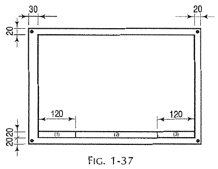
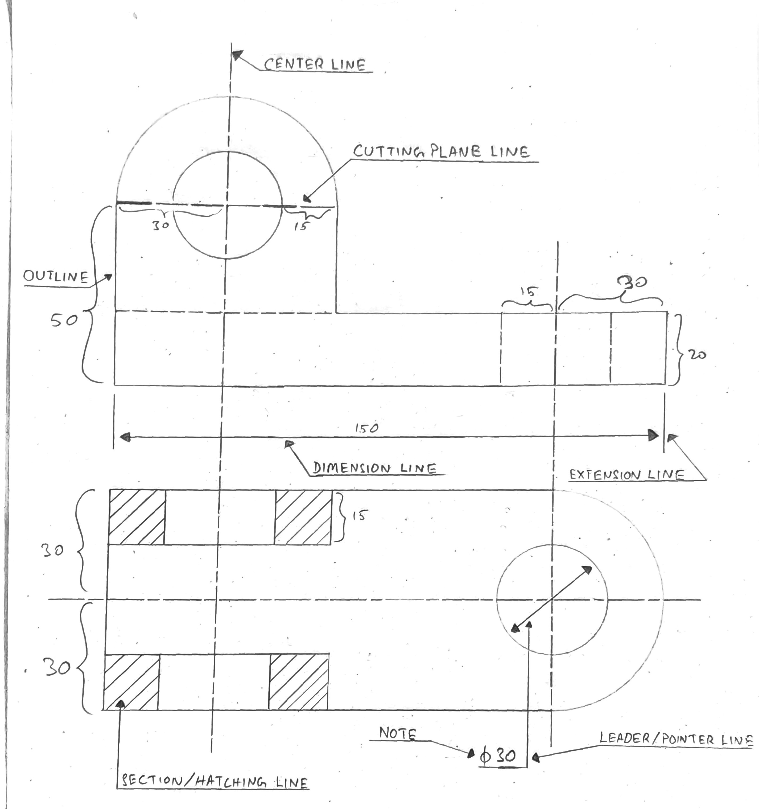
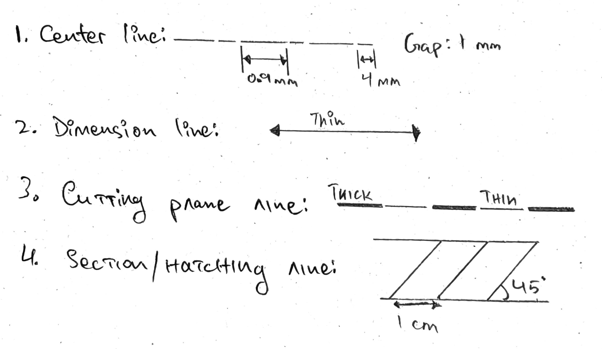

# Drawing Instruments and their Uses 
- Drawing instruments are used to prepare drawing instruments easily and accurately and the accuracy depends on the quality of instruments.

- The minimum requirements or instruments are: 
    1. **Drawing board**: a wooden board where the drawing sheet is kept on to draw graphics on.
    2. **T-square**: draw parallel lines that are parallel to each other. 
    3. **Set square**: $30\degree - 60\degree$ and $45\degree$, are set of triangular shapes with scales on their sides in centimeter, used to draw lines, check for normal and make angled lines. 
    4. Drawing instruments box, having
        1. **Large size compass with inter-changeable pencil and pen legs**: draw arcs, semicircles and circles. Can also be used to make angles by bisecting lines and angles. 
        2. **Lengthening bar**: attached to compass and divider to increase their reach. 
        3. **Small bow compass**: used to draw small arcs and circles. 
        4. **Large-size divider**: transfer or compare lengths from a ruler, scribe arcs and circles, dividing lines or cicles and checking measurement consistency. 
        5. **Small bow divider**: same work as a large-size divider but used for small measurements. 
        6. **Small bow ink-pen** finalize precision sketches by marking with ink. 
        7. **Inking pen**: finalize sketches by marking with ink. 
    5. **Scale (ruler)**: measuring and drawing straight lines. 
    6. **Protractor**: flat, semicircle tool with scales of division $1\degree$ used for making angles and also measuring them. 
    7. **French curves**: pre-made shapes used to draw consistent curves that cannot be drawn with compass. 
    8. **Drawing papers**: papers of exact dimensions used to make diagrams, sketches and graphics.
    9. **Drawing pencils**: used to draw sketches, can be found in different grades starting from softest (7B) to hardest (9H). Its sharpening is defined as two types: 
        1. Conical edge: make sketches and lettering 
        2. Chisel edge: draw long, thin lines of uniform thickness. 
    10. **Sand-paper block**: wooden block wrapped in sand paper half its length, used to sharpen drawing pencils according to need. **Its dimensions are $150 mm \times 50 mm \times 12 mm$**.
    11. **Eraser**: erase marking from pencils on paper. 
    12. **Drawing pins, clips or adhesive tapes**: attach drawing paper to the drawing board, pins can leave holes on the paper so alternately adhesive tapes or clips are used.  
    13. **Duster/soft-cotton/handkerchief**: used to clean underside of instruments that rub against paper, also used to remove eraser residue without leaving pencil smudges. 
    14. **Drafting machine**: device mounted on the drawing board that combines the function of T-square, set-square and protractor into one instrument. 
    15. **Roll-n-draw**: consists of a roller, scale of 16 cm and a protractor, used to draw vertical, horizontal and parallel lines and angles. 

## General Suggestions for Drawing a Sheet 
1. **Cleaning the Instruments**: Clean the drawing board and T-Square and place them on the table, and all other instruments that may become dirty. If using a drafting machine, also clean its underside.  
2. **Pinning the paper to the drawing board**: place the drawing paper in equal distances from the top and bottom and the shorter side about 25 cm from the opposite of dominant hand. 
3. **Border-Lines**: Draw proper lines on the border at equal distances, about 20-25 mm from top, bottom and right-hand side and 25 mm to 40 mm on the left-hand side to attach the bindings if required.  
    1. The extra lines should be erased beyond the points of intersection.
    2. One more horizontal line may be drawn from the bottom about 10 mm to 20 mm in width to include "Name of Institution", "Title of the Drawing" and "Name of Student, Class, etc."
4. **Spacing**: When one drawing is to be made, it should be done in the center of the working space. If there are two or more of them, they should be divided into their suitable block and drawn in the center of the block.  

----------

### In a simple drawing of your room, show the following lines, generally used in Engineering Graphics.
1. Outline
2. Center line
3. Cutting Plane line 
4. Dimension line
5. Extension line
6. Leader 
7. Note 
8. Section line 
9. Hidden line 

