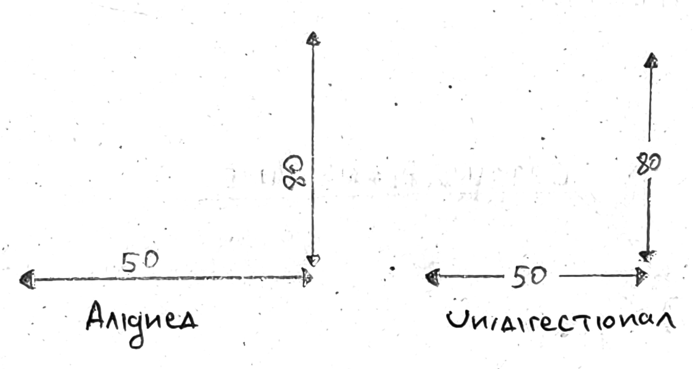
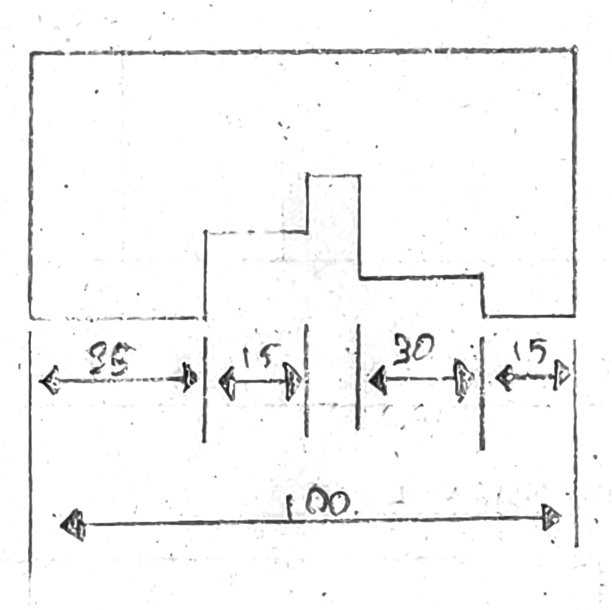
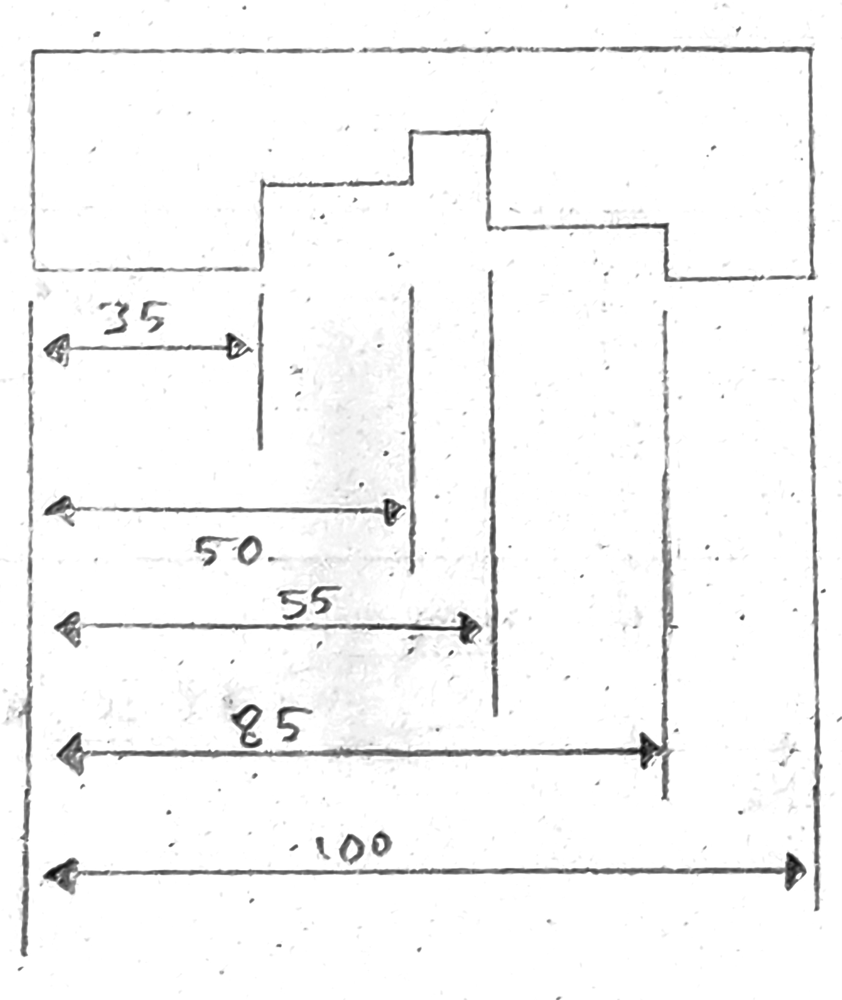

# Dimensioning 
- The two system of dimensioning are: 
    1. **Aligned system of dimensioning**: dimensions should be written as to be read from bottom for horizontal dimensions and from the right side for vertical dimensions.
    2. **Unidirectional system of dimensioning**: dimensions should be written as to be read from the bottom only with the labels being between the dimension line. 

## Chained or Continuous Dimensioning 
- Dimensions are to be written in a chained, discontinuous manner with the smallest dimension being omitted. 

## Parallel or Progressive Dimensioning 
- Dimensions are written in a progressive manner with the next dimension being added to the previous for the current dimension. 

