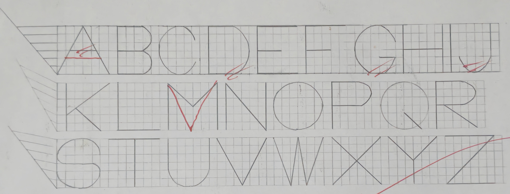
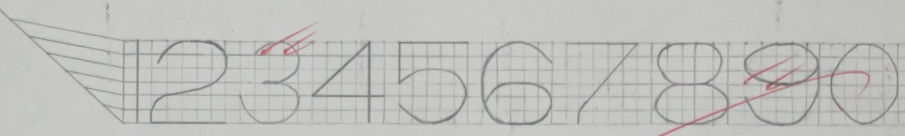
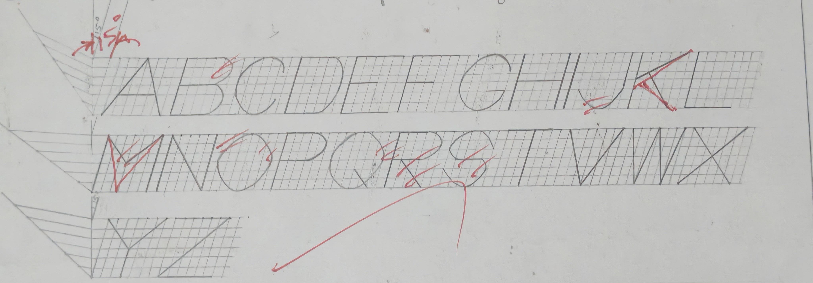
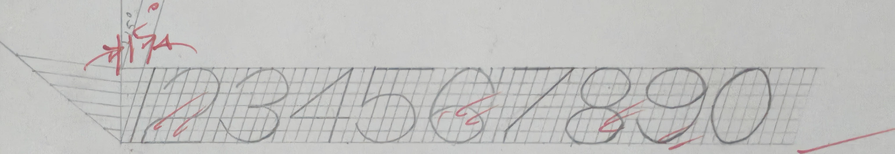
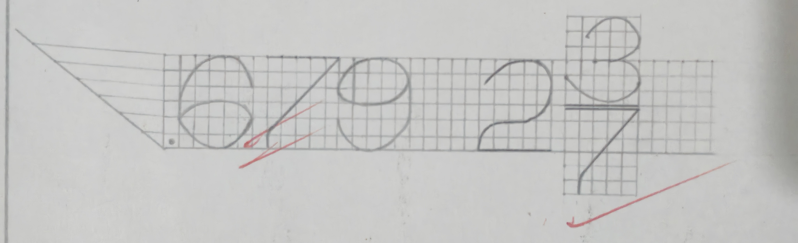
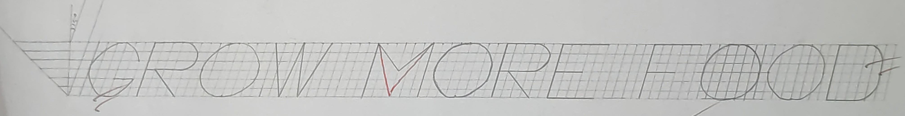
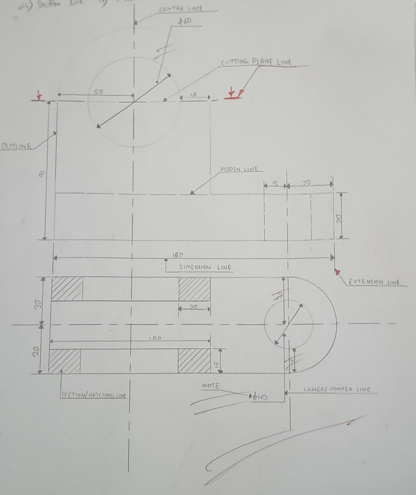
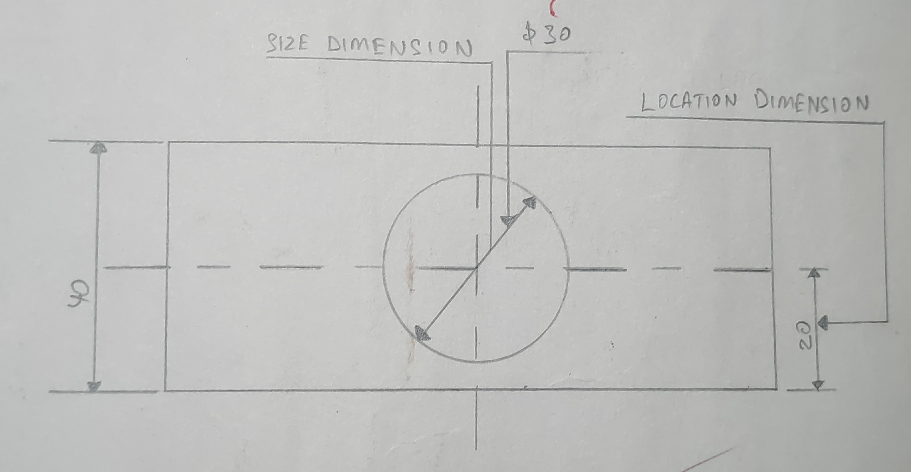
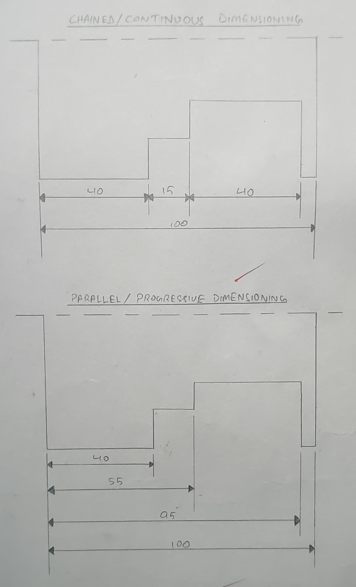
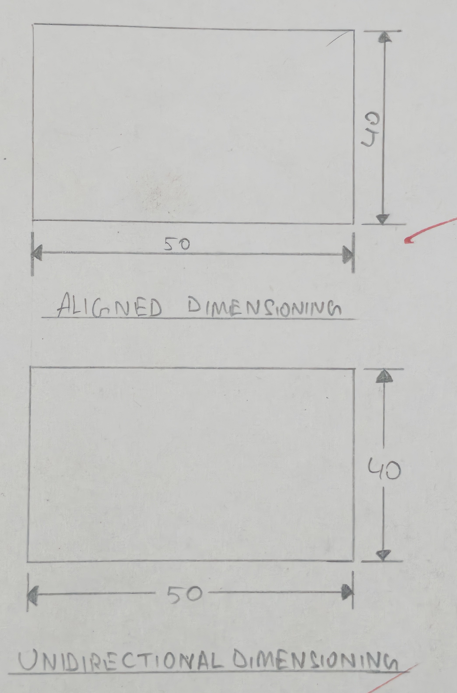

# 1. Write single stroke vertical letters of 20 mm height 

# 2. Write single stroke vertical numerals/figures of 15 mm height. 

# 3. Write single stroke italic letters of 15 mm height 

# 4. Write single stroke italic numerals of 15 mm height. 

# 5. Write the following in single stroke vertical style. Take height of figures as 15 mm. 

1. .679 
2. 2 3/7 

# 6. Write the following in any convenient style by maintaining single stroke. Take height of letters as 20 mm. 
1. GROW MORE FOOD 

# 7. In a simple drawing of your room, show the following lines, generally used in engineering graphics. 
1. Outline
2. Center line 
3. Cutting plane line 
4. Dimension line 
5. Extension line 
6. Leader 
7. Note 
8. Section line 
9. Hidden line 

# 8. Differentiate the following with the help of drawing 
1. Size dimension and location dimension 
2. Chained or continious and parallel or progressive dimensioning 

9. Differentiate between aligned and unidirectional dimensioning with the help of drawing. 

