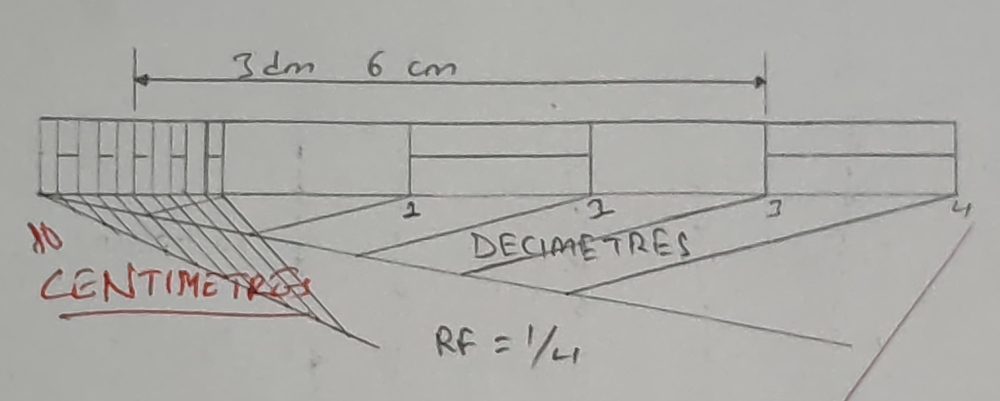
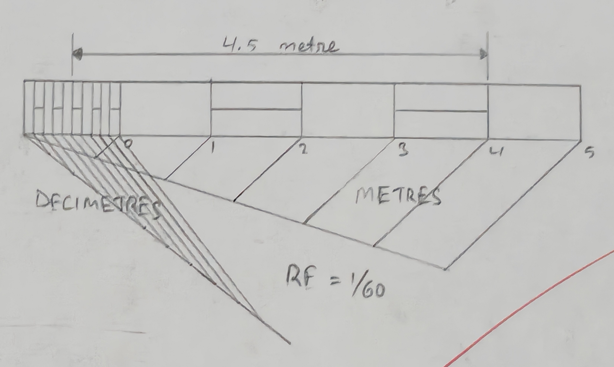
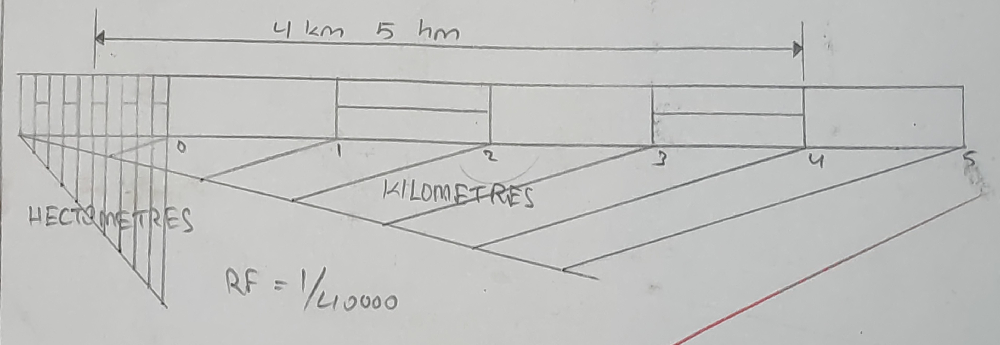
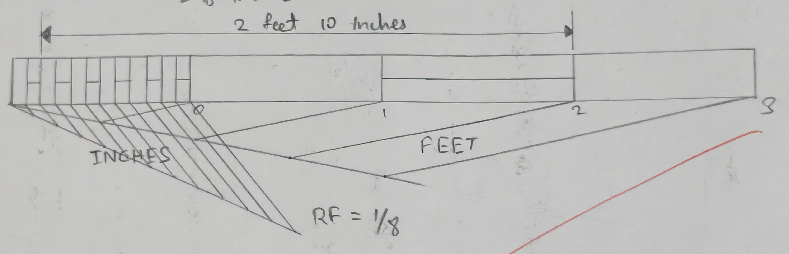
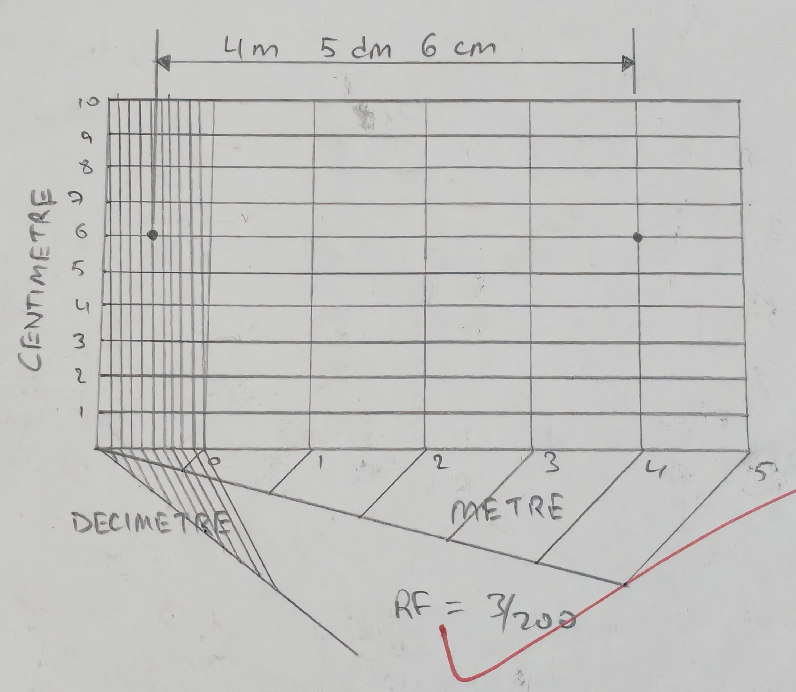
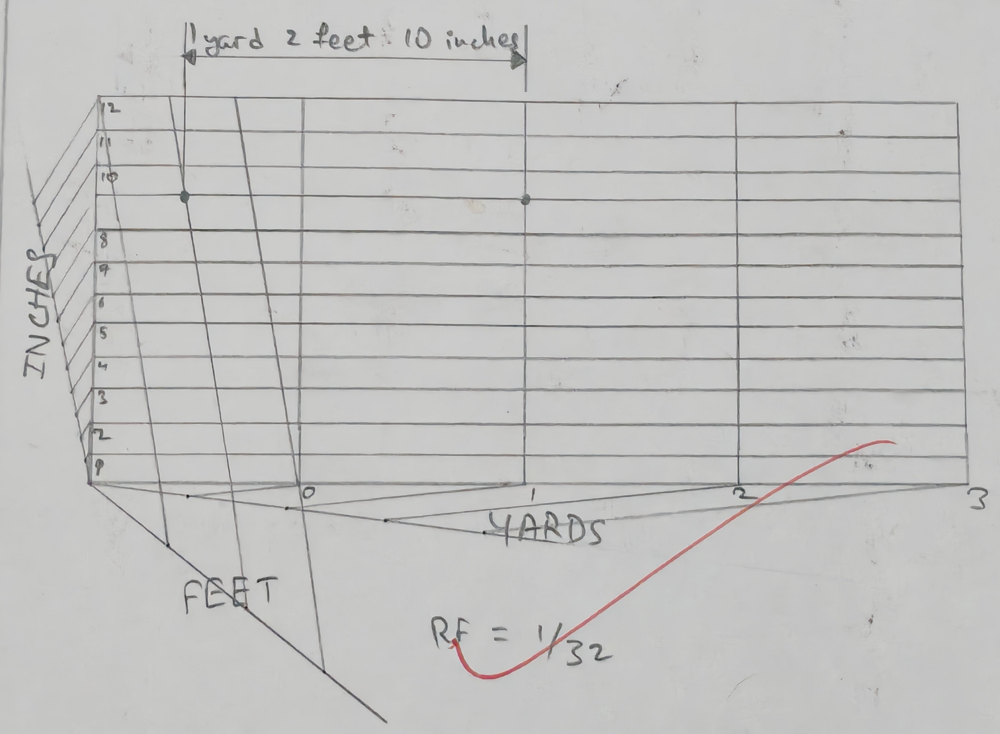
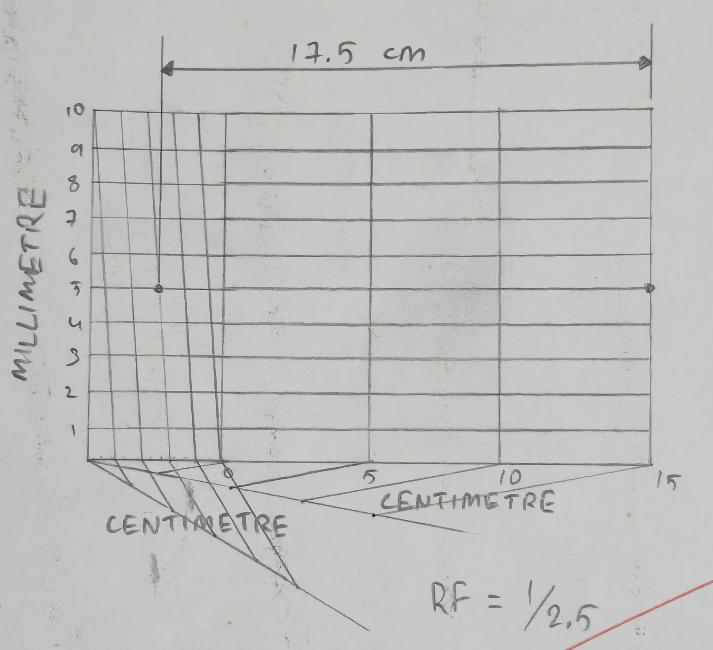
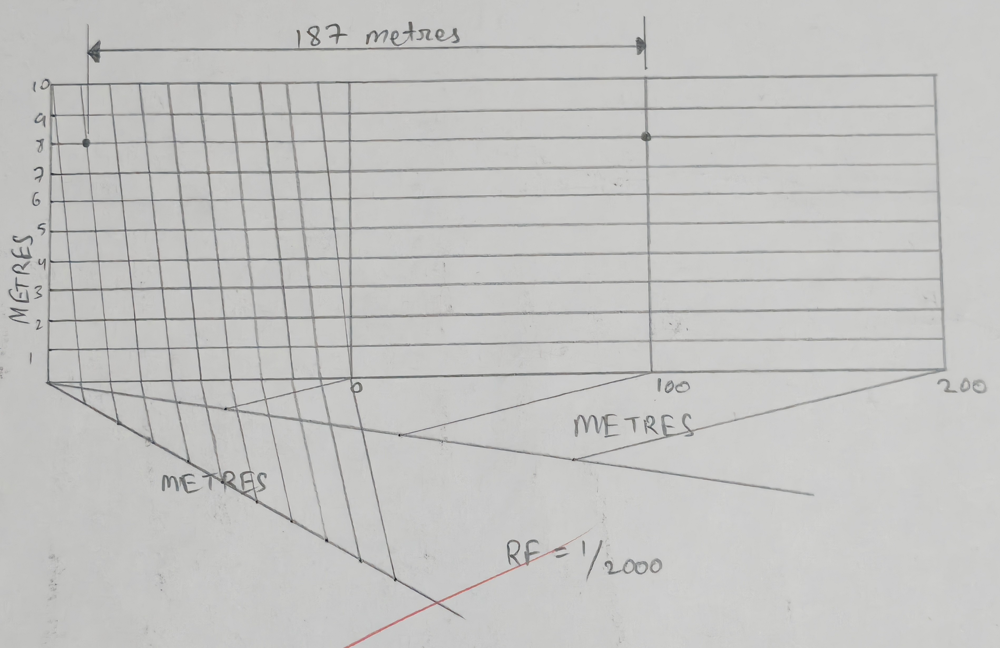

## 1. Construct a scale of 1:4 to show centimeter and long enough to measure upto 5 decimeters. Show a length of 3.5 decimeters in the scale. 
Given,  
RF = 1/4 

Here, Length of the scale = $RF \times \text{max. length required to be measured}$  
$\implies 1/4 \times 5 \text{dm}$  
$\implies 1/4 \times 5 \times 10 \text{cm}$  
$\implies 12.5 \text{cm}$

## 2. Draw a scale of 1:60 to show meters and decimeters and long enough to measure upto 6 meters. Mark a distance of 4.5 meter on the scale. 
Given,  
$RF = 1/60$
Length of the scale = $RF \times \text{max. length to be measured}$  
$\implies 1/60 \times 6 m$  
$\implies 1/60 \times 6 \times 100 \text{cm}$  
$\implies 10 \text{cm}$

## 3. To construct a plain scale to show kilometers and hecctometers when 25 cm are equal to 1 kilometer and long enough to measure upto 6 kilometers. Find RF and indicate a distance of 4 kilometers and 5 hecctometers on the scale. 
We know that,  
$RF = \frac{\text{Length of the drawing}}{Actual length}$  
$\implies \frac{2.5 \text{cm}}{1 \text{km}}$  
$\implies \frac{2.5 \text{cm}}{1000 \times 100 \text{cm}}$  
$\implies \frac{1}{4000}$

Now,  
Length of the scale = $RF \times \text{Max. length required to be measured}$  
$\implies 1/4000 \times 6 \times 1000 \times 100$  
$\implies \frac{60}{4}$  
$\implies 15 cm$

## 4. Construct a scale of 1.5 inches = 1 foot to show inches and long enough to measure upto 4 feet. Measure and mark a distance of 2 feet and 10 inch on the scale. 
Given, 
1.5 inches = 1 foot  
$\therefore 1 \text{inch} = \frac{12 \text{inch}}{1.5} = 8 \text{inches}$  
$\therefore RF = \frac{1 \text{inch}}{8 \text{inche}} = 1/8$  

Lenght of the scale = $RF \times \text{max. length to be measured}$  
$\implies 1/8 \times 4 \text{foot}$  
$\implies 1/8 \times 4 \times 12$  
$\implies 6 \text{inches}$ 

## 5. Construct a diagonal scale of 3:200, i.e., 1:66 3/2 showing meters, decimeters and centimeters and long enough to measure upto 6 meters. Show a distance of 4 meter and 5 decimeter and 6 centimeter in the scale. 
Given,  
$RF = \frac{3}{200}$

Hence,  
Length of the scale = $RF \times \text{max. length of the scale}$  
$\implies 3/200 \times 6 m$  
$\implies 3/200 \times 6 \times 100 \text{cm}$  
$\implies 9 \text{cm}$

## 6. Construct a diagonal scale of RF = 1/32. Showing, yards, foot and inches, and to measure upto 3 yards. Indicate on the scale a distance of 1 yard, 2 feet and 10 inches. 
Given,  
Length of the scale = RF $\times$ max. length to be measured  
$\implies 1/32 \times 4 yard$  
$\implies 1/32 \times 4 \times 5 \times 12 \text{inches}$  
$\implies 4.5 \text{inches}$ 

## 7. Draw a diagonal scale of 1:2.5 showing centimeters and millimeters and long enough to measure upto 20 centimeters. Measure and mark a distance of 17.5 cm on the scale. 
Given,  
RF = 1/2.5   
$\therefore$ Length of the scale = RF $\times$ max. length to be measured  
$\implies 1/2.5 \times 20 \text{cm}$  
$\implies 8 \text{cm}$

## 8. On a map of 22 cm long line represents a distance of 440 meter. Draw a diagonal scale to measure meters. Show a distance of 187 meters on the scale. 
Here,  
$RF = \frac{\text{Length of the drawing}}{\text{Actual length}}$  
$\implies \frac{22 \text{cm}}{440 \text{m}}$  
$\implies \frac{22 \text{cm}}{440 \times 100 \text{cm}}$  
$\implies 1/2000$

Let, max. length required to me measured be 300 meters.   
$\therefore$ Length of the scale = RF $\times$ max. length to be measured  
$\implies 1/2000 \times 300 \text{m}$  
$\implies 1/2000 \times 300 \times 100 \text{cm}$  
$\implies 15 cm$

