# 1 
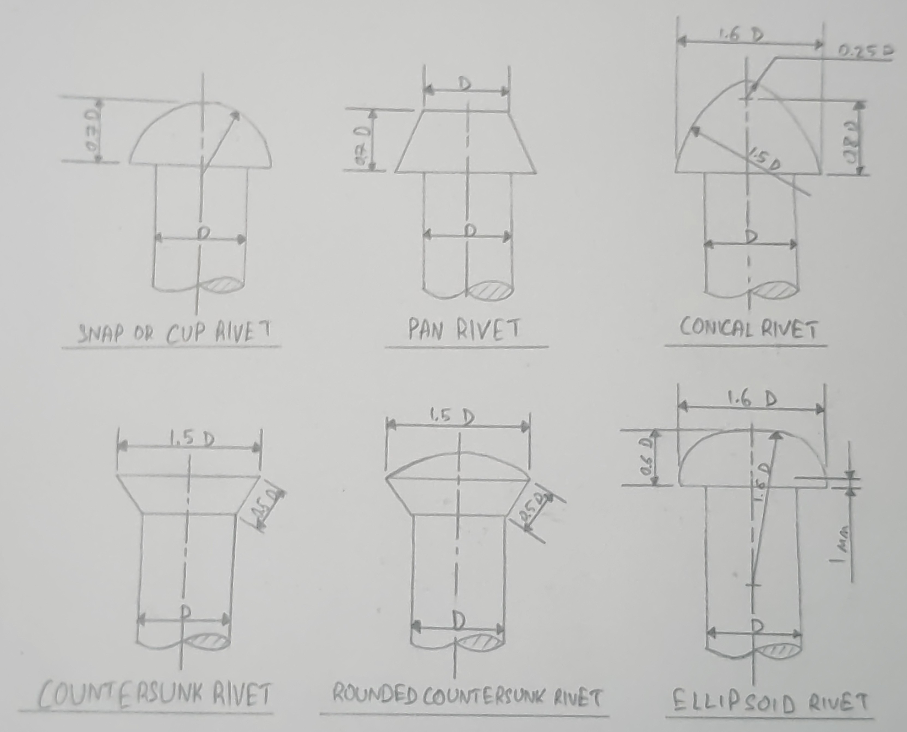

# 2. Single-Riveted Jap Joint
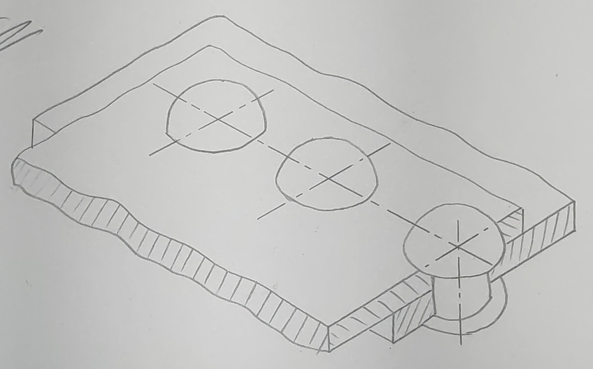
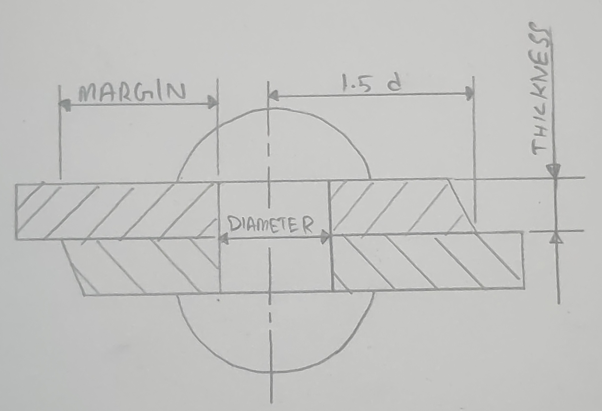
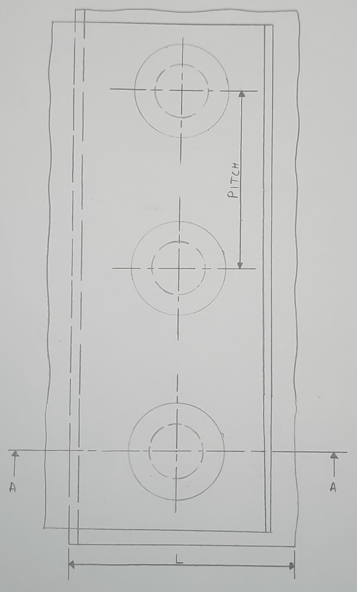

# 3. Double-Riveted (Chain) Lap Joint 
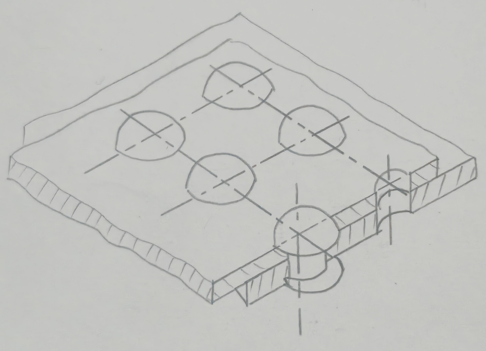
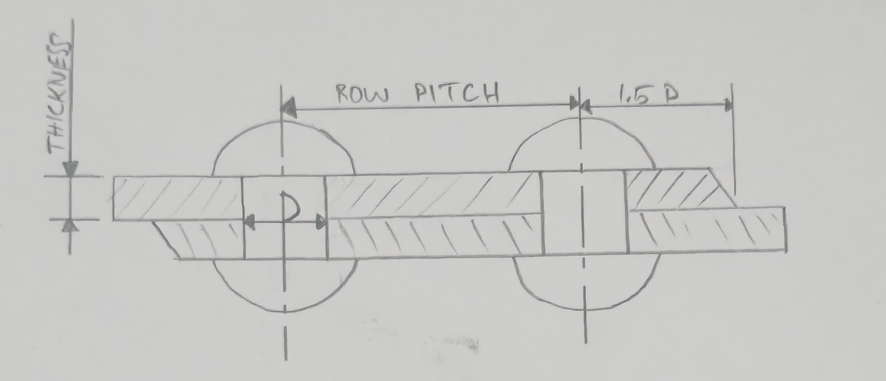
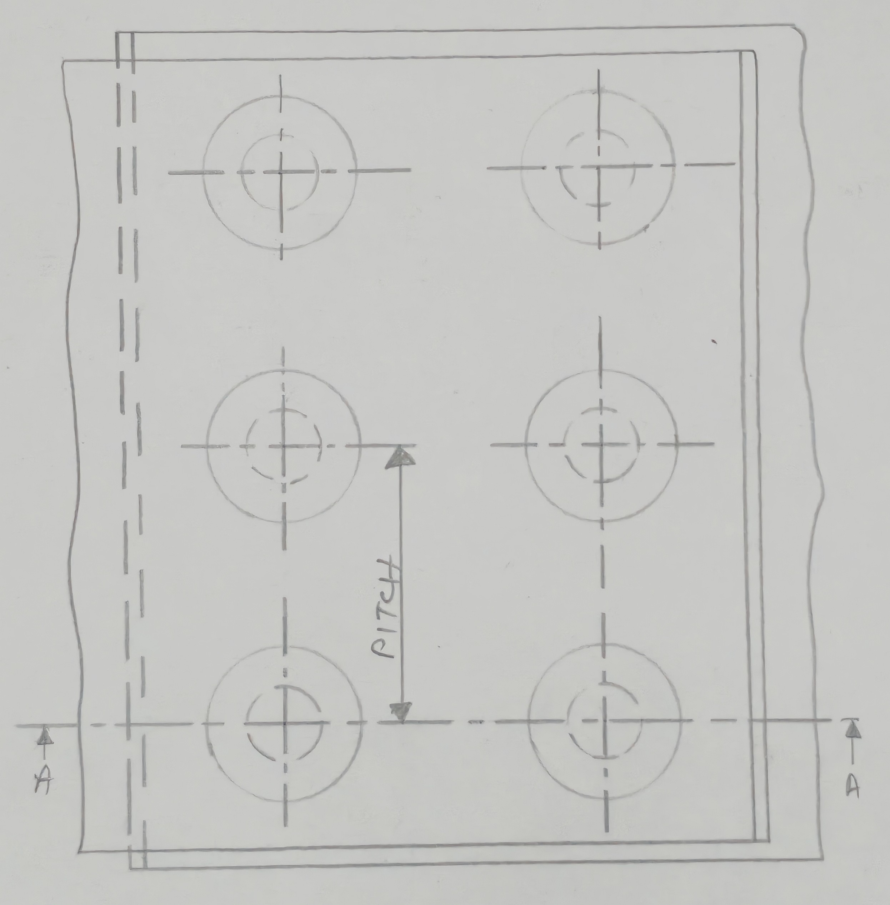

# 4. Double-Riveted (Zigzag) Lap Joint 
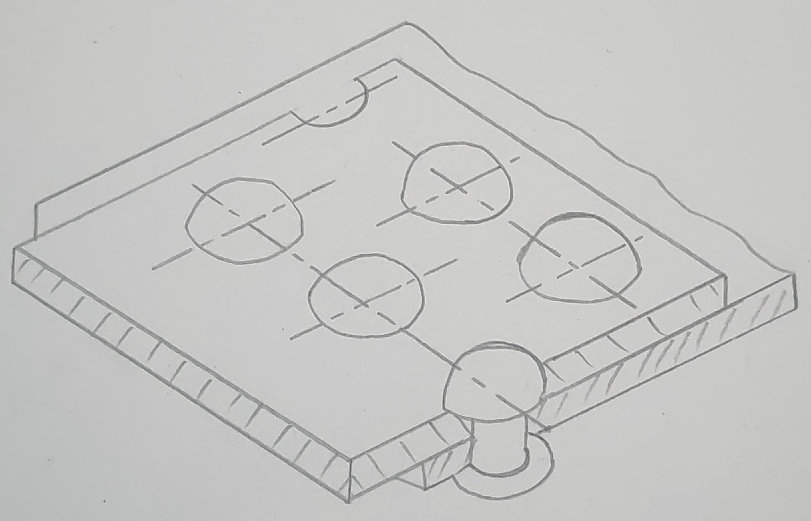

# 5. Single-Riveted (Single Strap) Butt Joint 
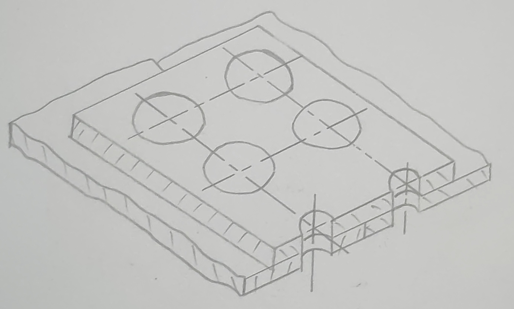

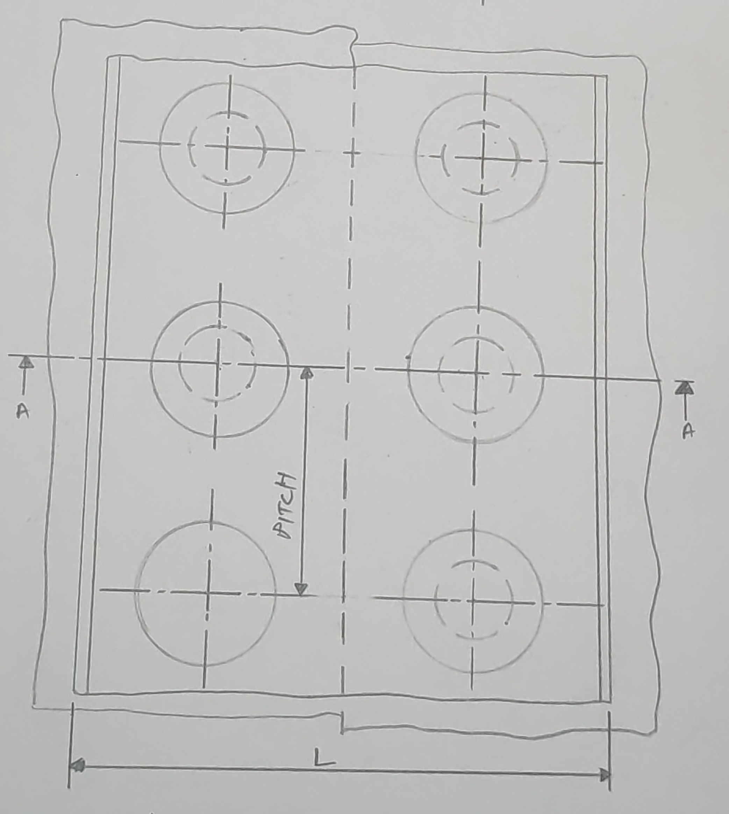

# 6. Single-Riveted (Double Strap) Butt Joint
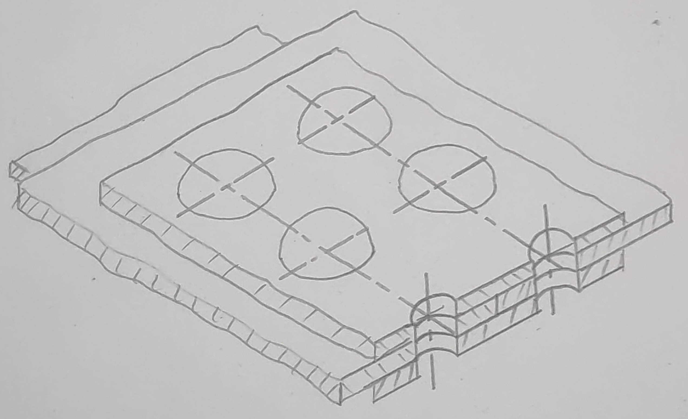
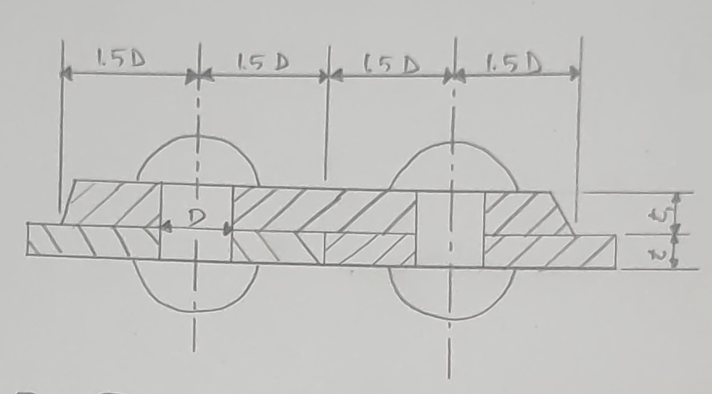
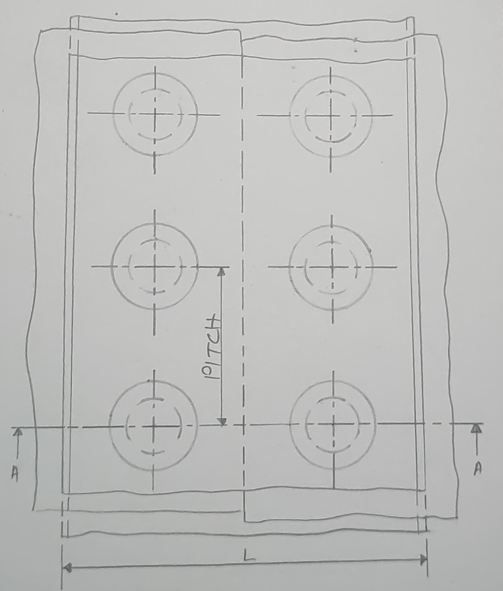

