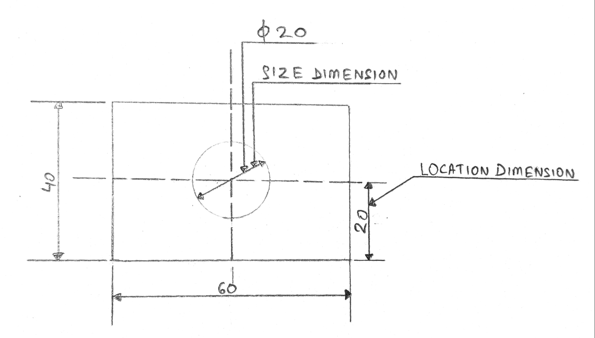
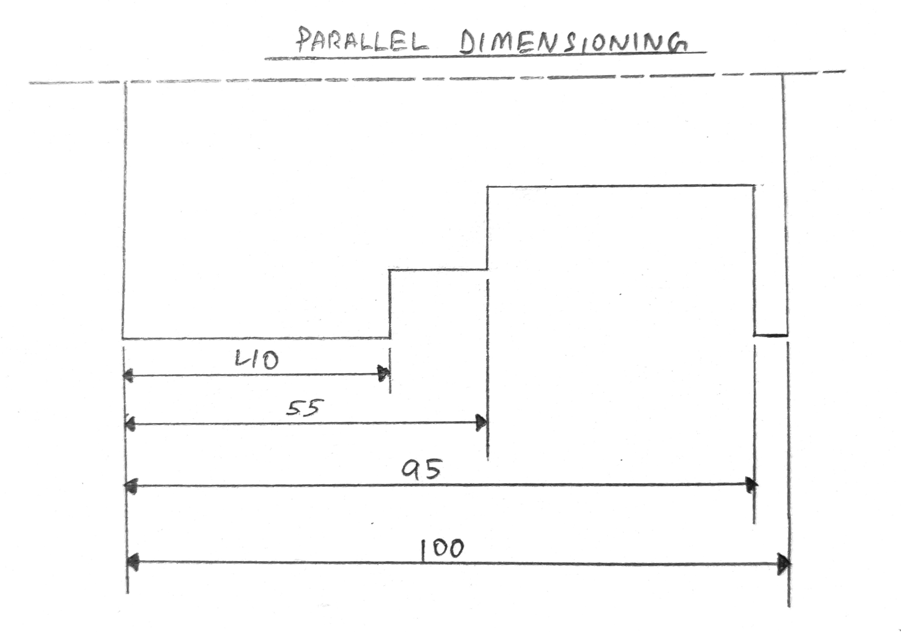
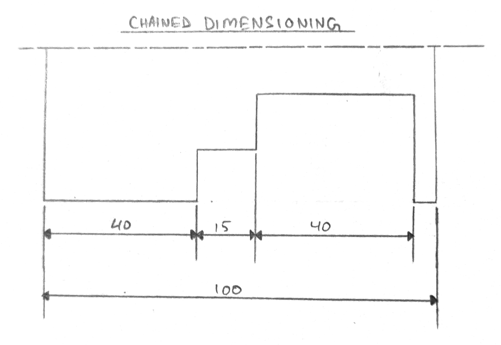

# Prob: Differentiate the following with the help of drawing. 
1. Size dimension and Location Dimension 
2. Chained or Continuous Dimensioning and Parallel or Progressive Dimensioning 

### 1. Size dimension and Location Dimension 
 

### 2. Chained or Continuous Dimensioning and Parallel or Progressive Dimensioning 
  

 
