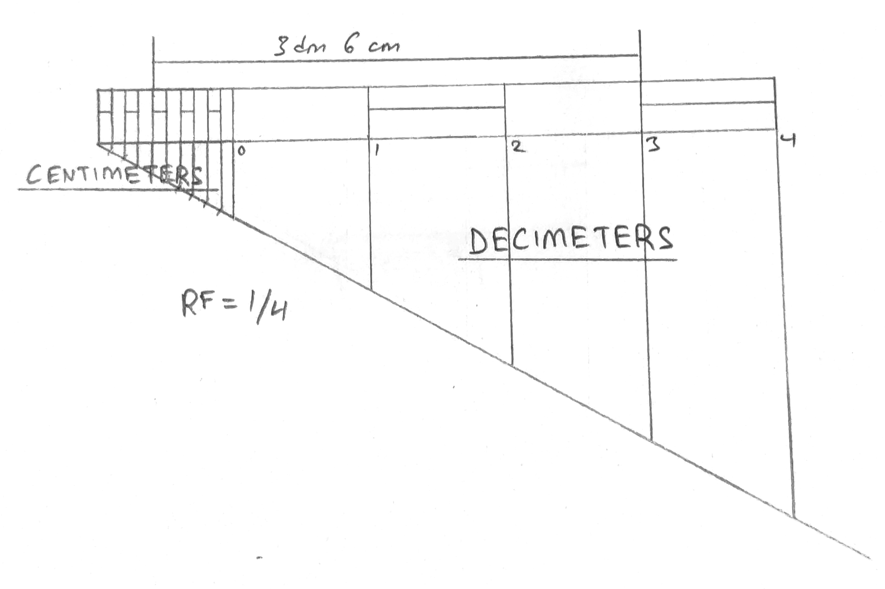

## Prob: Construct a scale of 1:4 to show centimeters and long enough to measure up to 5 decimeters. Show a length of 3.6 decimeters on the scale. 

Given: $RF = 1/4$

$\therefore \text{Length of the scale} = RF \times \text{maximum length required to be measured}$  
$\implies 1/4 \times 5 dm$  
$\implies 1/4 \times 5 \times 10 cm$  
$\implies 12.5 cm$

