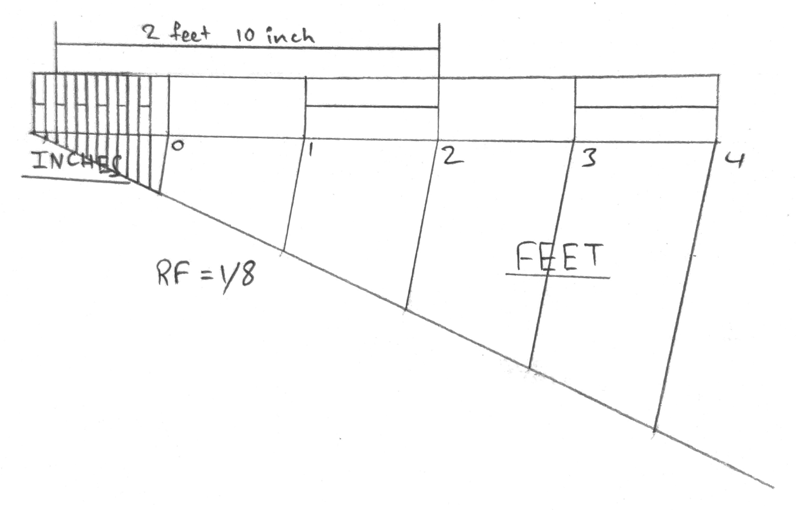

## Construct a scale of 1.5 inches = 1 foot to show inches and long enough to measure up to 4 feet. Measure and mark a distance of 2 feet and 10 inches on the scale. 

Here, given that $1.5 inch = 1 foot$

$$
1 inch = \frac{12 \text{inch}}{1.5} = 8 \text{inch}
RF = \frac{1 \text{inch}}{8 \text{inch}} = 1/8 
$$

$\text{Length of the scale = RF \times \text{Maximum length required to be measured}}$  
$\frac{1}{8} \times 4 \times 12 = 6 inch$  
$\implies 6 \text{inch} \times 2.54 = 15.24 cm$

 
