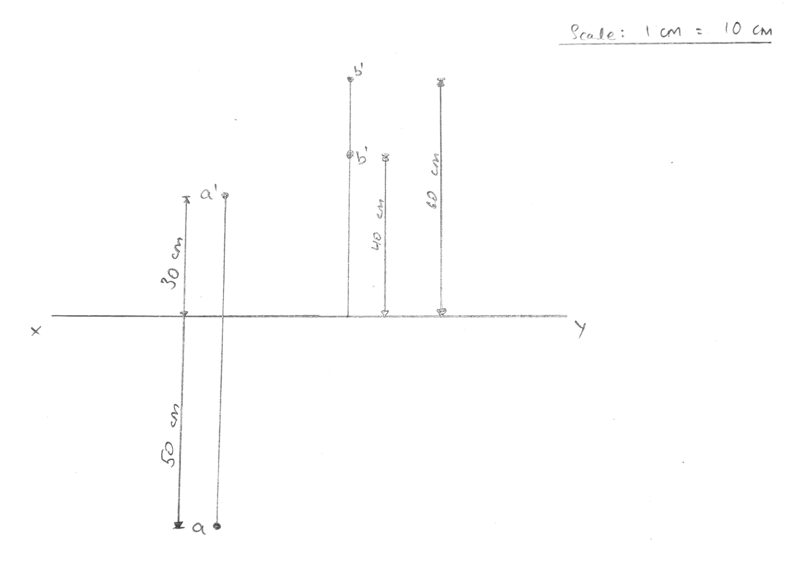

## A point A is lying 30 cm above horizontal plane (HP) and 50 cm in front of vertical plane (VP). And point B is lying 40 cm above the HP and 60 cm behind the VP. Draw the projection of the points. Distance between the projectors is 3 cm. 

