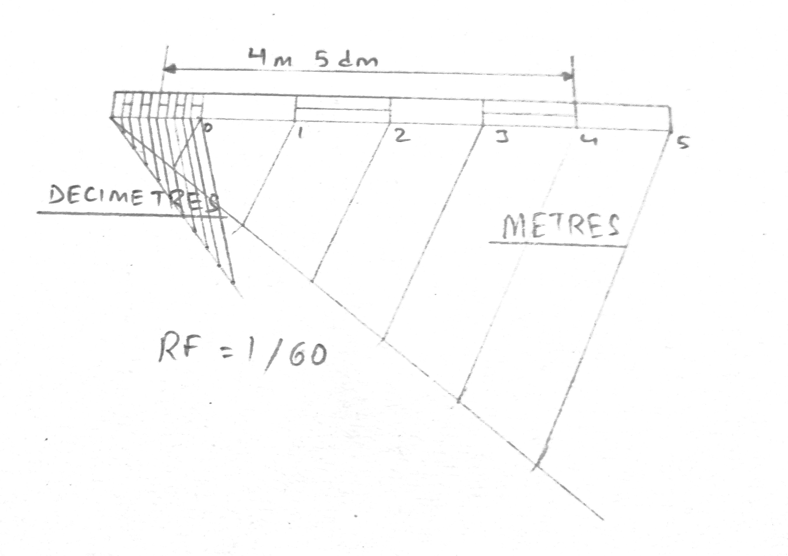

## Draw a scale of 1:60 to show meters and decimeters and long enough to measure upto 6 meters. Measure and mark a distance of 4.5 meters on the scale. 

$RF = 1/60$  
$\text{Length of Scale} = \frac{1}{60} \times 6 \times 100 = 10 \text{ cm}$

