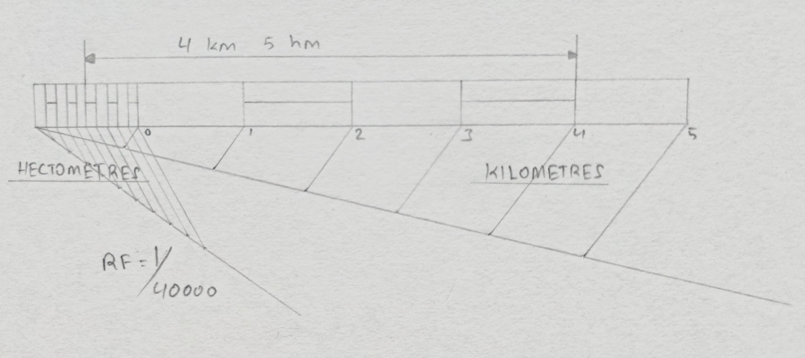

## Construct a plain scale to show kilometers and hectometers when 2.5 cm are equal to 1 kilometer and long enough to measure upto 6 kilometers. Find RF and indicate a distance of 4 kilometers and 5 hectometers on the scale. 

$\text{Given, } 2.5\ cm = 1 kilometer$  
$\therefore \frac{\text{Length of Drawing}}{Given Length} = \frac{2.5}{1 \times 1000 \times 100} = \frac{1}{40000}$

$\text{Length of the scale} = \frac{1}{40000} \times 6 \times 1000 \times 100\ cm = 15\ cm$ 

