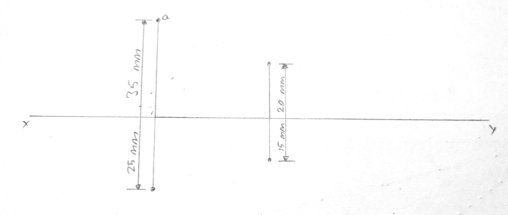

## A point $A$ is 35 mm above HP and 25 mm in front of VP. Another point $B$ is 20 mm above HP and 15 mm in front of VP. The distance between their projectors is 40 mm. Draw the projections of the point $A$ and $B$ and find the distance between them.

$$
\text{Distance between A and B in vertical plane} = 35 - 20 = 15 mm \\ 
\text{Distance between A and B in horizontal plane} = 25 - 15 = 10 mm
$$
