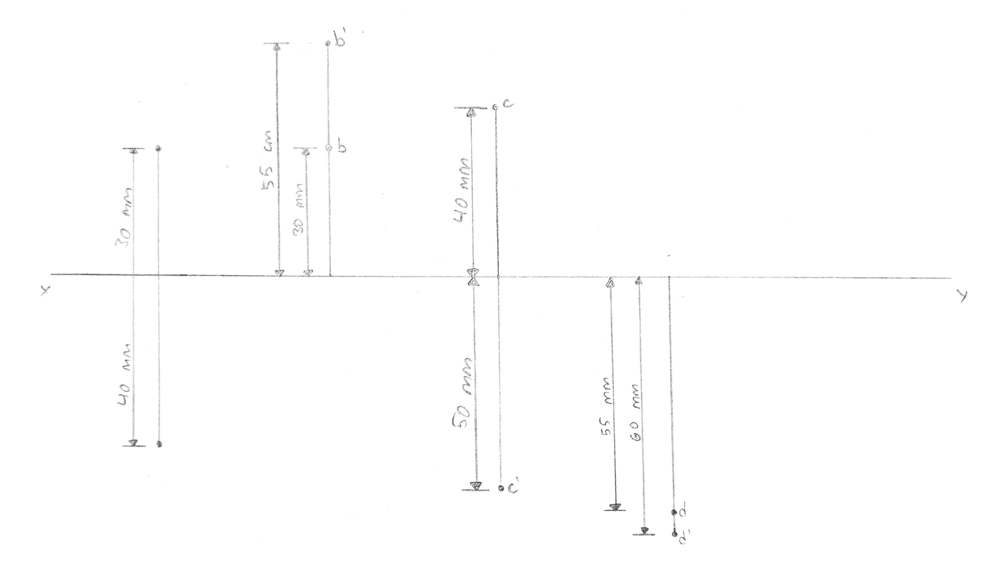

## Draw the projection of the following points: 
1. Point 'A' is 30 mm above HP and 40 mm in front of VP. 
2. Point 'B' is 55 mm above HP and 40 mm behind VP. 
3. Point 'C' is 50 mm below HP and 40 mm behind VP. 
4. Point 'D' is 60 mm below HP and 40 mm in front of VP. 

Distance between the projectors is 40 mm. 

 
