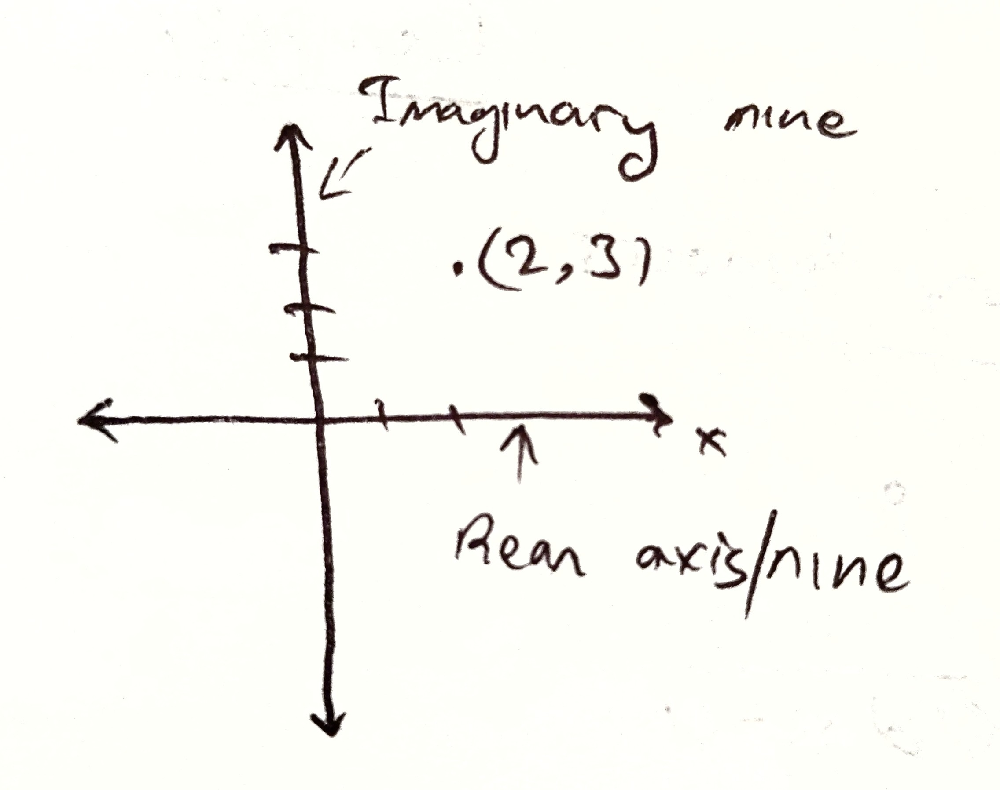

# Complex Numbers 
> 20/08/2025

E.g.: $\sqrt{-1} = i$  
$\sqrt{-16} = \sqrt{(16)\times (-1)}$  
$\implies 4\sqrt{-1}$  
$\sqrt{-16} = 4i$

$\sqrt{-47} = \sqrt{47\cdot(-1)}$  
$\implies \sqrt{47}\sqrt{-1}$  
$\implies = i\sqrt{47}$

If $a > 0$  
$\sqrt{-a} = i\sqrt{a}$

----------

$x^2 - 2 = 0$  
$x^2 = 2$  
$x = \pm \sqrt{2}$

$x^2 + 1 = 0$  
$x^2 = -1$  
$x = \pm\sqrt{-1}$  
$x = \pm i$

$x^2 + 10 = 0$  
$x^2 = 10$  
$x = \pm \sqrt{10}$

----------

$z = a + ib$ ['a' and 'b' are real numbers]  
$\therefore a: \text{ real part}$  
$& ib = \text{ imaginary part}$

$\text{If } a = 0,$  
$z = ib$; purely imaginary  
$\text{If } b = 0$  
$z = a$; real number 

$\therefore$ Real numbers are a subset of complex numbers.  
$\therefore$ Complex numbers are the largest set of numbers.

----------

If, $z = a + ib$   
$\therefore$, $z$ can be written in the form, $z = (a, b) 

If a = 2; b = 3 

$z = 2 + 3i$ 

# Complex Conjugate $(\bar{z})$
$z = a + ib$  
$\overline{z} = a - ib$

Here, $\overline{z}$ is the complex conjugate of $z$.

If, 

$z = - 10 - 5i$
$\therefore \overline{z} = -10 + 5i$

else, 

$z = 10i$
$\overline{z} = -10i$

1. $z_1 + z_2 = (a_1 + a_2) + i(b_1 + b_2)$
2. $z_1 - z_2 = (a_1 - a_2) + i(b_1 + b_2)$

----------
 
#### Sum of $2 + 5i$ and $-10 - 3i$
$z_1 = 2 + 5i$  
$z_2 = -10 - 3i$ 

$z_1 + z_2 = (2 -10) + (5i - 3i)$  
$\implies -8 + 2i$

#### Subtract $2 + 5i and -10 - 3i$ 
$z_1 - z_2 = {2 - (-10)} + i{5 - (-3)}$  
$\implies 12 + 8i$

#### Multiply 
$z_1 \cdot z_2 = (a+ib_1) (a_2 + ib_2)$  
$\implies a_1a_2 + a_1ib_2 + a_2ib_1 + i^2b_1b_2$  
$\implies $

----------

$i, i^5, i^9, i^13 = i$  
$i^2, i^6, i^{10}, i^{14} = -1$  
$i^3, i^7, i^{11}, i^{15} = -i$  
$i^4, i^8, i^{12}, i^{16} = 1$

$i = \sqrt{-1}$  
$i^2 = (\sqrt{-1})^2$  
$i^3 = i^2\times i$  
$i^4 = (i^2)^2 = (-1)^2 = 1$ 

$i^5 = i^4 \cdot i = i$  
$i^6 = i^4 \cdot i^2 = -1$  
$i^7 = i^4\cdot i^3 = -i$  
$i^8 = (i^4)^2 = 1$ 

