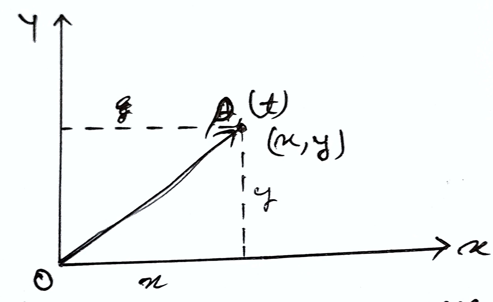

# Scalars and Vectors
- **Scalars:** Physical quantities with only magnitude. Specified by single number along with a proper unit. E.g.: mass, volume, time, temperature, etc. 
- **Vectors:** Physical quantity with both magnitude and direction. Specified by a number, with its unit and direction. E.g.: force, momentum, velocity, displacement, etc. 

## Representation of Vector 
- A vector quantity is represented by a straight line with an arrowhead over it. The length of the line give magnitude and the arrowhead gives the direction. E.g.: suppose a body is moving with velocity 10 km/h along east. Then, 

Let, 

$10 km/h = 1 \text{cm}$  
$40 km/h = 4 \text{cm}$

## Position and Displacement Vector 
- A vector which gives position of an object with reference to the origin of a coordinate system is called position vector. 

Consider the motion of an object in x-y plane with origin O. Let the object be at point P at any instance of time t, then $\overrightarrow{OP}$ is the position vector of the body. The position vector provides two information, 

1. It tells the straight line distance from origin O. 
2. It tells direction of the object with respect to the origin. 

Displacement vector tells us about how much and in which direction an object has changed its position in a given time interval. 

Suppose an object is moving from point P to P' at time inteval (t'-t), then the displacement vector of the object in x-y plane is $\overrightarrow{PP'}$.

