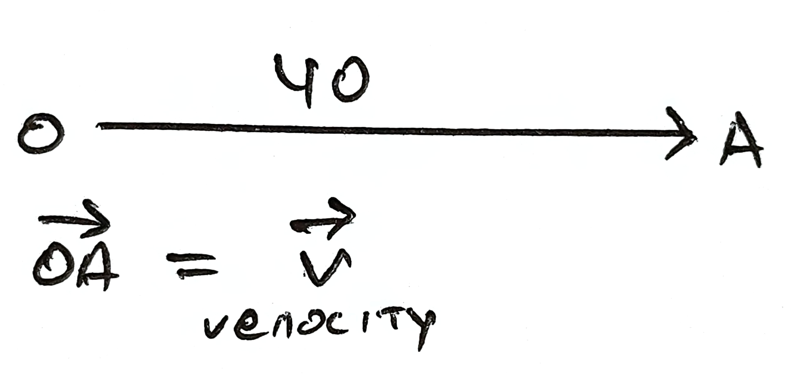
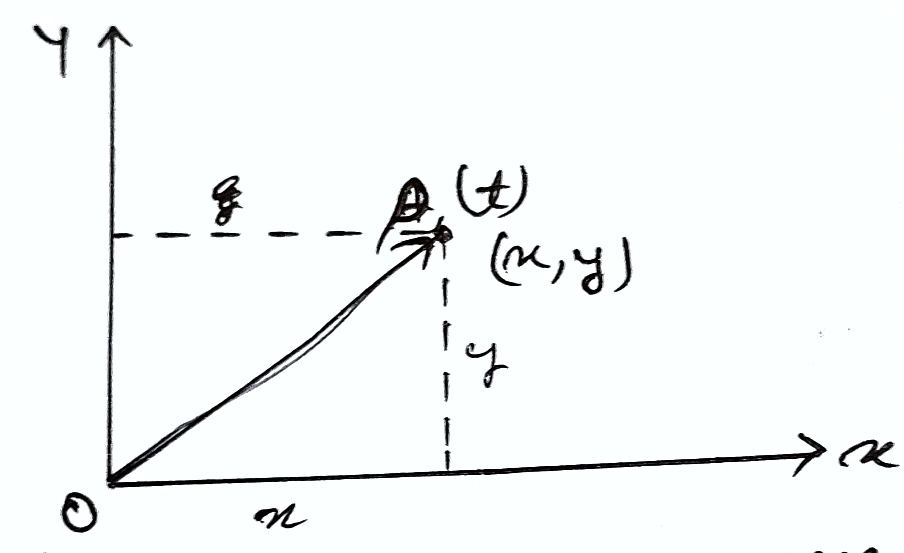
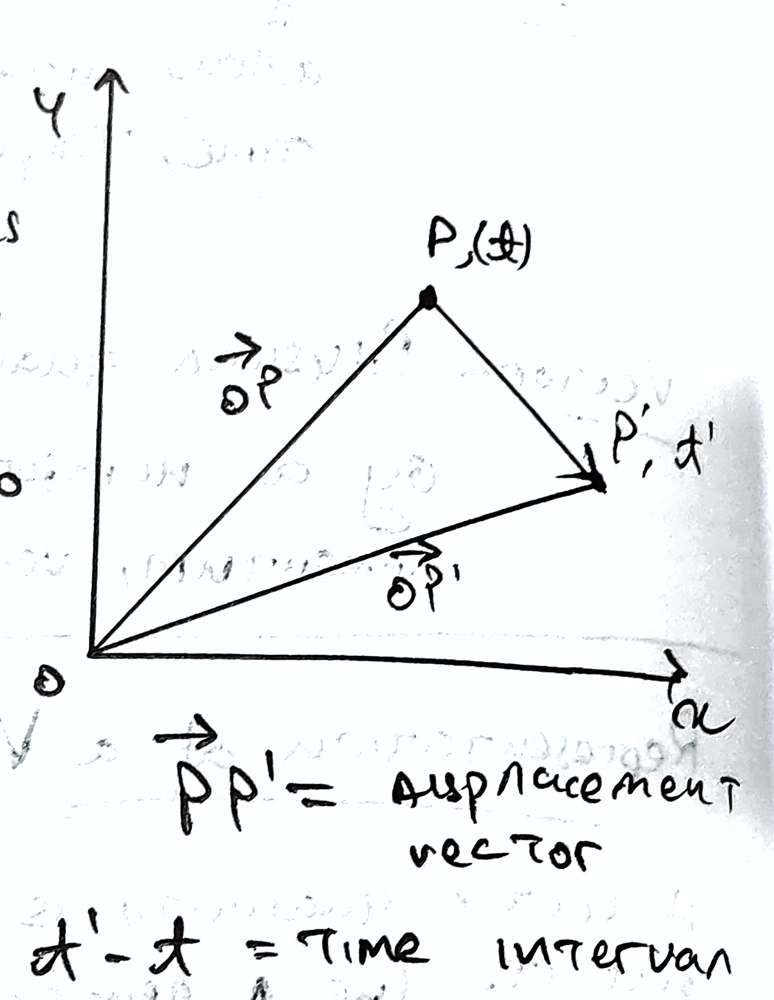
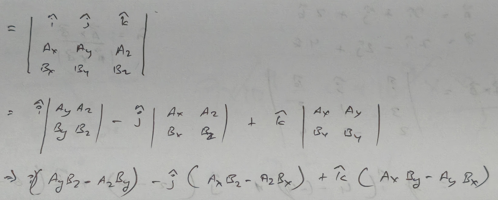

# Scalars and Vectors
- **Scalars:** Physical quantities with only magnitude. Specified by single number along with a proper unit. E.g.: mass, volume, time, temperature, etc. 
- **Vectors:** Physical quantity with both magnitude and direction. Specified by a number, with its unit and direction. E.g.: force, momentum, velocity, displacement, etc. 

## Representation of Vector 
- A vector quantity is represented by a straight line with an arrowhead over it. The length of the line give magnitude and the arrowhead gives the direction. E.g.: suppose a body is moving with velocity 10 km/h along east. Then, 

Let, 

$10 km/h = 1 \text{cm}$  
$40 km/h = 4 \text{cm}$

## Position and Displacement Vector 
- A vector which gives position of an object with reference to the origin of a coordinate system is called position vector. 

Consider the motion of an object in x-y plane with origin O. Let the object be at point P at any instance of time t, then $\overrightarrow{OP}$ is the position vector of the body. The position vector provides two information, 

1. It tells the straight line distance from origin O. 
2. It tells direction of the object with respect to the origin. 

Displacement vector tells us about how much and in which direction an object has changed its position in a given time interval. 

Suppose an object is moving from point P to P' at time interval (t'-t), then the displacement vector of the object in x-y plane is $\overrightarrow{PP'}$.

## Resolution of Vectors 
> 01/09/2025

- Resolution is the process of splitting a vector into 2 or more vectors in such a way that their combined effect is same as that of the given vector. 
    - The splitted components are called **rectangular components**.

Suppose, we want to resolve a vector $\overrightarrow{R}$ in the direction of given 2 vectors $\overrightarrow{A}$ and $\overrightarrow{B}$.

$$
\overrightarrow{OP} \parallel $\overrightarrow{A}$ \\
\therefore \overrightarrow{OP} = \lambda A \\

\text{Similarly,} \\ 
\overrightarrow{PQ} \parallel B \\
\therefore \overrightarrow{PQ} = \mu B
$$

Where $\lambda$ and $\mu$ are scalars. 

According to Triangular Law of Vector Addition, 

$$
\overrightarrow{OQ} = \overrightarrow{OP} + \overrightarrow{PQ} \\ 
\overrightarrow{R} = \lambda\overrightarrow{A} + \mu\overrightarrow{B}
$$

Thus, $\overrightarrow{R}$ is resolved in the direction of $\overrightarrow{A}$ and $\overrightarrow{B}$.  
Here, $\lambda \overrightarrow{A}$ is the component of $\overrightarrow{R}$ along A direction.  
Here, $\mu\overrightarrow{B}$ is the component of $\overrightarrow{R}$ along B direction.

## Unit Vectors
- These are $\hat{i}, \hat{j}\ \&\ \hat{k}$  

$$
|\hat{i}| = |\hat{j}| = |\hat{k}| = 1
$$

--- 

$\overrightarrow{A} = A_x\hat{i} + A_y\hat{j} + A_z\hat{k}$  
$A = \sqrt{A_x^2 + A_y^2 + A_z^2}$

---

And,  
$\overrightarrow{A} = \sqrt{A_x^2 + A_y^2 + A_z^2} = |A|$

## Scalar Product or Dot Product of Vectors 
- The scalar product of two vectors $\overrightarrow{A}$ and $\overrightarrow{B}$ is defined as the product of magnitude of $\overrightarrow{A}$ and $\overrightarrow{B}$ and the cosine of the angle between them. 

Mathematically, 

$\overrightarrow{A} \cdot \overrightarrow{B} = AB \cos \theta$

- E.g.: 
    1. Work done, $W = \overrightarrow{F} \cdot \overrightarrow{S}$  
    2. Magnetic Flux, $\Phi = \overrightarrow{B} \cdot \overrightarrow{A}$

## Properties of Scalar Product 
1. $\overrightarrow{A} \cdot \overrightarrow{B} = \overrightarrow{B} \cdot \overrightarrow{A}$
    - Scalar product is commutative (Commutative Law) 
2. $\overrightarrow{A} \cdot (\overrightarrow{B} + \overrightarrow{C}) = \overrightarrow{A} \cdot \overrightarrow{B} = 0$
    - Scalar Product is distributive over addition (Distributive Property)
3. If $\overrightarrow{A} \perp \overrightarrow{B}, \overrightarrow{A} \cdot \overrightarrow{B} = 0$
    - $\therefore \overrightarrow{A} \cdot \overrightarrow{B} = AB \cos 90\degree$
        - $\cos 90\degree = 0$
4. If $\overrightarrow{A} \parallel \overrightarrow{B}, \overrightarrow{A} \cdot \overrightarrow{B} = AB$
    - $\because \cos 0\degree\ \&\ \cos 180\degree = 1$
5. $\overrightarrow{A} \cdot \overrightarrow{B} = AA \cos 0\degree = A^2$ 
6. $\hat{i} \cdot \hat{j} = 0$
    - $\because$ x-axis $\perp$ y-axis = $\cos 90\degree = 0$
    - $\therefore \hat{i} \cdot \hat{j} = \hat{j} \cdot \hat{k} = \hat{k} \cdot \hat{i} = 0$
7. $\hat{i} \cdot \hat{i} = \hat{j} \cdot \hat{j} = \hat{k} \cdot \hat{k} = 1$
8. $\overrightarrow{A} \cdot \overrightarrow{B} = (A_x\hat{i} + A_y\hat{j} + A_z\hat{k}) (B_x\hat{i} + B_y\hat{j} + B_z\hat{k})$
    - $\overrightarrow{A} \cdot \overrightarrow{B} = A_xB_x + A_yB_y + A_zB_z$
        - $AB\cos\theta = A_xB_x + A_yB_y + A_zB_z$
        - $\cos\theta = \frac{A_xB_x + A_yB_y + A_zB_z}{AB}$

## Vector Product or Cross Product of Two Vectors 
The vector product of 2 vectors $\overrightarrow{A}$ and $\overrightarrow{B}$ is defined as another vector whose magnitude is equal to the product of magnitudes of two vectors and sine of the angle between them. 

$$
\overrightarrow{A} \times \overrightarrow{B} = AB \sin\theta \hat{n}
$$

Direction of $\overrightarrow{A} \times \overrightarrow{B}$ is perpendicular to the plane containing $\overrightarrow{A}$ and $\overrightarrow{B}$

The direction $\hat{n}$ can be found by using **Right-Hand Thumb Rule** by curling the fingers from the first vector to the second vector and the direction of thumb shows their direction. 

E.g.:  
$\text{Torque}, \tau = \overrightarrow{r} \times \overrightarrow{F}$  
$\text{Angular momentum}, \overrightarrow{L} = \overrightarrow{r} \times \overrightarrow{p}$ [$p$ = linear momentum; $\overrightarrow{p} = m\overrightarrow{v}$]

## Properties of Vector Products 
> 02/09/25

1. $\overrightarrow{A} \times \overrightarrow{B} = -\overrightarrow{B} \times \overrightarrow{A}$
    - Vector products are anti-commutative 
2. $\overrightarrow{A} \times (\overrightarrow{B} + \overrightarrow{C}) = \overrightarrow{A} \times \overrightarrow{B} + \overrightarrow{A} \times \overrightarrow{C}$
    - Vector Products are distributive. 
3. If $A \perp B, \overrightarrow{A} \times \overrightarrow{B} = AB$
    - $\sin 90\degree = 1$
4. If $A \parallel B, \overrightarrow{A} \times \overrightarrow{B} = 0$
    - $\sin 0\degree = 0$
5. 
    - $\hat{i} \times \hat{j} = \hat{k} \\ \hat{j} \times \hat{k} = \hat{i} \\ \hat{k} \times \hat{i} = \hat{j}$

6. 
    - $\hat{j} \times \hat{i} = -\hat{k} \\ \hat{k} \times \hat{j} = -\hat{i} \\ \hat{i} \times \hat{k} = \hat{j}$

7. 
    - $\hat{i} \times \hat{i} = 0 \\ \hat{j} \times \hat{j} = 0 \\ \hat{k} \times \hat{k} = \hat{0}$

8. $\overrightarrow{A} \times \overrightarrow{B}$ 

9. $\hat{n} = \frac{\overrightarrow{A} \times \overrightarrow{B}}{|\overrightarrow{A} \times \overrightarrow{B}|}$

10. $\sin \theta = \frac{|\overrightarrow{A} \times \overrightarrow{B}|}{|\overrightarrow{A}|\ |\overrightarrow{B}|}$

