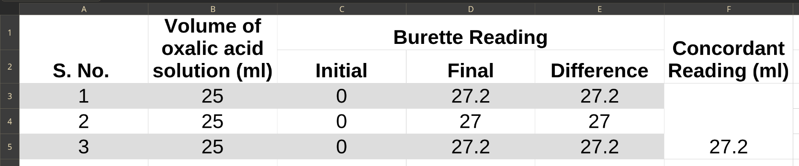

## Aim of the Experiment 
To determine the strength of $KMnO_4$ solution in normality and in gm/L by titrating against standard oxalic acid solution. 

## Apparatus Required 
Burette, Pipette, Conical Flask, Burette Stand, Tripod Stand, Burner, Wire Gauge, etc. 

## Chemicals Required 
$KMnO_4$ solution, Oxalic acid solution (0.1 M), dil. $H_2SO_4$ solution 

## Chemical reaction
$2KMnO_4 + 3H_2SO_4 + 5H_2C_2O_4 \rightarrow K_2SO_4 + 2MnSO_4 + 8H_2O + 10CO_2$ 

## Theory 
In this redox reaction, $KMnO_4$ acts as an oxidizing agent and oxalic acid as the reducing agent. Initially, the reaction is very slow. But as $MnSO_4$ or $Mn^{2+}$ is formed, it can catalyze the rate of reaction. 

The reaction is carried out at a temperature between $60-70\degree C$. This temperature is necessary to overcome the activation energy barrier for the reaction. 

$H_2SO_4$ is used in the titration to provide the acidic medium for the redox reaction. 

No internal indicator is added externally to detect the end point of the titration. $KMnO_4$ itself acts as a self-indicator in the titration. 

The strength of $KMnO_4$ is calculated by using the Normality Equation: 

$$
N_1V_1 = N_2V_2
$$

- Here,
    - $N_1$ = strength of $KMnO_4$ solution 
    - $N_2$ = strength of oxalic acid solution 
    - $V_1$ = volume of $KMnO_4$ solution 
    - $V_2$ = volume of oxalic acid solution 

The gm/L of $KMnO_4$ solution = Normality $\times$ gram equivalent weight = $N_1 \times 31.6$ 

## Procedure 
1. Fill up the burette with $KMnO_4$ solution up to zero level by leveling the upper meniscus of the solution. 
2. Take 25 ml of oxalic acid solution in a conical flask. 
3. Add 10 ml of dil. $H_2SO_4$ solution in it. 
4. Heat the conical flask on a wire gauge to $60-70\degree C$, i.e., to a temperature which is just unbearable to touch by hand. 
5. Now immediately place the conical flask under the burette, and titrate it with $KMnO_4$ solution until a permanent pink color gets developed in the solution. 
6. Record the final reading of the burette. 
7. Repeat the same procedure to get minimum of two concordant readings. 

## Observation 

## Calculation 
$N_1V_1 = N_2V_2$  
$N_1 = \frac{N_2V_2}{V_1} = \frac{0.1 \times 25}{27.2}$  
$N_1 = 0.14 N$

In gm/L = (0.14 $\times$ 31.6) g  
$\implies 4.42\ gm/L$

## Result 
The strength of supplied $KMnO_4$ solution is **0.14 N** or **4.42 gm/L**. 

## Precautions 
1. Always rinse the burette and the pipette with the solution to be taken in them. 
2. Never rinse the conical flask with the experimental solutions. 
3. Remove the air gaps if any, from the burette. 
4. For colorless solutions, always read the lower meniscus and for colored solutions read the upper meniscus. 
5. Never use pipette with a broken nozzle. 
