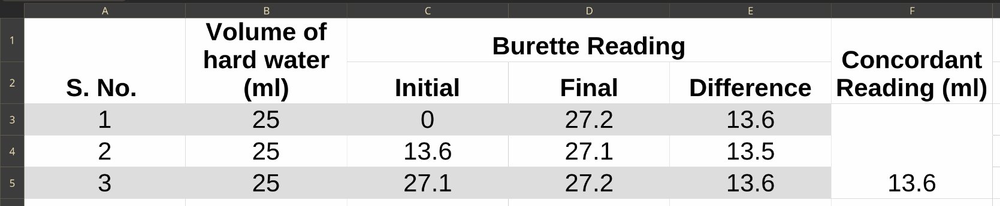

## Aim of the Experiment 
To determine the total hardness and calcium content of supplied hard water sample by EDTA method using Eriochrome Black T (EBT) as indicator. 

## Apparatus Required 
Burette, Pipette, Conical Flask, Burette Stand, Glaze Tiles, Measuring cylinder, etc. 

## Chemicals Required 
Hard water sample, standard EDTA solution, $NH_4Cl - NH_4OH$ buffer solution, EBT indicator 

## Chemical Reaction 
$\underset{(Ca^{2+}/Mg^{2+})}{M^{2+}} + \underset{\text{Blue}}{EBT} \rightarrow \underset{\text{Wine-red}}{[M-EBT]}$

$\underset{\text{Wine-red}}{[M-EBT]} + \underset{\text{Colorless}}{[M-EDTA]} + \underset{\text{Blue}}{EBT}$

## Theory 
In this complexometric titration, the hard water solution is buffered to $p^H ~ 10$ by adding $NH_4Cl - NH_4OH$ buffer solution. At this pH, the $Ca^{2+}/ Mg^{2+}$ ions present in the hard water solution forms weak compounds with the EBT indicator. The color of [M-EBT] is wine red. During the titration with EDTA solution, EDTA replaces the EBT indicator from [M-EBT] by forming a very stable [M-EDTA] complex. Hence, at the end point of the titration, the EBT indicator remains free in the solution, which imparts its characteristic blue color to the solution. Thus, the color changes from wine-red to blue in this titration. 

## Procedure 
1. Fill up the burette with EDTA solution. 
2. Take 25 ml of hard water sample in a conical flask. 
3. Add 10 ml of buffer solution and 2-3 drops of EBT indicator in it. 
4. Now titrate this solution with EDTA until the wine-red color changes to blue solution. 

## Observation

## Calculation 
Total hardness = $\frac{A \times B \times 1000}{\text{ml of sample}}$  
$\implies \frac{13.6 \times 0.3 \times 1000}{25}$  
$\implies 163.2\ ppm$

$Ca$-content = $\frac{13.6 \times 0.6 \times 400.8}{25} = 65.41\ ppm$

## Result 
From the above expirment, it is found that the total hardness of the hard water is **163.2 ppm** and $Ca$-content is **65.41 ppm** of $Ca$. 

## Precautions 
1. Always rinse the burette and the pipette with the solution to be taken in them. 
2. Never rinse the conical flask with the expirmental solution. 
3. Remove the air gaps if any, from the burette. 
4. Never use pipette and burette with a broken nozzle.
5. Do not blow out the last drop of the solution from the pipette. 
