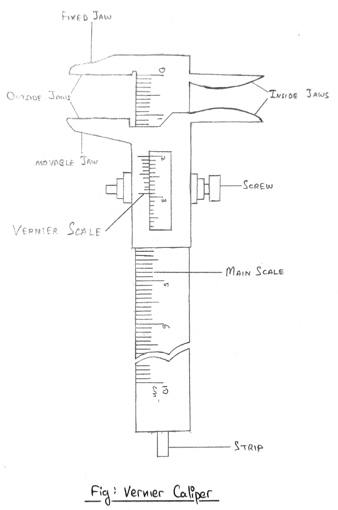
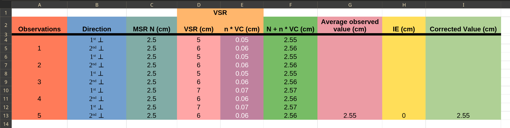

## Aim of the Experiment 
To find the volume of metallic ball using Vernier Caliper. 

## Apparatus Required 
Vernier Caliper and metallic ball. 

## Theory 
To determine the volume of the sphere, we have to determine the diameter of the sphere using Vernier Caliper. 

**Measurement of the diameter**: by holding the sphere between the two jaws diametrically, let $N$ be the reading of main scale (MSR) just before the zero of the Vernier Scale. 

If nth division of the Vernier scale coincides with any divisions of the main scale, then, 

$\text{Vernier Scale Reading} (VSR) = n \times VC \text{cm}$  
$\text{Thus, total diameter} (D) = N + n \times VC$  
$\text{Then, volume of the sphere} (V) = 4/3 \pi (D/2)^3 cm^3$

## Procedure 
1. The value of the smallest division of the main scale is determined. 
2. The number of smallest divisions of the MS which coincide with a total number of Vernier divisions is found. After that, the VC of the instrument is found out. 
3. The movable jaw is made to just touch the fixed jaw and checked whether there is any IE. If it is so, the nature of the error is ascertained, and the value is calculated. To do so, the number of Vernier mark which exactly coincide with any mark of the MS is found. 
4. The jaws are opened, and the sphere is held diametrically between the two jaws A and B. The jaw is adjusted such that it gently grips the sphere without any undue pressure on it. 
5. The main scale reading ($N$) just before the zero of the vernier scale and the division ($n$) of the Vernier scale which exactly coincide with any division of the main scale is noted. 
6. Step 5 is repeated by turning the sphere through $90\degree$.
7. Step 4-6 are repeated along other places of the sphere. 
8. The volume of the sphere is calculated by using the formula cited above. 

## Calculations 
$\text{Mean observed value} = \frac{(2.55 \times 3) + (2.56 \times 5) + (2.57 \times 2)}{10}\ cm$  
$\implies \frac{7.65 + 12.8 + 5.14}{10}\ cm$  
$\implies \frac{25.59}{10}\ cm$  
$\implies 2.55\ cm$ 

$\text{Volume} = 4/3 \times \pi \times (D/2)^3\ cm^3$  
$\implies 4/3 \times \pi \times (2.55/2)^3\ cm^3$  
$\implies 4/3 \times \pi 8.29/8\ cm^3$  
$\implies 8.29/3 \times 22/7\ cm^3$  
$\implies 2.76 \times 22/7\ cm^3$  
$\implies 60.72/7\ cm^3$  
$\implies 8.67\ cm^3$

## Observations 
1. Readings 
    1. Value of smallest division of MS = 0.1 cm 
    2. A number of smallest divisions of the MS which coincides with the total number of Vernier divisions = 9 
2. **Calculations of VC and IE**
    - $10 VSD = 9 MSD$ 
    - $VC = 1/10 \times 0.1 cm = 0.01 cm$
    - $IE = 0 cm$
3. **Table for measurement of the diameter of the sphere** 
    - 
4. **Calculation**: the volume of the sphere is 
    - $V = 4/3 \pi (D/2)^3 cm^3 = 8.67 cm^3$ 
5. **Result**: the volume of the sphere is $8.67 cm^3$
6. **Precautions**
    1. Make sure to check for instrumental error before calculation. 
    2. Always consider parallax error while observing. 
    3. Do not change the sphere during the experiment. 

