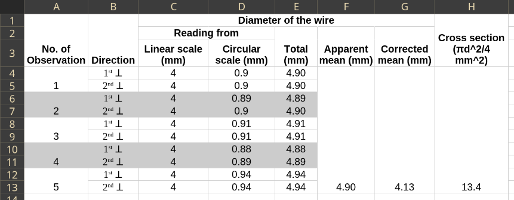

## Aim of the Experiment 
To find the cross-sectional area of a metallic wire. 

## Apparatus Required 
Screw Gauge, metallic wire 

## Theory 
$\text{Least count} = \frac{\text{Pitch}}{\text{No. of circular scale divisions}}$

$\text{Diameter (d) of a wire} = (\text{linear scale reading}) + (\text{circular scale reading} \times \text{least count}) - (\pm \text{instrument error})$

$\text{Cross section} = \frac{\pi d^2}{4}, \text{where d = diameter of wire}$

## Procedure 
1. The number of divisions in the circular scale is counted and the value of one small division of the linear scale is ascertained. 
2. The pitch of the screw is determined by observing the distance through which the edge of the circular scale moves for one complete rotation of the milled head. From this, least count is worked out. 
3. The instrumental error is determined by making the plane face A and B just touch each other. One face must not be pressed hard against the other. 
4. The wire is introduced between the plane face A and B and the milled head is turned in one direction only till the faces A and B just held. With gentle pressure only, the wire is pressed. Too much pressing may alter the diameter of the wire. 
5. The last visible mark of the linear scale is read. Then the circular scale reading against the reference line is taken. 
6. At each position, two reading in directions at right angles to each other are taken. 
7. Operations 4, 5 and 6 are repeated for at least five positions along the length of the wire. 

## Observation 
- No. of divisions of circular scale = 100 
- Value of one division of linear scale = 1 mm 

For one complete rotation of circular scale, the screw gauge moves through one division of linear scale. 

- Pitch = 1 mm 
- Least count = 0.01 mm 
- Instrument error = $n \times LC$
    - $\implies 77 \times 0.01$
    - $\implies 0.77\ mm$

 

## Calculation 
$\text{Average total} = \frac{4.90 + 4.90 + 4.89 + 4.90 + 4.91 + 4.91 + 4.88 + 4.89 + 4.94 + 4.94}{10} = 4.90 \text{ mm}$

$\text{Corrected mean} = 4.90 - 0.77 = 4.13 \text{ mm}$

$\text{Cross section area} = \frac{\pi d^2}{4} = \frac{22}{7} \times \frac{4.13^2}{4} = 13.40 \text{ mm}^2$

## Result 
From the above experiment, we get the cross-section area of the given wire to be $13.40 \text{ mm}^2$

## Precautions 
1. The error should be calculated properly. 
2. To avoid backlash error, the screw head must be rotated in the same direction.
3. Before doing the experiment, it is necessary to reduce backlash error. 
