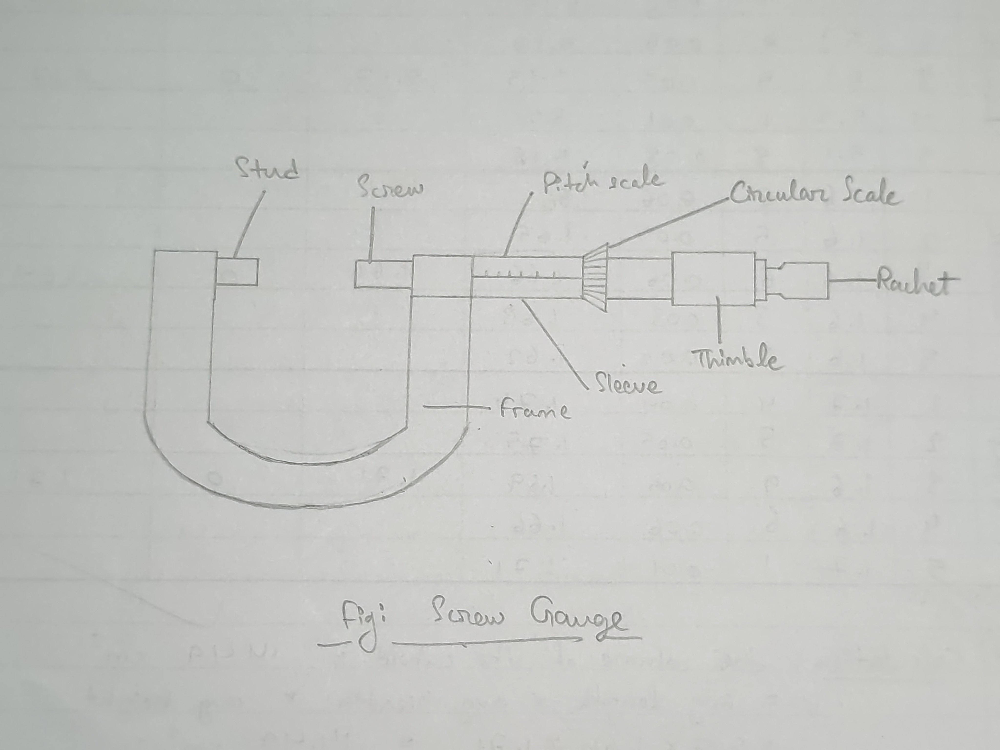
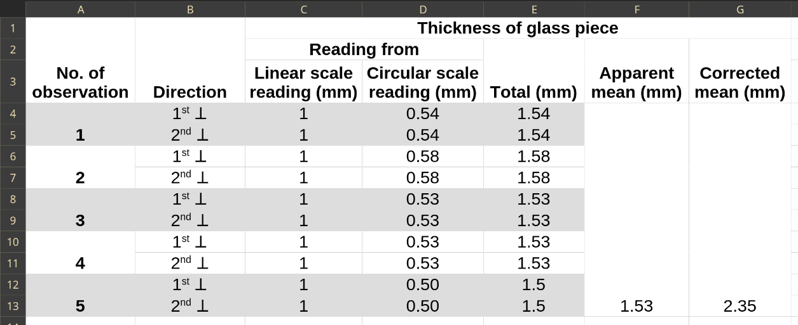

## Aim of the Experiment 
To find the thickness of glass piece by screw gauge. 

## Apparatus Required 
Screw gauge, glass piece

## Theory 
- $\text{Least count} = \frac{\text{Pitch}}{\text{No. of circular divisions}}$

- $\text{Mean thickness of glass piece} = \frac{\overset{n}{\underset{i=1}\Sigma} \text{ observations}_i}{\text{Total observations}}$

- $\text{Corrected thickness} = \text{mean apparent thickness} - (\pm \text{ instrumental error})$

## Procedure 
1. The number of divisions in the circular scale is counted and the value of one small division of the linear scale is ascertained. 
2. The pitch of the screw is determined by observing the distance through which the edge of the circular scale moves for one complete rotation of the milled head. From this, least count is worked out. 
3. The instrumental error is determined by making the plane face A and B just touch each other. One face must not be pressed hard against the other. 
4. The glass piece is introduced between the plane face A and B and the milled head is turned in one direction only till the faces A and B just held. With gentle pressure only, the glass piece is pressed. Too much pressing may alter the thickness of the glass piece. 
5. The last visible mark of the linear scale is read. Then the circular scale reading against the reference line is taken. 
6. At each position, two reading in directions at upper and lower faces are taken. 
7. Operations 4, 5 and 6 are repeated for at least five positions on the face of the glass piece. 

## Observation 
- No. of divisions of circular scale = 100 
- Value of one division of linear scale = 1 mm 

For one complete rotation of the circular scale, the screw moves through one division of linear scale. 

- Pitch = 1 mm 
- Least count = 0.01 mm 
- Instrumental error = $n \times LC = -82 \times 0.01 = -0.82$

## Calculation 

## Result 
The mean thickness of the glass piece is **2.35 mm**. 

## Precaution 
1. Make sure to check for instrumental error before calculations.
2. Always consider parallax error before observing. 
3. Do not change the glass piece during the experiment. 

