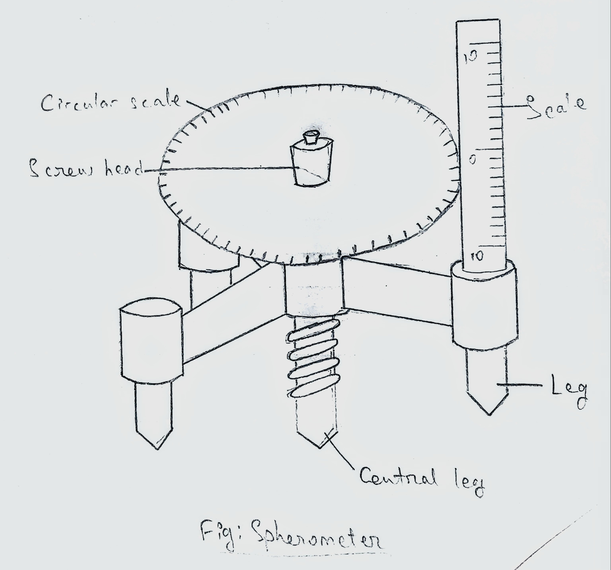

## Aim of the Experiment 
To measure the depth of a metallic block by spherometer. 

## Apparatus Required 
Spherometer, base plate (metallic block)

## Theory 
Least count = $\frac{\text{Pitch}}{\text{No. of circular division}}\ mm$

If $M = \text{no of complete rotation}$  
$N = \text{no. of additional circular division, through which the screw is turned down in lowering its point from its initial position on the test plate (metallic block).}$  
Then, depth of the metallic block will be, $(M \times \text{Pitch} + N \times L.C.\ mm$

## Procedure 
1. The value of a small division of the linear scale and the number of divisions of the circular scale are ascertained. 
2. Pitch of the screw is determined. Hence, the least count is worked out. 
3. The spherometer is placed on the metallic block. The depth is introduced under the central leg of the spherometer, the other three legs are standing on the plane surface of the block. Now, the milled screw head is gradually turned till the central leg just touches the depth surface. 
4. If the central screw has turned down too much, the spherometer will be found at the slightest touch, to rock or spin about it, it which case the central leg should be turned backward by a few rotations, and again carefully turned downward till the rocking and spinning action just starts. The reading of all the circular scale opposite to the linear scale corresponding to this position is noted. It is the initial reading. 
5. The total number of circular divisions through which the screw has been lowered in bringing its point from the initial position on the plane surface to the final position on the depth surface are noted. 
6. Above operation are repeated five times for different position on the depth surface. 

## Observations 
- Value of one linear scale division = 1 mm 
- Pitch of spherometer screw = 1 mm 
- Total no. of circular division = 100 

So, Least count = 0.01 mm 

| No. of Obs. | Initial Circular Scale Reading | No. of complete rotation made, M | Value of complete rotation (mm) | No. of additional circular scale divisions, N | Value of N (mm) | Total Depth (mm) | Mean Depth (mm) | 
|:-:|:-:|:-:|:-:|:-:|:-:|:-:|
| 1 | 39 | 5 | 5 | 12 | 0.27 | 5.27 | | 
| 2 | 41 | 5 | 5 | 19 | 0.22 | 5.22 | | 
| 3 | 40 | 5 | 5 | 11 | 0.29 | 5.29 | 5.33 | 
| 4 | 50 | 5 | 5 | 5 | 0.45 | 5.45 | | 
| 5 | 40 | 5 | 5 | 99 | 0.41 | 5.41 | | 

## Calculation 
- 39 - 12 = 27 
- 41 - 19 = 22 
- 40 - 11 = 29 
- 50 - 5 = 45 
- 100 - (99-40) = 41 

- Mean = (5.27 + 5.22 + 5.29 + 5.45 + 5.41) / 5 
    - = 5.33 

## Result 
From the experiment, it is found that the average depth of the metallic block is **5.33** mm. 

## Precautionn 
1. The metallic block should be handled with care as it may cause injury if block. 
2. Spherometers is a sensitive equipment, so every measurement has to be made precisely. 
3. Every total turn completed should be counted as it is an important measurement. 