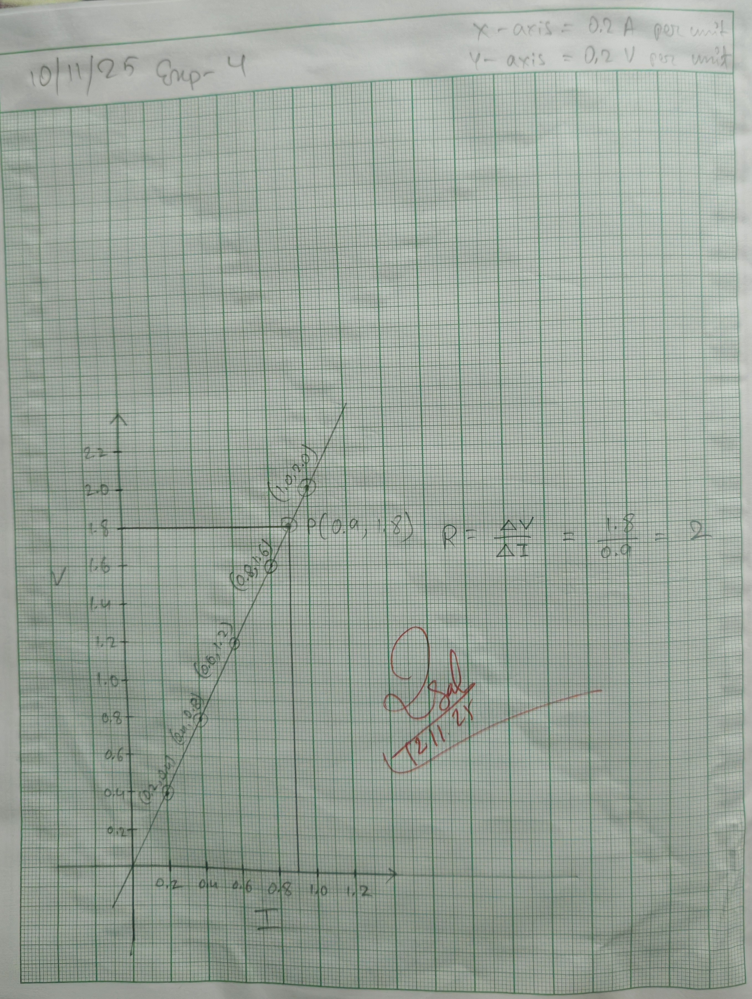

## Aim of the Experiment 
To verify Ohm's law by Ammeter-Voltmeter method. 

## Apparatus Required 
Battery eliminator, ammeter, voltmeter, rheostat, key, connecting wires. 

## Theory 
Ohm's law deals with relationship between voltage and current in an ideal conductor. 

This relationship states that:  
The potential difference (voltage) across an ideal conductor is proportional to the current through it. The constant of proportionality is called the 'resistance' R. Ohm's law is given by, 

$$V = IR$$

Where V is the potential difference between two points which includes a resistance R. I is the current flowing through the resistance. 

## Procedure 
1. Connect the battery eliminator, ammeter, given coil, rheostat, and key in series. 
2. The voltmeter is connected in parallel connection across the given coil. The circuit is closed. 
3. Now the rheostat is adjusted so that a constant current flows through the coil. Note down the ammeter reading I and the corresponding potential difference across the coil in the voltmeter as V. Use the formula to calculate the resistance of the coil. 
4. The experiment is repeated for different values of current and the corresponding potential difference is noted. Calculated the value of each trial. These value will be found to be constant. Thus verifying Ohm's law. 

## Observation 
| S. No. | Ammeter Reading (A) | Voltmeter Reading (V) | Resistance $R = V/I \Omega$ | 
|:-:|:-:|:-:|:-:|
| 1 | 0.2 | 0.4 | 2 | 
| 2 | 0.4 | 0.8 | 2 | 
| 3 | 0.6 | 1.2 | 2 | 
| 4 | 0.8 | 1.6 | 2 | 
| 5 | 1.0 | 2.0 | 2 | 

## Result 
From observation table, it is proved that the ratio of potential difference and current is 2 ( a const.). Thus, potential difference at the ends of the conductor is directly proportional to the current flowing through it. Thus, Ohm's law is verified by this experiment. Again, from the graph, the ratio of V/I, which is constant. 

## Precautions 
1. All connections should be tight. 
2.  an ammeter is always connected in series in the circuit while voltmeter is parallel to the conductor. 
3. The electrical current should not flow in the circuit for long time, else the temperaute will increase and result will be affected. 
