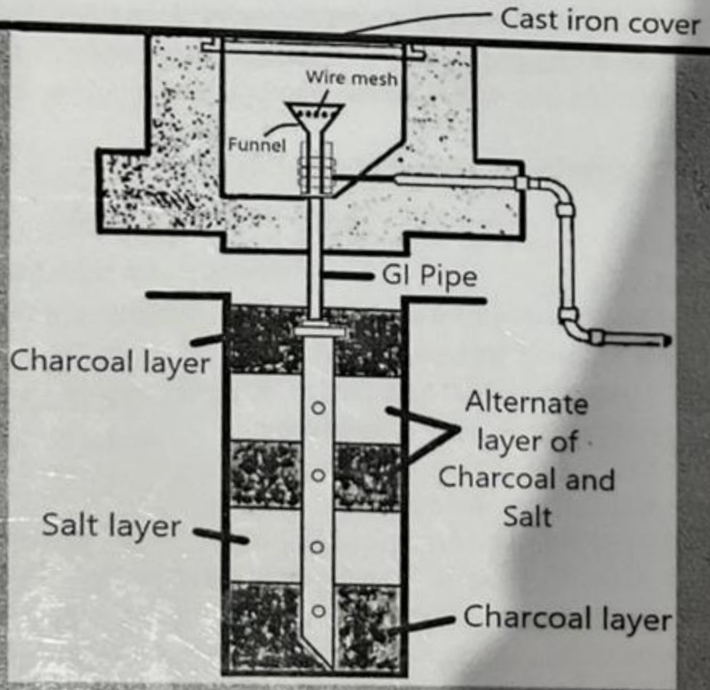
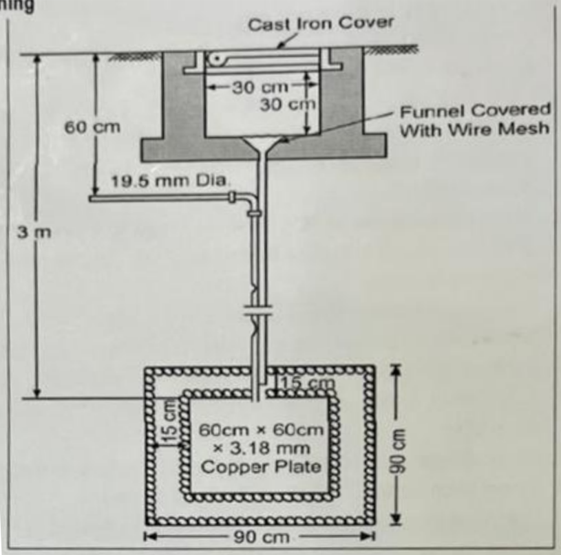
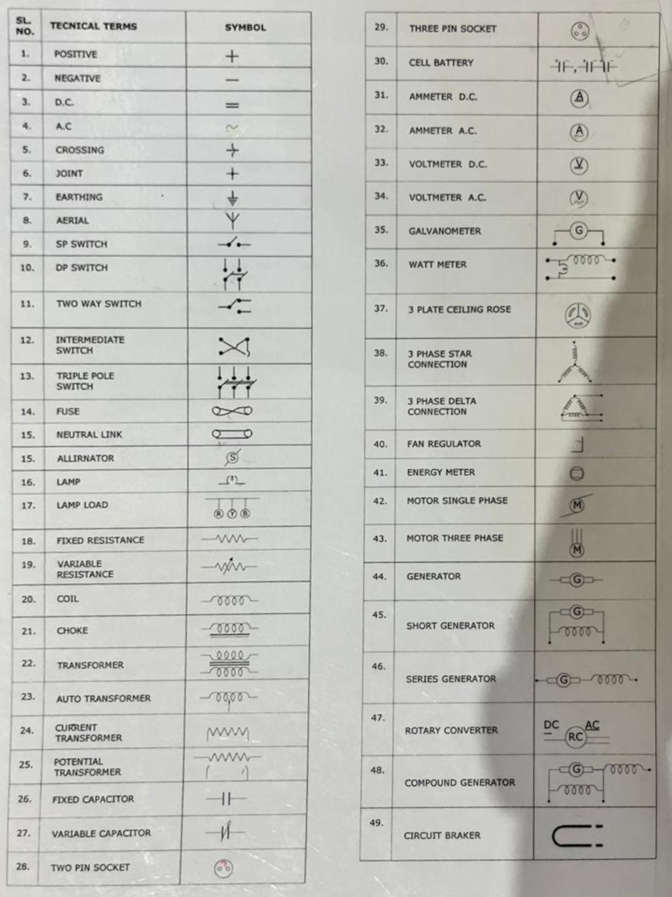
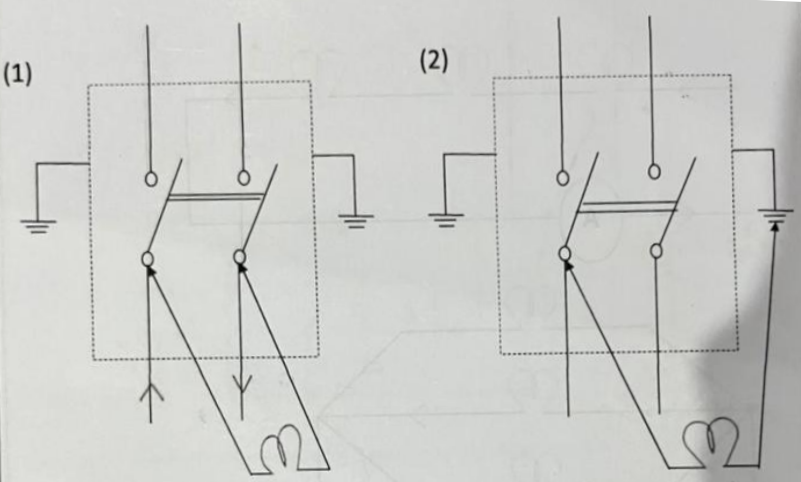
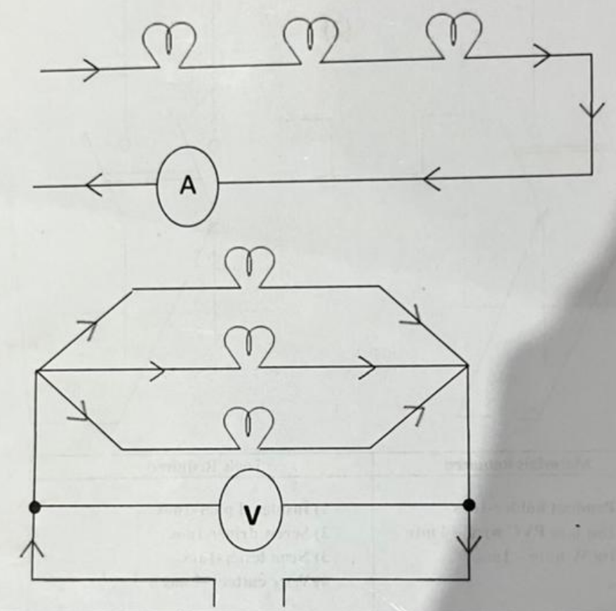
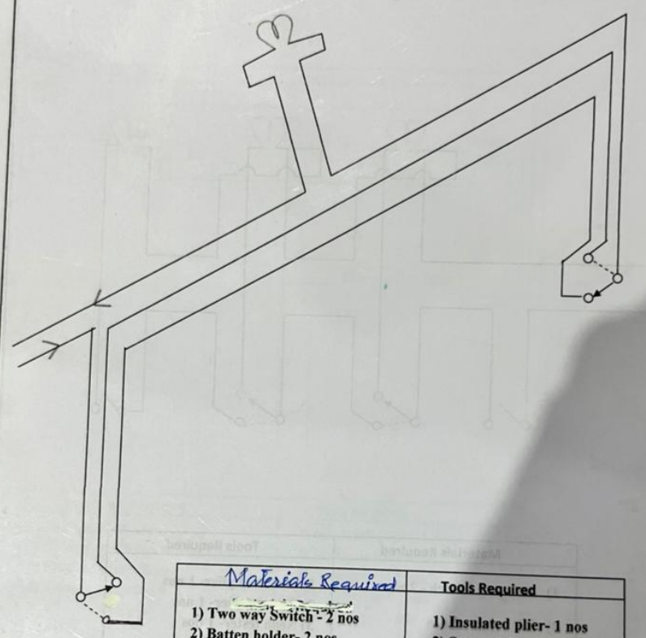
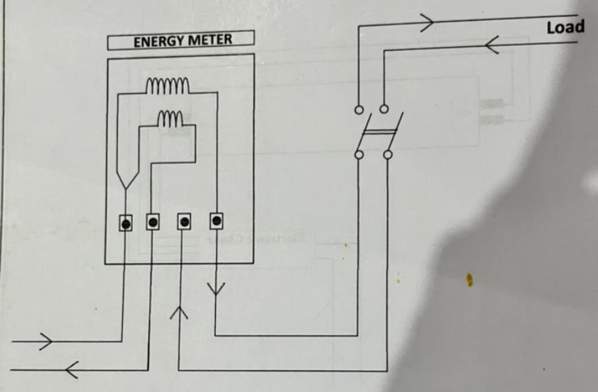

# Introduction 
Electricity is an essential need of our daily life. It is widely use for domestic as well as industrial purpose. So, it necessary to know not only for the engineering students but also the general people about electrical works. In Basic Workshop Practice (BWP) of Electric Shop some basic knowledge is given about the electricity & field of its applications, which are generally necessary in simple house wiring. Electric power is supplied for commercial and residential use in three phases with a neutral. Some of the low power consumption residential connections will have only a single phase with a neutral. The single-phase AC supply is 220V but a three-phase supply is 440V.

- **Electricity:** Electricity is a sort of energy which can be experienced in its applications like bulb, heater, motor, radio set etc.

- **Current:** Flow of electrons in any conductor is called electric current. Its symbol is $l$. Its measuring unit is Ampere (A) & measured by Ampere meter or Ammeter.

- **Conductor:** A conductor is a substance or material that allows electricity to flow through it. For example copper, silver, aluminum etc.

- **Semi-conductor:** A semi-conductor is a substance which is neither a conductor nor an insulator. For example, silicon

- **Insulator:** Insulator is a material in which electric current does not readily allow to flow through it. For example, glass, plastic, rubber etc.

- **Voltage:** Voltage means electric pressure. It is the pressure that moves the electrons to flow in any conductor. Its symbol is V. Its measuring unit is Volt & measured by a Voltmeter.

- **Power:** Power is the rate of doing work or rate at which it can perform the work. The St unit of power is Watt (W). The practical unit of power is Horse Power (HP), In British system 1HP denotes 746 watt.

- **Resistance:** Resistance is the property of a substance which gives opposition to flow of electrons through itself. It measuring unit is Ohm & measured by Ohm meter.

- **Phase:** The phase line is the one that carries current. It can be identified by tester.

- **Neutral:** The neutral line provides the return path to balance the flow of current.

- **Earthing:** Earthing is a process in which the instantaneous discharge of the electrical energy takes place by transferring charges directly to the earth through low resistance wires. Its denotes by E.

- **Positive & Negative:** In Dc voltage sources the symbols + ve (positive) and -ve (negative) are used to denote the polarity of the voltage supply. Voltage is measured in Volt and has the symbol V for voltage.

- **Line & Load:** In electrical engineering the terms Line & Load are shorthand words that refer to the wires that deliver power from the source to a device is called Line on the other hand the wires that carry power onwards to other devices further along the circuit is called Load.

**ALTERNATING CURRENT (AC)**:- Alternating current is an electric current that periodically reverses its direction. Its symbol is (~) Most electrical appliances such as fan, bulb, air conditioner, motor, refrigerator, heater, water heater, cloth iron are operate in alternating current.

**DIRECT CURRENT (DC):** Direct current which only flows in a single direction which cannot change periodically. Its symbol is (-) DC power is widely used in low voltage applications such as charging batteries, and any electronic device with a battery for a power source.

# Tools Used in Wiring 
- **PLIERS:** Pliers are used to cut wire and also to hold it. Pliers have an insulated handle. Long nose pliers are used to hold wires in small space and also to tighten or loose small nuts.

- **SCREW DRIVERS:** Screw drivers are used to tighten screws in the switches and electrical machines. Screw drivers of various sizes are used. Normally screw drivers used in electrical work are insulated.

- **HAMMERS:** Ball peen and claw hammers are commonly used in electrical work where greater power is required striking.

- **HACKSAW:** A hacksaw is used to cut cable armor, conduit pipes, etc. it has a frame where the blade is tightened by means of a wing nut.

- **LINE TESTER:** A line tester is used to check the electric supply in the line or phase wire. It has a small neon bulb which indicates the presence of power supply. It can also be used as a screw driver to tighten small screws in switches.

- **MEASURING TAPE:** A measuring tape is used to measure the length of the wire and also to mark the positions of the switches and other electrical fittings.

- **ELECTRIC HAND DRILL MACHINE:** An electric hand drill is a drill which is driven by an electric motor. Basically it is used for boring holes in a hard materials, wall, wood etc with a drill bit.

- **CHISEL:** Chisel is a cutting tool with a sharpened edge at the end of a metal blade, is used often by driving with a mallet or hammer in dressing, shaping or working a solid material such as wood, stone or metal.

- **WIRE CUTTER:** Wire cutters are tools that have been designed to properly cut either wire or cable with nominal damage to the insulation or internal conductors of the wire or cable.

# Materials Used in House Wiring 
- One way or single pole switch 
- Two way switch 
- Bed Switch 
- Rotary switch 
- Selector switch 
- Two plate ceiling rose 
- Three plate ceiling rose 
- F.T. Choke 
- 3 pin socket 
- 5 pin socket 
- Fan regulator 
- Fan capacitor 
- Fluorescent lamp holder 
- Connector 
- MCB (Miniature Circuit Breaker)
- PVC Gutties 
- Elbow, T, External, Internal, Joint, etc. 
- Square box 
- Batten holder 
- Angle holder 
- Pendent holder 
- Bracket holder 
- Multiplug pin 
- Combined switch socket 
- Plug top 
- 2 pin socket 
- Screw 
- D.O.L. Starter 
- MCCB, ELCB, RCCB, RCBO, RCD 
- PVC Tape 
- PVC casing capping / flexible pipe 
- Switch board 
- Cut out / Fuse, etc. 
- Wires 
- Lugs 

# Wires 
An electric wire is a copper or aluminum insulated conductor and has one or more twisted strands. Vulcanized Indian Rubber (VIR) wires, cotton flexible or rubber flexible wire and poly vinyl chloride (PVC) wires are commonly used in house wiring. Wires are available in various sizes, i.e, 0.75 sq mm, 1sq mm, 1.5 sq mm, 2.5 sq mm, 4 sq mm, 6 sq mm, 10 sq mm, 16 sq mm, etc. Besides those are available in single core, two core, three core, four core, 3 and half core, etc. & that may be single strand or multi strand. Generally the colors of the insulation are red, yellow, blue, black & green. Maintaining of color code is very important during wiring to clarify any trouble.

##  PVC insulated copper wires current carry capacity chart in various cross-sectional are of a conductor 

| S. No. | Cross-sectional area of a conductor in sq. mm | Current carrying capacity in A | 
|:-:|:-:|:-:|
| 1. | 0.5 Sq. mm | 4A |
| 2. | 0.75 Sq mm | 6A | 
| 3. | 1.00 Sq. mm | 11 A | 
| 4. | 1.5 Sq. mm | 14 A | 
| 5. | 2.5 Sq. mm | 18 A |
| 6. | 4.00 Sq mm | 26 A | 
| 7. | 6.00 Sq. mm | 32 A | 
| 8. | 10.00 Sq. mm | 45 A | 
| 9. | 16.00 Sq. mm | 63 A |
| 10. | 25.00 Sq. mm | 75 A | 
| 11. | 35.00 Sq. mm | 95 A | 
| 12. | 50.00 Sq. mm | 125 A |

# Instruments used in Electric Shop 
1. **Voltmeter:** Voltmeter is an instrument used for measuring the potential difference or voltage, between two points in an electrical or electronic circuit either alternating current (AC) or direct current (DC).

2. **Ammeter:** Ammeter is an instrument used for measuring ampere (A) either alternating current (AC) or direct current (DC).

3. **Multi Meter:** Multi meter is an electronic measuring instrument that combines several measurements functions in one unit. i.e, voltage, current, resistance, continuity, etc.

4. **Energy Meter:** Energy meter is an electrical measuring instrument/ device which is used to record or measure Electrical Energy consumed over a specific period of time in terms of units. One unit equals one KWH or 1000 Watts/Hour.

5. **Clamp Meter:** A clamp meter is known as Tong Tester. It is a device used to measure the current passing through a wire without making physical contact with the wire. A clamp meter consists of a hinged jaw integrated into an electrical meter that allows the user to clamp the jaws around a conductor in an electrical system and measure the current without disconnecting it.

6. **Test lamp:** Test lamp is such an electrical testing instrument/ tool by which we can very easily check the phase, neutral and earthing of electrical supply or can check any faulty electrical equipments. The 3 phase supply is also checked by a test lamp. 

# Wiring 
Wiring is an electrical installation of cabling and its associated devices such as switches, distribution boards, sockets, light fittings, etc., through the wires in a perfect manner for economic uses of wiring conductors inside a room or building with better load control.

## 5 Different Types of Electrical House Wiring Systems 
- Cleat wiring
- Casing & capping wiring
- Batten wiring
- Lead sheathed wiring 
- Conduit wiring

### Casing Capping Wiring
- **Advantages**
    1. It has good appearance.
    2. The wires are safe from atmosphere.
    3.  The phase and neutral wires can easily be detected.
    4. The life is sufficiently long.

- **Disadvantages**
    1. There is a risk of fire.
    2. It can be easily affected by the moisture.
    3. Fault locations not easy.
    4. To make the joints very smooth and clean, skilled labors are required. It means the cost would increase. 

- **Precautions**
    1. Neutral wires should be carried in top channel and phase wires in the bottom channel.
    2. Conduit pipes should be used for passing the wires through the walls.
    3. Screws should not be buried under the wall.

### Conduit Pipe Wiring 
1. Surface conduit
2. Concealed conduit wiring

- **Advantages of surface conduit wiring**
    1. The wiring can be done in open places.
    2. The cost of this system is less.
    3. There is no risk of fire.
    4. Maintenance is easy.
    5. Alternation is possible.

- **Disadvantages of surface conduit wiring**
    1. Installation is not easy and simple.
    2. The beauty of this wiring system compared to a concealed system is less.
    3. The fault-finding process is very difficult.
    4. The cost is high.
    5. More time is required for the installation of this wiring system.

- **Advantages of concealed conduit wiring**
    1. Its appearance is very good.
    2. It is fireproof.
    3. Its life is very high.
    4. The cables are safe from mechanical damage.
    5. It can be done in damp places, open places even which are exposed to sun and rains also.

- **Disadvantages of concealed conduit wiring**
    1. It is costly
    2. It is very hard to find any defects in the wiring
    3. Changing of location of appliances or switches is difficult
    4. Complicated to add/manage additional connection in the future

- **PRECAUTIONS**
    1. All the joints of conduit should be tight
    2. Junction box, lee, elbow etc. should be of inspection type so that wires can be checked from time to time.
    3. To bend the pipe bending machine should be used.
    4. The pipe should be cut carefully and ends be filed smooth to free them from burrs
    5. Earth continuity should be maintained on all joints.
    6. The conduit pipe should be erected away from the water and gas pipe.
    7. The conduit pipe size should be properly chosen to accommodate that the number and size of wires enclosed.

# Circuit 
A conducting path for electric current is called a circuit. There are two types of electrical circuit:

1. **Series circuit:** The series circuit provides a single, continuous path through which current flows. In this the devices are connected one after another and the current flows through them until it returns to the power source.

2. **Parallel circuit:** In parallel circuit the devices are connected side by side so that, current flows in parallel path. In this type of circuit each device is connected across the power source so that even if one device breaks down, the other devices continue to operate. Hence, this type of circuit is used in home wiring

## Types of Circuit 
There are three types of circuits. They are:

1. **Open circuit:** If the switch used in the circuit is in 'off' position, then the circuit is said to be open circuit There will not be any flow of current in open circuit.

2. **Closed circuit:** If the switch used in the circuit is in 'on' position, then the circuit is said to be closed circuit. There will be normal flow of current in closed circuit.

3. **Short circuit:** When the positive terminal and negative terminal of any circuit comes in contact and very high current flows through the circuit, then it is called as short electrical circuit.

# General Rules for Wiring
While designing of installation and preparing an estimate, one should keep the following important points of general rules for wiring in his mind.

1. In order to disconnect the consumer's installation from the supply mains, there must be a suitable link switch in between the supplier terminals and at the point of commencement of wiring in consumer premises.

2. The proper size of wires should be used to carry the required current safely.

3. The height of all switch boards from the floor level should be as per IS specifications, Le
    1. The height of switch board for controlling switches should not be less than 1.3 mtr and should not be more than 1.5 mtr from the floor level
    2. The height of sub-distribution board and the main board should not be less than 1.5 mtr & more than 1.75 mtr from floor level

4. Light and the power circuits in a building should run separately

5. All metal covering in the wiring system should be earthed properly.

6. Single phase load should be equally divided among all the three places where 3 phase, 4 wire distribution system is used.

7. All motor control switches must be easily accessible to the operator.

8. All wiring installations should be tested as per I.E.R before connecting to supply mains.

# Electric Shock
When a person touches a naked electric wire containing current, a shock is felt due to the passing of electric current through his body. Electric shocks are of two types:

1. Electric shocks from AC current
2. Electric shocks from DC current

- D.C. current shocks are more dangerous than AC current shock. Following are the effects of an electric shock.
    1.  Mental balance is lost
    2. Heart beat decreases

# Earthing 
A wire coming from the ground 2.5 to 3 meters deep from an electrode (Plate or so) is called earthing. The earths potential is always taken as zero for all practical purposes. The electrical appliances or Machines when connected with earth attain zero potential and are said to be earthed.

## Types of Earthing 

| | | | 
|:-:|:-:|:-:|
| 1. | Pipe Earthing |  | 
| 2. | Plate Earthing |  | 

## Objective of Earthing
1. To save life from danger or shock or death by blowing fuse of any apparatus which becomes leaky?
2. To protect large buildings from atmosphere lightning.
3. To protect at all Machines fed from Overhead lines from lighting arrestors.
4. To maintain the line voltage 

## Specifications required for Earthing as per IS (Indian Standards)
1. The earthing electrode should be situated at a place at least 1.5 meters away from the building (outside) whose installation system is being earthed.
2. The earth wire should be of same material as of earth electrode used.
3. The minimum sectional area of earth lead wire should not be less than 0.02 sq. inch and not more than 0.1 sq inch.
4. The size of earth conductor as a general rule should not be less than half of the section of the line conductor.
5. The earth wire should be taken through G.I pipe of 12 mm for at least 32 cm length above added below ground surface to the earth electrode to safe guard against Mechanical wear and tear.
6. All the metallic covering of the switch brackets etc. along with the earth terminal of the wall socket should be earthed.
7. The earth resistance of any earthing should not be more than 50 in rocky soil. But in any case the resistance of the earth continuity conductor should not be more than 10 through out the system.
8. All three phase machine have to be double earthed. The distance between the two electrodes should be of 5 meter.

# Electrical Safety Precautions 
1. A great care should be taken against electric shock while working on the line whether its conductor is insulated or bared.
2. Never work bare feet. It is better to wear rubber shoes while working.
3. In case of electric shock when a victim is still in contact with the live wire which you can not immediately switch off. Insulate yourself in a dry wood or any other any insulating material to release victim.
4. Use safety belt before starting the work on an electrical pole or tower.
5. The ladder should always be hold by another person while working on overhead lines so that it may not slip away.
6. Phase or positive wire should always be connected through the switch.
7. Before charging the line, check that there is none working on the main line.
8. Before replacing the blown fuse, always keep the main switch off.
9. Before taking a table fan or any portable appliances from one place to another disconnect it from the supply.
10. Do not disconnect the flexible wire of electrical equipments from the socket by pulling it out.
11. Do not touch electric installation without any purpose.
12. Overhead lines should be touched unless you are sure that they are dead and properly earthed.
13. Before starting the work be ensured that you are authorized to do the work.
14. Do not tamper electrical protective or interlocking gear unless you are authorized these devices are meant for your safety.
15. Safety depends upon on earthing, always keep earth connection in good condition.
16. The battery charging room should be properly lighted and airy.
17. In case of fire do not through water on a live wire and equipment, it is dangerous. The best remedy is to disconnect the main supply immediately.
18. The electric fire should be extinguished with liquid carbon dioxide extinguisher or dry sand.

# Electrical Abbreviations 
| S. No. | Abbreviation | Full Form | 
|:-:|:-:|:-:|
| 1. | Ph | Phase | 
| 2. | N | Neutral | 
| 3. | E | Earthing | 
| 4. | AC | Alternating Current | 
| 5. | DC | Direct Current | 
| 6. | 1 Ph | Single Phase | 
| 7. | 3 Ph | Three Phase | 
| 8. | F | Fuse | 
| 9. | V | Voltage | 
| 10. | A | Ampere | 
| 11. | W | Wattage | 
| 12. | EM | Energy Meter | 
| 13. | MS | Multi Strand | 
| 14. | DB | Distribution Box | 
| 15. | MS | Main Switch | 
| 16. | MCB | Miniature Circuit Breaker | 
| 17. | MCCB | Molded Case Circuit Breaker | 
| 18. | NL | Neutral Link | 
| 19. | DP | Double Pole | 
| 20. | TP | Triple Pole | 
| 21. | ΤΡΝ | Three Phase Neutral | 
| 22. | FP | Four Pole | 
| 23. | COS | Change Over Switch | 
| 24. | ASS | Ammeter Selector Switch | 
| 25. | VSS | Voltmeter Selector Switch | 
| 26. | CU | Copper | 
| 27. | AL | Aluminum | 
| 28. | HP | Horse Power | 
| 29. | RCCB | Residual Current Circuit Breaker | 
| 30. | RCBO | Residual Current Circuit Breaker with Over load & Short Circuit Protection | 
| 31. | ELCB | Earth Leakage Circuit Breaker | 
| 32. | RCD | Residual Current Device | 
| 33. | P | Positive | 

# Difference Between 1 Phase and 3 Phase 
The one key difference between single phase and three-phase wiring is that a three-phase power supply better accommodates higher loads. On the other hand single phase power supplies are most commonly used when typical loads are lighting or heating, rather than large electric motors. Single phase systems can be derived from three-phase system. Potential difference of single phase line is 220 volt & three-phase line is 440 Volt.

# Practical Section 

# Job No. 1 
- **Aim:** To test the supply by test lamp and to test the phase and neutral by test lamp and neon tester. 

| S. No. | Materials Required | Tools Required | 
|-|-|-|
| 1. | Pendent holder - 1 nos | Insulated pliers - 1 nos | 
| 2. | 1 sq. mm PVC wire - 4 mtr | Screw driver - 1 nos | 
| 3. | 100 W bulb - 1 nos | Neon tester - 1 nos | 
| 4. | | Wire cutter - 1 nos | 

# Job No. 2 
- **Aim:** 
    1. To make a series and parallel connection. 
    2. Connection of Voltmeter and Ammeter 

| S. No. | Materials Required | Tools Required | 
|-|-|-|
| 1. | 100 W bulb - 3 nos | Insulated pliers - 1 nos | 
| 2. | 1 sq. mm PVC wire - 5 mtr | Screw driver - 1 nos | 
| 3. | Voltmeter - 1 nos | Neon tester - 1 nos | 
| 4. | Ammeter - 1 nos | Wire cutter - 1 nos | 
| 5. | Batten holder - 3 nos | PVC tape - 1 nos | 
| 6. | 10" x 12" switch board - 1 nos | Poker - 1 nos | 

# Job No. 5 
- **Aim:** To control one lamp from two way switch in staircase wiring. 

| S. No. | Materials Required | Tools Required | 
|-|-|-|
| 1. | Two way switch - 2 nos | Insulated pliers - 1 nos | 
| 2. | Batten holder - 2 nos | Screw driver - 1 nos | 
| 3. | PVC wire - 3 mtr | Neon tester - 1 nos | 
| 4. | 100 W bulb - 1 nos | Wire cutter - 1 nos | 
| 5. | One way switch board - nos | Firmer chisel - 1 nos | 
| 6. | | Ball peen hammer - 1 nos | 

# Job No. 8 
- **Aim:** Connection of single phase energy meter with load. 

| S. No. | Materials Required | Tools Required | 
|-|-|-|
| 1. | PVC wire - 5 mtr | Insulated pliers - 1 nos | 
| 2. | Batten holder - as required | Screw driver - 1 nos | 
| 3. | 1 Ph Energy meter - 1 nos | Neon tester - 1 nos | 
| 4. | DP MCB - 1 nos | Wire cutter - 1 nos | 
| 5. | Lamp - as required | Test lamp - 1 nos | 
| 6. | SP switch - as required | Poker - 1 nos | 

