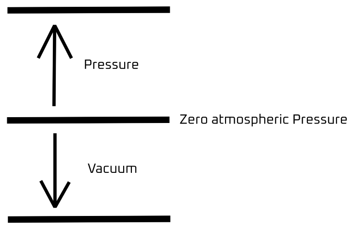
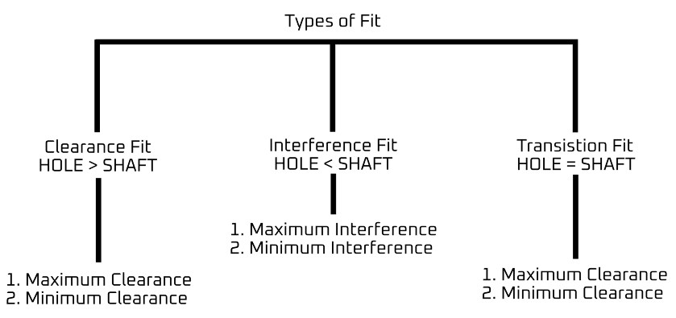
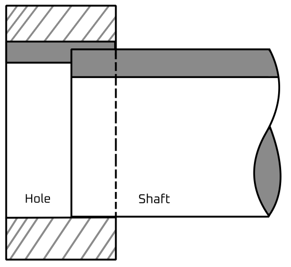
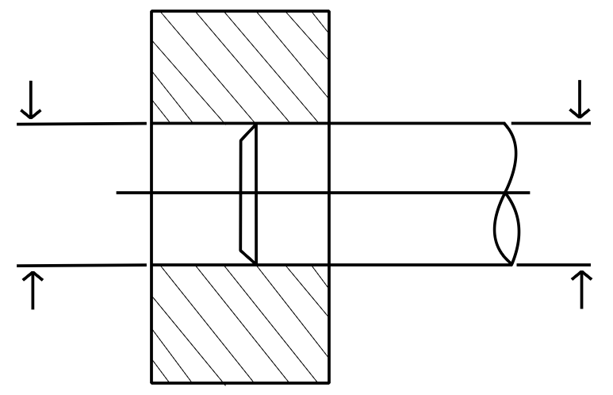
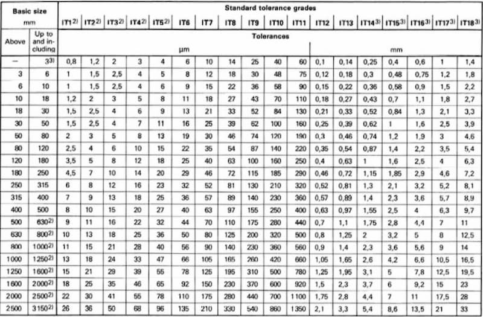

# Measurements, Units and Unit system 
## Measurements and Units 
In our day-to-day lifestyle, we need to measure things. For that, we need some measuring instruments which can measure the physical quantities in units. Units explain the number of things or substances we are measuring. It could be simple numbers, or it could be according to the weight of the substance.

There are two types of units:

1. Standard units
2. Derived units 

### Standard Unit
Standard units are the basic units of every physical quantity. For example, meter is the unit of length, kilogram is the unit of weight, second is the unit of time, etc. 

| Quantity measured/Physical Quantity | Base SI Unit | Symbol |
|:-:|:-:|:-:|
| Mass | kilogram | kg | 
| Length | meter | m | 
| Temperature | Kelvin | K | 
| Amount of substance | mole | mol | 
| Electric current | ampere | A | 
| Time | second | s | 
| Luminous intensity | candela | cd | 

### Derived Units 

Derived units are basically the combination of standard units when they come in relation with each other. For example, m/sec is the derived unit of speed where length and time are interrelated, etc.

| Quantity | Unit | Symbol |
| :- | :- | :- |
| Volume | cubic meter | $m^3$ |
| Density | kilogram per cubic meter | $kg/m^3$ |
| Speed | meter per second | $m/s$ |
| Newton | $kg m/s^2$ | $N$ |
| Energy | Joule $(kg m^2/s^2)$ | J | 
| Pressure | Pascal $(kg/(ms^2))$ | $Pa$ | 

## Unit System 
We know that basic quantities are measured in standard units. However, standard units are different over the places. Therefore, a measuring unit system is designed which is followed all over the world.

There are three types of measuring system. These are: 

| System | Length | Mass | Time |
|:-:|:-:|:-:|:-:|
| M.K.S | meter | kilogram | second |
| F.P.S System | foot | pound | second | 
| C.G.S System | centimeter | gram | second | 

## International Unit System 
International Standard of measurement uses different parameters. For example, pressure, which is defined as force per unit area. So, its units are $N/m^2,\ \text{Psi},\ \text{Bar},\ \text{Pascal},$ etc.

| Type | Definition | Application Examples |
| --------------- | --------------- | --------------- |
| Gauge | Reference to atmospheric pressure | Car tire, water level measurement, chamber pressure, hydraulic applications |
| Sealed | Reference to a sealed chamber cleared with atmospheric pressure (approx. 1 bar) | For used in aggressive media, industrial applications, washdown environments, food and beverage | 
| Absolute | To reference in a vacuum (0 bar or no pressure) | Barometric, weather stations and metrological applications | 
| Differential | Measuring the difference between two pressure part readings. | Filter and pump monitoring, air conditioner, HVAC Ventilation and Air conditioning, Clean room monitoring. | 

### Measurement of Pressure 
The Pressure is measured in different units for different aspects of work. It is measured in $Psi$ for air, $N/m^2$ for any force. Therefore, absolute pressure is measured by addition or subtraction of gauge pressure and pressure vacuum.

 

$$
\text{Absolute Pressure} = \text{Gauge Pressure} \pm \text{Pressure Vacuum}
$$

### Measurement of Temperature
The temperature is measured in $\degree C$ or $\degree F$ and absolute temperature. The raised level of mercury in the column indicates the temperature. In clinical thermometer, temperature starts from $32 \degree F$. In laboratory thermometer, temperature starts from $0 \degree C$.

# Fit
Joining different parts is called fit. For example, 

1. Bush and shaft fit 
2. Bush and bush housing 
3. Gear and spline shaft 
4. Lead screw and nut 
5. Shaft and pulley with keys 

- There are three types of fit: 
    1. **Clearance fit**: in this, the shaft diameter is less than hole.
    2. **Interference fit**: in this, the shaft diameter is more than the hole. 
    3. **Transition fit**: in this, the possibility of both of them are conditional. 

## Clearance Fit
With a clearance fit, the shaft is always smaller than the hole. This enables easy assembly and leaves room for sliding and rotational movement. When the shaft diameter is at its minimum and hole diameter at its maximum, we have a situation of maximum clearance, and minimum clearance for vice-versa.

Clearance fits come in 6 sub-categories. These are: 

1. Loose running 
2. Free running 
3. Close running 
4. Sliding 
5. Close clearance 
6. Locational clearance 

## Transition Fit 
A transition fit encompasses two possibilities: the shaft may be a little bigger than the hole, requiring some force to create the fit. At the other end of the spectrum is a clearance fit with a little bit of room for movement. Specifying a transition fit means that both outcomes are possible even inside a slide batch. 

- Transition fit has two forms 
    1. Similar fit 
    2. Fixed fit 

### Similar Fit 
It leaves a small clearance or creates a small interference. Its assembly is possible using a rubber mallet. For example, hubs, gears, pulleys, bearings, etc. 

 

### Fixed Fit 
It leaves a small clearance or creates a small interference. Its assembly is possible using light force. For example, driven bushes, armatures on shafts, etc. This is used in engineering. 

## Interference Fit 
The assembly stage requires force, sometimes lubrication, heating of the hole and freezing the shaft. These help to increase/decrease the hole and shaft sizes respectively to make for an easier process. 

The interference helps to secure the relative positioning of the shaft and hub even during rotation, making this type of fit good for transmitting rotational speed and power. 

### Press Fit 
- It has minimal interference.
- Its assembly can be performed with cold pressing. 
- For example, hubs, bushing, bearing, etc. 

### Driving Fit 
- It needs higher assembly forces for cold pressing.
- Another way to mate parts is by using hot pressing. 
- This interference fit is more prominent than with a press fit. 
- For example, permanent mounting of gears, shafts, bushes, etc. 

### Forced Fit 
- It is high interference fit. 
- Its assembly requires heating the part with a hole and freezing the part with a hole and freezing of the shaft to force the mating parts together. 
- Disassembly of the mated parts can result in broken parts. 
- For example, shafts, gears, etc. 

# Tolerance 
The difference in between the actual hole size and shaft size is called tolerance. 

- It is of two types: 
    1. Unilateral Tolerance 
    2. Bilateral Tolerance

## Tolerance Grade 
With engineering fits, the tolerance will always be shown in alpha-numeric code. For example, a tole tolerance may be H7. 

The capital letter signifies that we are dealing with a hole. When indicating tolerance for a shaft, the letter will be lowercase. The number shows the international tolerance grade (ISO 286).

A tolerance class determines a range of values the final measurement can vary from the base measurement. From the table, we can see that the tolerance grade applies to a range of basic sizes. 

So, if we have a hole with a nominal hole with a normal size of 25 mm and a tolerance class of $H_7$, we will fit into the 18...30 mm basic size group. The letter signifies the start of the tolerance zone. 

For $H_7$, the starting point is at exactly 25.000 mm. The maximum hole size is then 25.021 mm. For $F_7$, the tolerance range is the same, but the starting point is 25.020 mm, taking the last acceptable measurement to 25.041 mm. 

## Grade of Accuracy 

| Accuracy Grade | Permissible Error | 
|:-|:-|
| 5A (laboratory precision test gauges) | $\pm 0.05%$ of span | 
| 5AR (laboratory precision test gauges) | $\pm 0.05%$ of reading |
| 4A (laboratory precision test gauges) | $\pm 0.1%$ of span | 
| 4AR (laboratory precision test gauges) | $\pm 0.1%$ of reading | 
| 3A (test gauges) | $\pm 0.25%$ of span |
| 3AR (test gauges) | $\pm 0.25%$ of reading |
| 2A (process gauges) | $\pm 0.5%$ of span |
| 2AR (process gauges) | $\pm 0.5%$ of reading |
| A (industrial gauges) | $\pm 1%$ of span |
| AR (industrial gauges) | $\pm 1%$ of reading |
| B (commercial gauges) | $\pm 2%$ of span |
| BR (commercial gauges) | $\pm 2%$ of reading |

This represents the joint accuracy. It means less tolerance and more accuracy. According to IS919-1993, total grade is 18 (01, 0, -1, to 16). $H_7/H_6$ means for fitting hole grade of accuracy 7 and a shaft of accuracy grade is 6.

# Work and Energy 
When a force is applied to a body which changes its position then it is said that work has been done on that body. If the position of a body doesn't change then work done will be zero even if the force is being applied. S.I. unit of work is Joule (J).

The unit of work done remains joule in any case but for higher quantities some prefixes can be added. These are: 

- K = Kilo ($10^3$)
- M = Mega ($10^6$)
- G = Giga ($10^9$)
- T = Tera ($10^12$)
- P = Peta ($10^15$)
- E = Exa ($10^18$)

## Surface Roughness 
It is basically a waviness on the surface of the body. This is influenced by the stress concentration. 

Where, 
- $a$ = value of roughness 
- $b$ = production method 
- $c$ = sampling length 
- $e$ = machine allowance 
- $f$ = other roughness value 
- $Ra$ = range of roughness in microns
