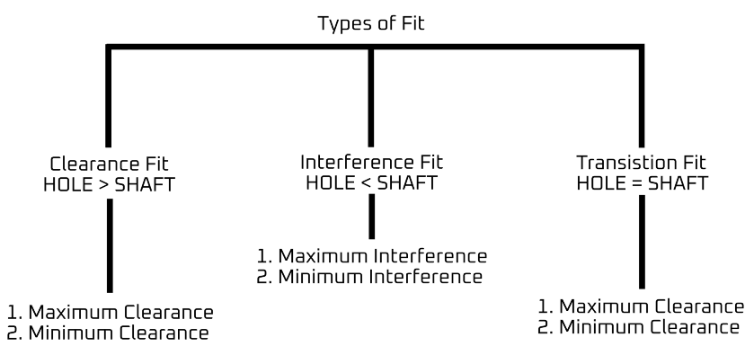
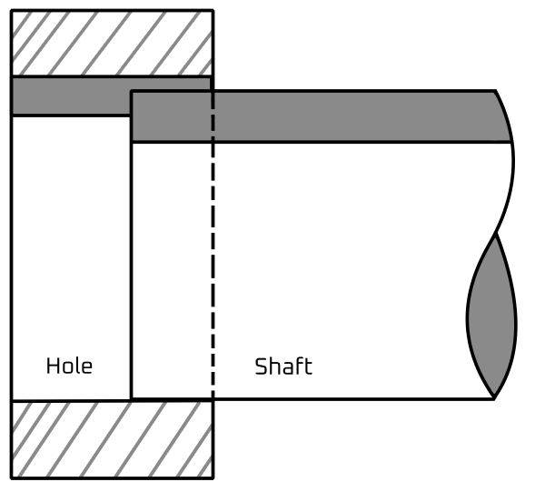

# Fit
Joining different parts is called fit. For example, 

1. Bush and shaft fit 
2. Bush and bush housing 
3. Gear and spline shaft 
4. Lead screw and nut 
5. Shaft and pulley with keys 

- There are three types of fit: 
    1. **Clearance fit**: in this, the shaft diameter is less than hole.
    2. **Interference fit**: in this, the shaft diameter is more than the hole. 
    3. **Transition fit**: in this, the possibility of both of them are conditional. 

## Clearance Fit
With a clearance fit, the shaft is always smaller than the hole. This enables easy assembly and leaves room for sliding and rotational movement. When the shaft diameter is at its minimum and hole diameter at its maximum, we have a situation of maximum clearance, and minimum clearance for vice-versa.

Clearance fits come in 6 sub-categories. These are: 

1. Loose running 
2. Free running 
3. Close running 
4. Sliding 
5. Close clearance 
6. Locational clearance 

## Transition Fit 
A transition fit encompasses two possibilities: the shaft may be a little bigger than the hole, requiring some force to create the fit. At the other end of the spectrum is a clearance fit with a little bit of room for movement. Specifying a transition fit means that both outcomes are possible even inside a slide batch. 

- Transition fit has two forms 
    1. Similar fit 
    2. Fixed fit 

### Similar Fit 
It leaves a small clearance or creates a small interference. Its assembly is possible using a rubber mallet. For example, hubs, gears, pulleys, bearings, etc. 

 

### Fixed Fit 
It leaves a small clearance or creates a small interference. Its assembly is possible using light force. For example, driven bushes, armatures on shafts, etc. This is used in engineering. 

## Interference Fit 
The assembly stage requires force, sometimes lubrication, heating of the hole and freezing the shaft. These help to increase/decrease the hole and shaft sizes respectively to make for an easier process. 

The interference helps to secure the relative positioning of the shaft and hub even during rotation, making this type of fit good for transmitting rotational speed and power. 

### Press Fit 
- It has minimal interference.
- Its assembly can be performed with cold pressing. 
- For example, hubs, bushing, bearing, etc. 

### Driving Fit 
- It needs higher assembly forces for cold pressing.
- Another way to mate parts is by using hot pressing. 
- This interference fit is more prominent than with a press fit. 
- For example, permanent mounting of gears, shafts, bushes, etc. 

### Forced Fit 
- It is high interference fit. 
- Its assembly requires heating the part with a hole and freezing the part with a hole and freezing of the shaft to force the mating parts together. 
- Disassembly of the mated parts can result in broken parts. 
- For example, shafts, gears, etc. 
