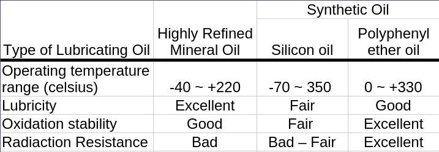

# Bearing And Lubrication
## Bearing 
A Bearing is a machine or system holding such that it enable the rotation underneath and support the thrust. It constraints relative motion to only the desired motion. It reduces friction between moving parts. Bearing support the rotating shafts of the wheels, gears, turbines, rotors, etc. in those machines, allowing them to rotate more smoothly. 

### Terminology of Bearing 

### Functions of Bearing 
Bearings performs two major functions: 
1. Reduce friction and make rotation more smooth. 
2. Protect the part that supports the rotation, and maintain the correct position of the rotating shaft. 

### Structure of Bearing 
Modern bearings come in a wide variety of types. The components that make up the bearing are as follows: 

1. Bearing rings (races)
2. Rolling elements
3. Cage 

### Bearing Rings (Races)
- The ring-shaped components are called bearing rings or races. 
- Bearing rings are used for these radial bearings. 
- The bearing ring on the inside, into which the shaft is inserted, is called the inner ring. 
- The one on the outside is called the outer ring, and is inserted into the housing.

### Housing 
- "Housing" refers to the components which come in contact with the outer ring when the bearing is inserted. 

### Races 
- The Races used for thrust bearing provide support force applied in the same direction as the shaft. 
- Shaft race is the race on the side, into which the shaft is inserted. 
- Housing race is the race inserted, into the housing.

### Rolling Elements 
- There are a variety of different rolling elements designed to suit the specific conditions of the bearing, such as the strength of the supporting force or the speed of the rotation. 
- A tabulated rolling elements are given here 

| Image | Name | Type | 
|-|-|-|
| img | Ball | Ball Bearing | 
| img | Cylindrical roller | Roller bearing | 
| img | Needle Roller | Roller bearing |
| img | Tampered roller (tampered trapezoid) | Roller bearing |
| img | Convex roller (barrel-shaped) | Roller Bearing | 

### Cage 
- When the bearing's inner ring rotates this causes the rolling elements to roll. 
- When the surfaces come in contact, the rolling elements' rolling direction will be inverted relative to each other, and the rolling motion of the rolling elements will be disrupted.
- In order to prevent this, a cage is put in place to keep the rolling elements separated from each other. This allows them to roll smoothly.
- There are a variety of different types of cage units designed to suit the specific conditions of the bearing, such as the strength of the supporting force or the speed of the rotation. 

### Categorization of Bearing 
- Bearings can be categorized into 4 groups based on the direction of force supported and the shape of the rolling elements 

| Direction in which force is mostly applied | Ball Rolling element | Roller Rolling Element | 
|-|-|
| Perpendicular to the shaft (radial load) | Radial ball bearing | Radial roller bearing | 
| The same direction as the shaft (axial load) | Thrust ball bearing | Trust roller bearing | 

### Radial Ball Bearing 
- Radial ball bearings are ball bearings that can support a force that is applied perpendicular to the shaft.
- Some types of radial ball bearing are given below: 
    1. Deep Groove Ball Bearings 
    2. Angular Contact Ball Bearings 

### Deep Groove Ball Bearing 
- Deep groove ball bearings are the most widely used among all bearings. 
- They can support both a radial load and a certain amount of axial load coming from both directions at the same time.
- If a bearing is to support very large axial loads then the "angular contact ball bearings" is needed. 
- Deep groove ball bearing start with the series 30200. 

### Angular Contact Ball Bearing 
- Angular contact ball bearings can support a radial load and a one directional axial load at the same time. 
- When axial loads coming from both directions are to be supported, two or more angular contact ball bearings are combined. 
- Here two contact ball bearings are combined for more load bearing. 

### Radial Roller Bearing 
- Radial roller bearings are roller bearings that can support a force perpendicular to the shaft. 
- They can support an even greater load then radial ball bearings, and these are bearing types that are made to suit the type of roller. These are: 
    1. Cylindrical Roller Bearings 
    2. Needle Roller Bearings 
    3. Tapered Roller Bearings 

### Cylindrical Roller Bearings 
- These use cylindrical rollers as their rolling elements. 
- Cylindrical roller bearings can support an even greater load than deep groove ball bearings, and are used in machinery where they will experience strong impacts. 

### Needle Roller Bearings 
- These use needle rollers as their rolling elements.
- Needle rollers have a smaller diameter than cylindrical rollers, and contributed to the down-sizing of machinery. 
- It has intermittent operation and can perform both side rotation. 
- It bears moderate load and operate on moderate speed. The series starts from 223220. 

### Tapered Roller Bearings 
- These use tapered rollers in the shape of tapered trapezoids as their rolling elements.
- Tapered roller bearings are the most widely used among all roller bearings, and can support a radial load and a one-directional axial load at the same time. 
- When axial loads coming from both directions are to be supported, two or more tapered roller bearings are combined together. 
- Here, two tapered roller bearings are combined for more load bearing. 

## Lubrication 
- Bearings aim for stable and smooth rotation, and to do that the friction with rolling motion needs to be reduced and the abrasion of the various components needs to be prevented. 
- This is the job of the 'lubricant'.
- Semi-solid (i.e., like ice scream) "grease" and liquid "lubricating oil" are both widely used as bearing lubricants.
- The lubricant also serves to remote the heat that is generated inside the bearing as it rotates, serving to increase the service life of the bearing.

### Purpose of Lubrication 
Some of the reasons for lubrication are: 

1. To reduce friction and wear on the components of the bearing.
2. To carry away the heat generated by friction inside the bearing. 
3. Prolong the bearing fatigue life by maintaining the proper oil film on the rolling contact surface at all times. 
4. Prevent corrosion during use of the bearing. 
5. Remove contaminants that penetrate into the bearing. 

### Types of Lubrication
- The major type of lubrication are: 
    1. Grease Lubrication 
    2. Oil Lubrication 

### Grease Lubrication 
- Grease is a semi-solid substance. 
- It tends not to leak out and can be easily affixed to the inside of the bearing. 
- Since this makes it convenient as a sealing device, grease lubrication is widely applied for bearings. 

### Components of Grease 
- The main components of grease are base oil (lubricating oil), thickeners, and additives. 
- Amount of these are adjusted and blended according to the purpose of use.

| Component | Role | 
|-|-|
| Base oil (lubricating oil) | Oil with excellent lubricating function | 
| Thickener | Disperses the base oil and retains oil to make it semi-solid (determines characteristics such as operating temperature range and mechanical stability) |
| Additives | Complements performance according to the purpose of use (e.g. withstanding heavy loads, preventing rust) | 

### Grease Lubrication Method 
- Greasing the components or machine parts is helpful in many ways. 
- But, the greasing method is different in different types of bearings 
- Some of the greasing lubrication methods are: 
    1. Grease Packed Bearing 
    2. Grease Feeding Method 

### Grease Packed Bearings 
- Grease-packed bearings are bearings that are sealed by the bearing manufacturer using a shield or seal after inserting the necessary grease into the inside of the bearing. 

### Grease Feeding Method 
- After mounting a non-greased bearing into the machine, grease is filled onto the bearing. 
- Grease supplied through the grease nipple is filled into the grease sector inside the housing, flowing into the inside of the bearing. 
- Used grease is pumped out of the bearing and ejected out of the housing by the centrifugal force of the rotary disc attached to the grease valve. 
- The grease feeding interval can be determined by the type, size and rotation speed of the bearing. 
- A graph in the left depicts the greasing feeding interval. 

### Oil Lubrication 
- Mineral oil is a refined crude oil and suitable for lubrication, therefore it is used as lubricating oil. 
- However, mineral oil has the disadvantages that it oxidizes at high temperatures and its lubricating function deteriorates. 
- At low temperatures its viscosity increases and the force required to stir the lubricating oil increases. 
- For this reason, we use synthetic oil that has excellent lubricating function in high or low temperatures. 
- Additives are added to the lubricating oil to improve certain characteristics (prevents oxidation, rust, foam and so on).

### Characteristics of Lubricating Oil 
 

### Lubrication Oil Method 
- Oil Lubrication method consider the operation condition, usage criteria and cost as well.
- Some common method of oil lubrication are: 
    1. Oil bath 
    2. Oil drip 
    3. Oil splash 
    4. Forced oil circulation 

### Oil Bath Lubrication 
- This is a method of operating the machine by immersing the bearing in lubricating oil.
- It is suitable for low- to medium-speed rotation.

### Oil Drip Lubrication 
- Lubricating oil is dripped from the oiling device and the effect of the rotating part causes the lubricating oil to mist and fill the housing.
- This has a cooling effect.
- This method can be applied at relatively high speeds and mid-level loads.

### Oil Splash Lubrication 
- This is a method in which gears, etc. are attached to the shaft, the lubricating oil is splashed, and it is made into droplets for oil supply.
- This method can be applied at relatively high speeds.

### Forced Oil Circulation 
- This is a lubrication method In which the lubricating oil is Inserted inside the bearing, then cooled, and then circulated again.
- It is most commonly applied in high-speed rotation or high-temperature conditions.

### Comparison between Grease and Oil Lubrication 
| S. No. | Item | Grease Lubrication | Oil Lubrication | 
|:-:|:-:|:-:|:-:|
| 1. | Sealing device | Simple | Slightly troublesome. Care needs to be taken for the maintenance of the device. | 
| 2. | Lubricating ability | Good | Excellent | 
| 3. | Rotation speed | Low/medium speed | Can be used in high-speed rotation | 
| 4. | Replacement of lubricant | Slightly troublesome | Easy | 
| 5. | Life of lubricant | Relatively short | Long | 
| 6. | Cooling effect | No cooling effect | Good (but circulation is needed) | 
| 7. | Filtration of dirt (removal of contaminants) | Difficult | Effective | 

