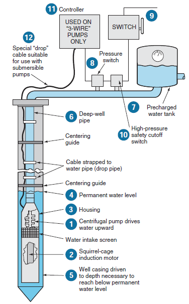

# Pumps
- A pump is a mechanical device, used to transfer different fluids from one location to another.
- It is a hydraulic device that lifts or move fluids from low to high levels or pressure area.
- The low pressure on the inlet side causes the liquid to rise and the high pressure on the outlet side pushes the liquid out.
- The pump transfers fluid by converting the fluid's mechanical energy into pressure energy.
- Pumps are using widely all over the world in different industries for numerous applications.
- A pump has multiple types that are designed according to the requirements of different applications.
- For example, the hydraulic pump can also be utilized in processes that require high hydraulic pressure.
- Pumps are classified into two types:
    1. Dynamic Pumps
    2. Positive Displacement Pumps.

## Dynamic Pumps 
Dynamic Pumps are of many types:

1. Centrifugal Pumps
2. Vertical Centrifugal
3. Horizontal Centrifugal
4. Submersible
5. Fire Hydrant

### Centrifugal Pumps 
- These types of pumps are most commonly used worldwide. 
- The working is very simple, described well and carefully tested.
- This pump is strong, efficient and fairly cheap to make.
- This kind of pump produces an enhancement within force by transmitting mechanical power from the electrical motor to the liquid throughout the revolving impeller.
- The flow of liquid will enter the center of impeller and exits along with its blades.
- The centrifugal power hereby enhances the velocity of fluid & also the energy like kinetic can be altered to force.

### Vertical Centrifugal
- Vertical centrifugal pumps are also called as cantilever pumps. 
- These pumps use an exclusive shaft & maintain design that permits the volume to fall within the pit as the bearings are external to the pit. 
- This mode of pump utilizes no filling container to cover the shaft however in its place uses a throttle bushing.
- A parts washer is the common application of this kind of pump. 

### Horizontal Centrifugal 
- These types of pumps include a minimum of two otherwise more impellers. 
- These pumps are utilized in pumping services.
- Every stage is fundamentally a divide pump.
- All the phases are in a similar shelter & mounted on a similar shaft.
- On a solo horizontal shaft, minimum eight otherwise additional stages can be mounted
- Every stage enhances the head by around an equal amount
- Multi-stage pumps can also be single otherwise double suction on the first impeller.
- All kinds of pumps have been providing as well as servicing this type of centrifugal pumps.

### Submersible
- These pumps are also named as storm water, sewage, and septic pumps. 
- The applications of these pumps mainly include building services, domestic, industrial, commercial, rural, municipal, & rainwater recycle applications.
- These pumps are apt for shifting storm water, subsoil water, sewage, black water, grey water, rainwater, trade waste, chemicals, bore water, and foodstuffs.
- The applications of these pipes mainly include in different impellers like closed, contra-block, vortex, multi-stage, single channel, cutter, otherwise grinder pumps.

### Fire Hydrant
- Fire hydrant pump systems are also named as hydrant boosters, fire pumps, & fire water pumps. 
- These are high force water pumps intended to enhance the capacity of firefighting of construction by increasing the force within the hydrant service as mains is not sufficient.
- The applications of this system mainly include irrigation as well as water transfer.

## Positive Displacement Pumps 
- Positive Displacement Pumps are of many types: 
    1. Diaphragm Pump
    2. Gear Pump
    3. Peristaltic Pump
    4. Lobe Pump
    5. Piston Pump

### Diaphragm Pump 
- Diaphragm pumps also known as AOD pumps (Air operated diaphragms), pneumatic, and AODD pumps. 
- The applications of these pumps mainly Include in continuous applications like in general plants, Industrial and mining.
- AOD pumps are particularly employed where power is not obtainable, otherwise in unstable and combustible regions.
- These pumps are also utilized for transferring chemical, food manufacturing, underground coal mines, etc.

### Gear Pumps 
- These pumps are a kind of rotating positive dislocation pump, which means they force a stable amount of liquid for every revolution. 
- These pumps move liquid with machinery coming inside and outside of mesh for making a non-exciting pumping act.
- These pumps are capable of pumping on high forces & surpass at pumping high thickness fluids efficiently.
- A gear pump doesn't contain any valves to cause losses like friction & also high impeller velocities.

### Peristaltic Pumps 
- Peristaltic pumps are also named as tube pumps, peristaltic pumps. 
- These are a kind of positive displacement pumps and the applications of these pumps mainly involve in processing of chemical, food and water treatment industries. 
- It makes a stable flow for measuring and blending and also capable of pumping a variety of liquids like toothpaste and all kinds of chemicals. 

### Lobe Pumps 
- So this pump is compatible for handling thick liquids like fuel as well as grease oils. 
- These pumps are not suitable for driving solids as well as harsh liquids.
- The working of these pumps can be related to gear pumps, apart from the lobes which do not approach into contact by each other.
- Additionally, these pumps have superior pumping rooms compare with gear pumps that allow them to move slurries.
- These are made with stainless steel as well as extremely polished.

### Piston Pumps 
- Piston pumps are one kind type of positive dislocation pumps wherever the high force seal responds through the piston. 
- These pumps are frequently used in water irrigation, scenarios requiring high, reliable pressure and delivery systems for transferring chocolate, pastry, paint, etc.
