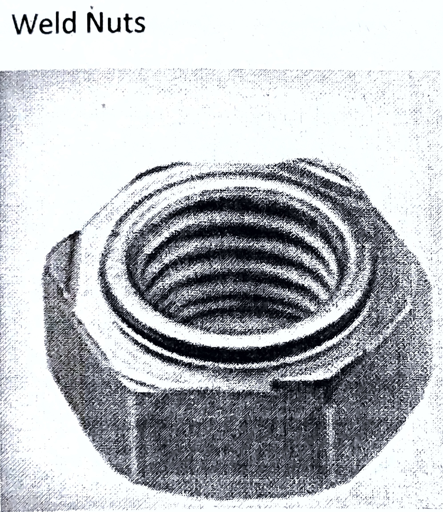
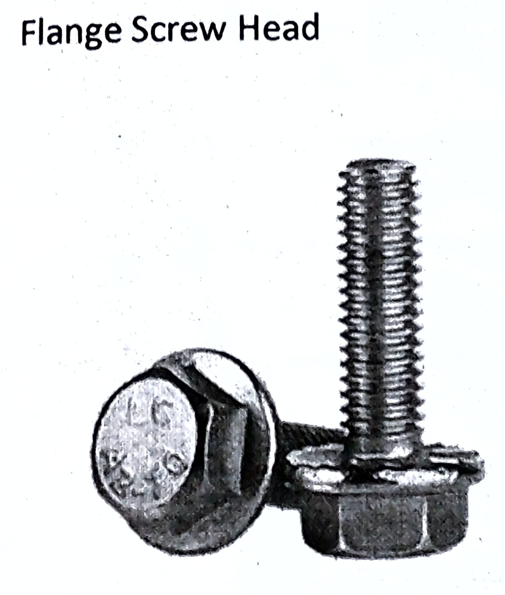
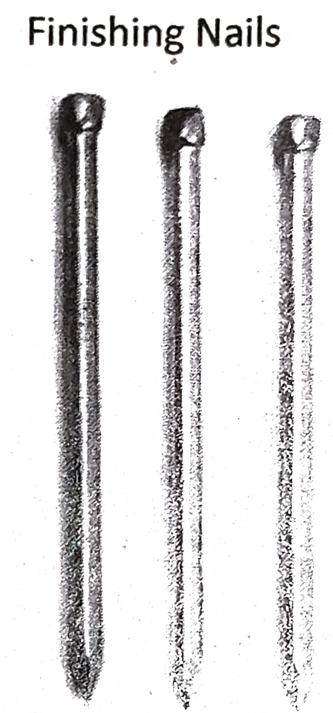
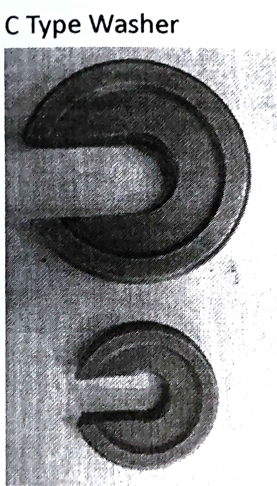
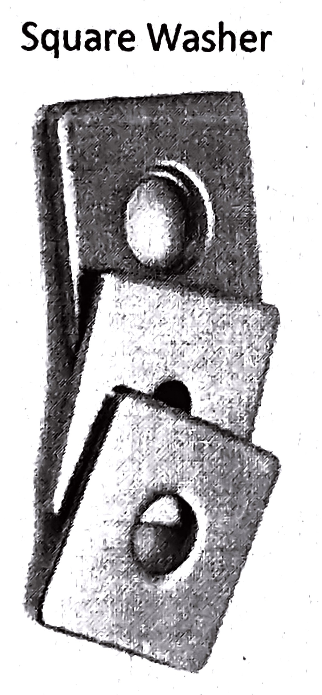

# Vibrations and Fasteners Utility 
- Vibration can be defined as simply the cyclic or oscillating motion of a machine or machine component from its position of rest. 
- However, vibration can indicate a problem and if left unchecked can cause damage or expedited deterioration.

## Causes of Vibrations
- There are many factors which cause the machine to vibrate. Some of them are: -
    1. Imbalance in the machine parts.
    2. Misalignment of the machine while mounting.
    3. Wearing and tearing of the components.
    4. Looseness of the machine parts like belts, chains, etc.

### Imbalance 
- If a rotating component has what is known as a heavy spot this can cause machine vibration, this increases exponentially with speed. 
- Imbalance is when the shafts geometric centerline and mass centerline do not coincide.
- The reason for this is because the heavy spot will force the mass centreline off the geometric centreline.
- Imbalance can be caused by a few different things, such as:
    1. maintenance issues: missing balance weights or dirty or deformed fan blades.
    2. manufacturing defects including casting flaws or machining errors.
- The effects of an imbalance increases with machine's speed.
- The biggest concern with imbalance is that it can cause unnecessary machine vibration and drastically reduce the operational life of bearings.

### Misalignment
- A common cause of machine vibration is when the machine shafts that are out of line. 
- Misalignment is a root cause of many machine breakdowns, bearing failures, and damaged seals, shafts and couplings.
- In fact, it is widely believed that over 50% of machine failures are due to misalignment.
- Misalignment does not have one single cause but can be a combination of causes. It can happen:
    1. By developing over time (wear)
    2. During the assembly process
    3. Not considering thermal expansion during the alignment process
    4. Not being reassembled properly after maintenance
    5. Because of shifting components (structural issues)

### Wearing and Tearing 
- When rotating components like roller or ball bearings, gears, or drive belts, start to show signs of wear, the machine vibrates. 
- For example, if a roller bearing race becomes pitted, then the bearing rollers will generate impact and friction causes machine to vibrate.
- This occurs as the rolling elements travel over the section of pitted race.
- Other examples of wear causing vibration include: a drive belt breaking down, or a heavily worn or chipped gear tooth.

### Looseness 
- Looseness can be rotating or mechanically generated. 
- There are three types of Mechanical looseness to consider:
    1. Rotating looseness
    2. Structural looseness (foundation flexibility)
    3. Non-rotating looseness.
- Rotating looseness can occur due to wear in a bearing. 
- The problem with looseness is that irrespective of what caused it, looseness can cause damage such as: fatigue and wear in equipment mounts and further bearing wear.
- It can become very dangerous and destructive if a vibrating component is either loosely attached to its mounts, or has loose bearings.

## Vibration Effect 
- Some of the vibration effects are: 
    1. Vibration can accelerate machine wear, consume excess power, and cause equipment to be taken out of service, resulting in unplanned downtime.
2. Other effects of vibration include safety issues and diminished working conditions.
    3. When measured and analysed properly, however, vibration can play an important role in preventive maintenance programs.
    4. It can serve as an indicator of machine condition and allow plant maintenance professionals to act before damage or disaster strike

## Corrective Methods of Vibrations 
There are few ways to correctly treat machine vibration problems, these include:

1. Precision balancing
2. Bearing replacement
3. Identifying any additional bad parts and having them sourced then replaced.
4. Precision Alignment
5. Precision Lubrication.
6. Dissemble, inspect visually, clean, and then reassemble, this can help to fix some of the more elusive problems. Stiffening and mass loading to reduce measured vibration.

# Fasteners 
- A fastener is a non-permanent or permanent mechanical tool that rigidly connects or affixes two surfaces on objects together.
- Non-permanent fasteners can easily be removed without damaging the joined materials.
- The removal of permanent fasteners might require substantial force and might damage the connected surfaces.
- The wide range of fasteners Includes screws, nails, nuts, bolts, and washers that come in different sizes, types, and configurations.

## Non-Permanent Threaded Fasteners 
- The variability between fasteners is due to the extreme forces that are placed on them. 
- The purpose of fasteners is to hold parts, components, and pieces of machinery together in the presence of excessive vibrations and pressure while retaining the ability to disassemble the pieces when necessary. 

### Bolts 
- Bolts are one of the more common types of fasteners and are used to hold two non-threaded pieces together. 
- The head of a bolt, which comes in several varieties, is attached to the threaded male end.
- Bolts are classified by their shape and type of head.

#### Anchor Bolts 
- Anchor bolts are referred to as "cast in place," which means they are included in the fabrication of the component or part and are permanently attached to it. 
- Different types of anchor bolts are designed for specific jobs.
- They are an industrial bolt that has been embedded into concrete for securing columns and supports to foundations.

#### Arbor Bolts 
- Arbor bolts have a washer permanently attached to the head and reverse threading. 
- The head of an arbor bolt has a sunken design that creates a ridge on the head.
- Most arbor bolts have a dark or black finish that distinguishes them from other bolts.
- They are designed to be used with tools such as a miter saw to keep the blade in place.

#### Carriage Bolts 
- Carriage bolts have a smooth head with a square section located underneath that keeps the bolt from turning when secured. 
- The popularity of carriage bolts is due to their ability to be used with any type of material, from stainless steel to wood.
- They are referred to as plow or coach bolts and get their name from their original use, which was to secure carriages and carriage wheels.

#### Elevator Bolts 
- Elevator bolts were invented for use in the construction of elevators and have a large flat head with a square neck underneath to keep the connection secure when vibrations and shock are present. 
- The flat head is designed to fit flat and flush against the surface of the attached material as well as provide load bearing capacity.

#### Hex Head Bolt 
- The hex head bolt gets its name from the hexagonal shape of its head that makes it easy to tighten using a box, socket, or crescent wrench. 
- The six sides of the hexagonal shape give the bolt the proper granularity angles for fastening the bolt in difficult locations.
- The threads on a hex head bolt extend halfway or all the way up to the bolt head with partially threaded bolts having a higher shearing capacity.

#### Double End Bolts
- A double end bolt has threads at both ends without a head. 
- They can have a nut on one end and be inserted into a threaded hole.
- Double end bolts come with class five threads for the tap end and class 2A threads for the nut end.

#### Eye Bolts 
- Eye bolts have a loop or circular configuration instead of a head. 
- The eye or loop is used for securing electrical lines, holding chains in place, or for guiding ropes.
- The loop end can be open or closed; the open version does not have a completed loop while the closed version does.

#### U Shaped Bolts 
- U bolts have two threaded arms connected by a U shape bend without a head. 
- The threaded ends are designed to connect nuts and washers.
- They are made from carbon, alloy, or stainless steel by cold or hot forging.
- When the washers and nuts are tightened, they provide clamping force to connect parts or to hold components in place and prevent them from moving.

### Screws
- The construction of screws is similar to that of bolts, with male threads starting from the tip with various types of heads to drive the threads.
- Unlike bolts, screws do not use nuts to make connections and require some form of internal threads to sustain a grip.
- In most cases, screws are self threading or self tapping, meaning they create the threads into the material where they are being placed.

#### Self Drilling Screws
- Self drilling screws create internal threading when they are installed. 
- They are fully threaded from the tip to the head, with threads that are harder and more rigid than the materials they are joining.
- Self drilling screws have a variety of tips in unique shapes.

#### Sheet Metal Screws 
- Sheet metal screws are designed to join metal pieces and have a threaded shank that covers its entire length with a rounded or flat head. 
- The tip of a sheet metal screw is sharp so that it can pierce the substrate of a piece of metal.
- Sheet metal screws can be self drilling and self-tapping.

#### Machine Screw 
- A machine screw is similar to a bolt and has a diameter of 0.75 inches or less. 
- When joining or connecting two pieces of metal, machine screws are inserted into threaded holes.
- The size of the threads, helical ridges, remain the same from the top of the screw to the tip.

#### Dowel Screw
- A dowel screw is like a double end bolt with both ends being threaded with a wood screw tip. 
- They do not have a head and can be inserted into pre-drilled holes or create their own threading.
- A dowel screw functions like a dowel with threads but forms a more permanent bond between the pieces being joined.
- They are normally used for woodworking projects and can be threaded from end to end without a gap.

### Nuts 
- A nut is a fastener with an external thread that is used with a mating bolt that is of the same size. 
- There are several varieties of nuts that include box and hex types as well as several other speciality kinds, configurations and designs. 

#### Cap Nuts
- Cap nuts are known as dome or acorn nuts and have the shape of a dome on the closed end to protect the bolt-nut assembly.

#### Castle Nuts 
- Castle nuts have notches on one end that allow for the Insertion of a pin.

#### Weld Nuts
- Welded nuts are welded onto the surface and are used to fasten hard to reach places.

#### Hex Nuts 
- The hex nut is one of the most common types of nuts and is easy, to install.

#### Nylon Lock Nuts
- Nylon lock nuts have the same shape as a hex nut but have a nylon collar that locks into the bolt to prevent loosening#.

#### Flange Nuts 
- A flange nut is like a flange bolt and flange screw with a wide flange at one side of the nut to distribute pressure to the place being secured.

### Heads 
- A distinguishing feature between the various types of screws and bolts are their heads, which are designed to fulfill a particular function.
- The variety of heads is as expansive as the different types of screws.

#### Flat Screw Head 
- Flat screw heads are countersunk and fit flush with the secured surface.
- They have varying angles from the top of the head to the threads.

#### Raised Screw head
- Raised head or oval head are similar to flat head screws but have a domed shaped head.

#### Bugle Screw Head
- Bugle screw heads have a curved shape below the head instead of an angle to prevent damage to the surface they are connecting.

#### Domed Screw Head
- Domed screw heads provided a larger surface for the screw to stop turning.

#### Truss Screw Head
- A truss screw head is wide but low profile with a large surface area. The head is slightly rounded but wider.

#### Binding Screw Head
- Binding screw heads are similar to a pan head but thicker with a deeper slot, and they have a 10% larger bearing surface.

#### Flange Screw Head
- Flange screw heads provide a wide surface area and have an attached washer built into the screw head.

#### Pan Screw Head
- A pan head is slightly rounded with short vertical sides. The head is similar to the head on a carriage bolt without the square shape underneath the head.

## Permanent Fasteners 
- Permanent fasteners come in several forms and are designed to connect surfaces and not be removed.
- Permanent fasteners do not have threads and can be quickly installed without the need for extra fastening components.
- Wooden dowels, nails, various types of rivets, and varieties of pins are classified as permanent fasteners.

### Nails 
- The unique quality of nails is their smooth shaft that is designed to connect surfaces by being driven in by the force of a hammer or nail gun.
- The common nail is divided into the head, shank or shaft, point, and gripper marks, which are marks incised into the shank near the head for extra gripping. 

#### Common Nails 
- Common nails are used for carpentry and construction.
- They have a heavy shank for sturdy support for any type of building or structural project.
- Common nails are functional and not used for their appearance.
- They are noted for their strength, endurance, and reliability.

#### Box Nails 
- Box nails are similar to common nails but have a thinner shaft for use with thin wood and plastics.
- Unlike common nails, box nails are not sturdy or strong due to the structure of their shaft but are ideal for use in finishing projects such as cabinets and paneling.

#### Brad Nails 
- Brad nails are small with a thin head that is almost invisible when driven into wood.
- The majority of brads have an 18 gauge diameter, which makes them easy to mask on trim and moulding.
- Their thin design makes them ideal for use with materials that would be split by larger diameter nails.

#### Finishing Nails 
- Though brad nails and finishing nails are similar, finishing nails are large with gauges ranging between 15 and 16.
- They are used in projects where strong holding is necessary, such as for items that may hang from the walls or ceiling.
- Regardless of the difference in size between brads and finishing nails, finishing nails have the same small head as brads but with greater holding power.

#### Cut Nails
- Cut nails have a blunt point and tapered shank to help reuce splitting.
- They have a four sided design that is similar to a square that is resistant to bending when being installed.
- When cut nails are placed and connected, they are extremely difficult to remove.

#### Drywall Nails 
- Drywall nails have to be specially designed due to the types of materials with which they are used.
- They have rings along the shaft that may look bike the threads of a screw, which increases their gripping power and keeps them from slipping out.

#### Flooring Nails 
- There are several varieties of flooring nails with designs that enhance their gripping power and strength.
- Some flooring nails are like drywall nails with rings on the shank that help them fit more securely.
- The types of flooring nails include ones with spiral shanks to increase the tightness of the fit.

#### Concrete Nails 
- Concrete nails are some of the sturdiest and most durable types of nails.
- They have a thick shank that is made from hardened steel that is capable of punching a hole in a cinder block.
- They have fluted shafts to make them cling snuggly to brick, concrete, and masonry.

#### Roofing Nails 
- The special feature of roofing nails is their wide head that is designed to seal their hole and prevent leaks.
- They have a ringed or twisted shank to increase their holding power as well as prevent them from loosening.
- Roofing nails are galvanized to resist corrosion and rusting.

### Rivets 
- Rivets are light weight and have excellent support against shearing forces.
- With a head at each end, rivets can support a certain amount of axial loads and are installed using a rivet gun without the need for holes being drilled or threads being created.
- Of the forms of permanent fasteners, rivets are the most permanent, and they have a wide range of strength to weight ratio types.

#### Solid Rivets 
- The solid rivet is one of the oldest forms of fasteners, and it has a very basic design and construction that consists of a shaft and head.
- They are installed using an impact hammer, riveter gun, or compression tool.
- Solid rivet drivers use hydraulic, pneumatic, or electromagnetic force to drive, deform, and place a rivet.
- They are used where reliability and safety are required.

#### Tubular Rivets
- The structure of a tubular rivet is very similar to that of a solid rivet but with a partial tube at the tip.
- The tube at the end reduces the amount of force required to install the rivet.
- When the rivet is driven in, the tubular portion rolls outward to seal the rivet in place.

#### Blind Rivets 
- Blind rivets, or pop rivets, are a tubular rivet with a mandrel down the center.
- They are installed where there isn't access to the back side of the materials being Joined.
- The rivet is inserted into a hole and the mandrel is pulled out using a special tool As the mandrel leaves, it folds the tube against the side of the inner surface.

#### Drive Rivets 
- A drive rivet is a form of blind rivet with a shorter mandrel, and it is hammered in to make the connection.
- As the rivet is hammered, the shank expands to seal the connection on the inner surface of the material.

#### Split Rivets
- A split rivet, or bifurcated rivet, is a self-piercing rivet that has split legs attached to the head of the rivet.
- The pre-split shaft is placed into a hole and pounded.
- The force of the pounding causes the legs to spread and secure the connection.

## Auxiliary Fasteners 
### Washers 
- Washers are a small, circular, metal disc in the shape of an annulus, halo, donut, or ring that is used to distribute the force of a screw, bolt, or nut.
- They can relieve friction, stop leakages, maintain tension, prevent corrosion, and serve as a spacer or separator.
- The wide and varied uses of washers has made them a necessity in a number of applications.
- Types of Washers
    1. Plain Washer
    2. Spring Washer
    3. Lock Washer
- In each of the categories are specialized forms that are designed to serve a specific or unusual function.

#### Plain Washer 
- The purpose of plain washers is to isolate the material being secured from a bolt, screw, or nut.
- They may serve the purpose of insulation or be a means of protecting the substrate.
- Another function of plain washers is to distribute the load by increasing the surface area that contacts the substrate.
- If a hole is too large, a washer can make up for the size difference.

#### Flat Washer 
- A flat washer is referred to as type A and is for general use in correcting hole size and distributing the load.

#### Torque Washer 
- Torque washers are used for woodworking projects with bolts to prevent them from spinning when the nut is being connected.

#### Fender Washer 
- Fender washers have a small inner diameter with a much larger outer diameter as a way to distribute force over a large area, especially with thin metals. 

#### C Type Washer 
- A C washer has a section cut out of a flat washer that allows it to be inserted when a fastener is not completely disconnected.
- The space allows a C washer to be slipped in place.

#### Finishing Washer 
- Finishing washers are used with countersunk screws as a means of balding them in place.

#### Square Washer
- Square washers, known as blind rivet washers, fit into slots and channels and have flat sides that keep them from rotating.
- They are wider and thicker than round washers, which makes them an excellent method for distributing a load.
- They come in several sizes and dimensions to perfectly fit any bolt or screw. 

#### Spring Washer 
- A spring washer is capable of acting like a spring due to a slight change in their circular structure that gives them axial flexibility and elasticity.
- Spring washers are designed to stop possible loosening or release of tension in the fastener due to shock, vibration, or shaking of the joined pieces.

#### Belleville Spring Washer 
- Belleville spring washers look like a hollow cone with the top of the cone removed.
- They have great flexibility in the axial direction and support axial forces with little deflection.
- Belleville spring washers can be found in applications that are subject to thermal expansion.

#### Crescent Spring Washer 
- A crescent washer is a plain flat washer that has been moderately bent or curved to give it the appearance of a crescent.
- This type of washer is slightly capable of absorbing axial forces and is only used in small movement applications.

#### Dome Spring Washer 
- Dome spring washers have the shape of a dome with a hole in the top.
- They have a very high load capacity with a small deflection range and have ground curves to form a flatter load bearing surface.
- Dome spring washers are used for their ability to form a flatter surface.

#### Wave Spring Washer 
- Wave spring washers are used in applications where there is thermal expansion and contraction.
- They are designed for minimal axial space and for a modest working range.
- Their uniform waves ensure an optimal load rate and loaded waves.

#### Locking Washer 
- Locking washers are an excellent tool for locking bolts, nuts, and screws in place where there is a chance of a connection becoming loose due to friction, shock, rotation, or vibrations.
- They exert a spring tension on a fastener that keeps it from loosening. Locking washers are placed beneath the fastener as an extra measure of security.

#### External Teeth Washer
- The teeth for an external locking washer are around the circumference of the washer and extend radially outward.
- When the nut, bolt, or screw is tightened, the external teeth bite into the surface of the substrate to hold the fastener tightly in place.

#### Internal Teeth Washer
- For an internal tooth locking washer, the teeth are on the inner diameter of the washer and extend toward the center of the washer.
- Just like in the external tooth locking washer, as the fastener is tightened, internal teeth dig into the substrate to lock the fastener in place.

#### Split Lock Washer 
- Split lock washers have helical shaped split rings that exert spring force on the fastener that creates Increased friction and motion resistance.
- A split lock washer looks like a flat washer that has been cut and the two ends bent in opposing directions
- When the fastener is tightened in place, the two split ends lodge snuggling in a firm, secure mating position.

#### Tab Locking Washer 
- A tab locking washer looks like a flat washer with a single tab extended on the inner side of the hole in the washer.
- They can be manufactured with a single tab or multiple tabs depending on the application.
- Tab lock washers are designed to fit around bolts or nuts and are made to lay flat.
- They lock the fastener in place and are ideal for drastically hot conditions or heavy vibrations.

