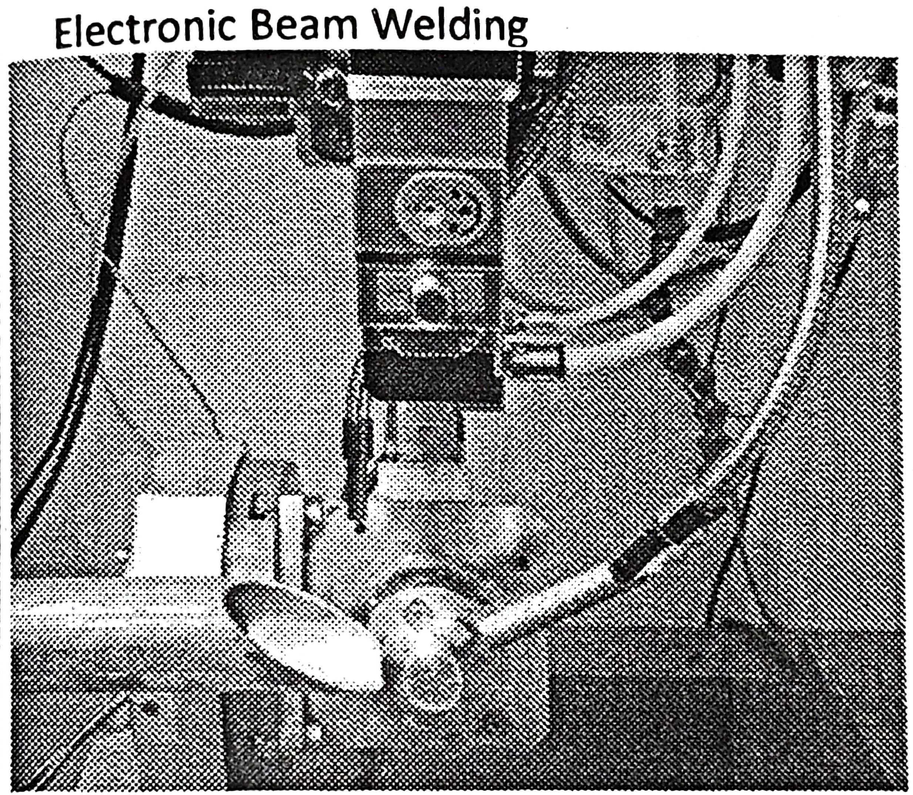

# Maintenance Activities and Welding 
- Maintenance, in general, can be defined as efforts taken to keep the condition and performance of a machine always like the condition and performance of the machine when it was still new. 
- Maintenance activities can basically be divided into two parts: 
    1. Planned maintenance activities
    2. Unplanned maintenance activities 
- Planned maintenance is maintenance that is organized and carried out with thought to the future, control and recording with the plans that have been determined previously. 
- The following types of maintenance methods are commonly used in several industries: 
    1. Preventive Maintenance 
    2. Predictive Maintenance
    3. Corrective Maintenance 
    4. Breakdown Maintenance 

### Preventive Maintenance 
- It is a method for preventing damage to equipment by periodically replacing parts based on time of use and carrying out minor maintenance and inspections of the equipment / machinery.
- Example: Cleaning, checking, lubricating, bolt tightening Periodic inspection Periodic and small overhaul restorations. 

### Predictive Maintenance
- Predictive maintenance is a method for doing maintenance by replacing parts based on predictions using a tool.
- The point is if the preventive method is only based on the schedule, then the predictive method is based on the results of the measurement.
- This method can also use the five senses, for example in bearing inspection can be distinguished from the sound produced.
- Or checking temperature, by touching it we can feel the difference or abnormality of the equipment.
- Examples: Tachometer, to measure the rotation of the Thermometer, to measure the temperature of the Ampermeter, to measure amperage.

### Corrective Maintenance 
- It is a method intended to improve the reliability of equipment/machines by improvising. 
- In addition to equipment, it is also intended for parts that have a short life cycle (reduce the frequency of damage) and speed up repair time. 
- In other words, this method is to extend MTBF (Mean Time Between Failure) and accelerate MTTR (Mean Time to Repair) because of its reliability and maintenance. 

### Breakdown Maintenance
- It is a method while inspection and replacement of parts are not carried out, so with this method we leave the equipment damaged, and then we fix it or replace it. 
- Usually this method is applied to equipment/machines with consideration: 
    1. Equipment is only optional (additional) so that if it is damaged it does not interfere with production. 
    2. The cost of repairing/replacing cheap parts. 
    3. Insignificant damage. 
    4. Easy and fast repair. 

## Maintenance Record 
- Maintenance record, is a document that includes information regarding each repair and maintenance work that is done on asset or equipment. 
- In simple words, it keeps tracks of assets failures and repairs. 
- It is one of the best way to maintain health and safety management. 
- It also improves asset management as such record includes information such as: 
    1. Time and date when maintenance is required to be done. 
    2. Type of maintenance required to be done.
    3. Asset details such as number, parts required, working condition, etc. 
    4. Risk associated with it.
    5. Environment condition as its affect. 

### Importance 
- There are several benefits of keeping maintenance record. These are: 
    1. **Preventive Expensive Repairs**
        - Asset Maintenance is something that leads to increase in overall cost of organizations.
        - Some asset maintenance is less costly and some of them are very high. 
        - Repair cost is simply amount required to bring back asset back to its normal working condition.
        - Maintenance record keeps information regarding reach maintenance and repair done on equipment. 
        - With help of maintenance record, one can easily determine when and which maintenance strategy is required to be performed on particular asset. 
    2. **Increases Safety**
        - Maintenance record also includes information regarding affect of each asset's failure on system, employees and environment. 
        - It also includes information regarding how workers or operators are performing their tasks. 
        - When help of maintenance record, one can easily determine how severe asset is, when it's going to fail, how it can be prevented from failure so that one can take steps to prevent it from occurrence. 
        - This in turn reduces risk regarding safety and environmental health. It also helps one to ensure that which equipments are safe to work with. 
    3. **Replacing Equipment** 
        - Maintenance record includes information regarding asset failure about number of times particular asset is getting failed, asset condition. 
        - One can easily determine about working condition of asset, when asset is required to repair, cost associated with each repair of particular asset. 
        - One of the main advantage is that, one can easily determine then asset is required to be replaced. 
        - If repair cost of asset is more than cost required to replace with new one, then it's much better to replace asset with new one as it can reduce cost, reduces failure occurrence, includes warranty, minimizes effort required to repair, etc. 
    4. **Reduces Labor Workload**
        - As we know that with help of maintenance record, one can prevent failure from occurrence.
        - It helps to reduce unnecessary maintenance work required, schedule maintenance work that is required, help management to ensure employees, workers or labors, that are performing well, labors that are required to perform the task. 
        - This simply reduces efforts required to repair assets. 
        - In turn, it reduces number of labors required to perform task as well as reduce labor workload. 
    5. **Manage Each Machine** 
        - Maintenance record keeps each information about assets. 
        - It includes working details, maintenance details, repair details, working environment, its processing, risk associated with it, etc. 
        - With help of all this information, one can perform maintenance task whenever required so that assets condition is maintained well, prevent it from failures and increases its life span. 

# Welding 
- Welding is a fabrication process whereby two or more parts are fused together by means of heat, pressure or both forming a join as the parts cool. 
- Welding is usually used on metals and thermoplastics but can also be used on wood. 
- The completed welded joint may be referred to as a weldment. 
- As opposed to brazing and soldering, which do not melt the base metal, welding is a high heat process which melts the base material. Typically, with the addition of a filler material. 
- Heat at a high temperature causes a weld pool of molten material which cools to form the join, which can be stronger than the parent metal. 
- Pressure can also be used to produce a weld, either alongside the heat or by itself.
- It can also use a shielding gas to protect the melted and filler metals from becoming contaminated or oxidised.

## Joint Configuration 
- There are many types of joints that can be made while welding two substances together. These joints are:
    1. Butt Joint
    2. T Joint
    3. Corner Joint
    4. Edge Joint
    5. Cruciform Joint
    6. Lap Joint

### Butt Joint 
- A connection between the ends or edges of two parts making an angle to one another of 135-180° Inclusive in the region of the joint.

### T Joint 
- A connection between the end or edge of one part and the face of the other part, the parts making an angle to one another of more than 5 up to and Including 90° in the region of the joint.

### Corner Joint
- A connection between the ends or edges of two parts making an angle to one another of more than 30 but less than 135° in the region of the joint.

### Edge Joint
- A connection between the edges of two parts making an angle to one another of 0 to 30° inclusive in the region of the joint.

### Cruciform Joint 
- A connection in which two flat plates or two bars are welded to another flat plate at right angles and on the same axis.

### Lap Joint
- A connection between two overlapping parts making an angle to one another of 0-5° inclusive in the region of the weld or welds.

### Butt Weld Features 

### Fillet Weld Features 

## Types of Welding 
- There are a variety of different processes with their own techniques and applications for industry, these include: 
    1. Arc Welding
    2. Friction Welding 
    3. Electronic Beam Welding 
    4. Laser Welding 
    5. Resistance Welding 

### Arc Welding 
- This category includes a number of common manual, semi-automatic and automatic processes. 
- These include metal inert gas (MIG) welding, stick welding, tungsten Inert gas (TIG) welding also know as gas tungsten arc welding (GTAW), gas welding, metal active gas (MAG) welding, flux cored arc welding (FCAW), gas metal arc welding (GMAW), submerged arc welding (SAW), shielded metal arc welding (SMAW) and plasma arc welding. ISD
- These techniques usually use a filler material and are primarily used for joining metals including stainless steel, aluminium, nickel and copper alloys, cobalt and titanium.
- Arc welding processes are widely used across Industries such as oil and gas, power, aerosp ace, automotive, and more.

### Friction Welding 
- Friction welding techniques join materials using mechanical friction. 
- This can be performed in a variety of ways on different welding materials including steel, aluminium or even wood.
- The mechanical friction generates heat which soften materials & it mixes to create a bond. 
- Friction is frequently used in aerospace applications as it is ideal for joining otherwise 'non-weldable' light-weight aluminium alloys.
- Friction processes are used across industry and are also being explored as a method to bond wood without the use of adhesives or nails.

### Electronic Beam Welding 
- Friction is frequently used in aerospace applications as it is ideal for joining otherwise 'non-weldable' light-weight aluminium alloys. 
- Friction processes are used across industry and are also being explored as a method to bond wood without the use of adhesives or nails.
- (EBW) is performed in vacuum to prevent the beam from dissipating.
- There are many common applications for EBW, as can be used to join thick sections.
- This means it can be applied across a number of Industries like aerospace, nuclear power, automotive & rail.

### Laser Welding 
- (EBW) is performed in vacuum to prevent the beam from dissipating. 
- There are many common applications for EBW, as can be used to join thick sections.
- This means it can be applied across a number of Industries like aerospace, nuclear power, automotive & rail.
- Being easily automated, the high welding speed at which this process can be performed makes it perfect for high volume applications, such as within the automotive industry.
- Being easily automated, the high welding speed at which this process can be performed makes it perfect for high volume applications, such as within the automotive industry.

### Resistance Welding 
- This is a fast process which is commonly used in the automotive industry. 
- This process can be split into two types, resistance spot welding and resistance seam welding.
- Spot welding uses heat delivered between two electrodes which is applied to a small area as the work pieces are clamped together.
- Seam welding is similar to spot welding except it replaces the electrodes with rotating wheels to deliver a continuous leak-free weld.
