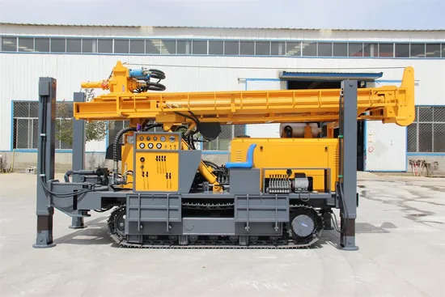

# Hydraulics 
## Fluid Power and its Scope 
- Fluid power is the technology that deals with the generation, control and transmission of forces and movement of mechanical element or system with the use of pressurized fluids in a consined system. 
- Both liquids and gases are considered fluids. Fluid power system includes a hydraulic system (hydra meaning water in Greek) and a pneumatic system (pneuma meaning air in Greek).
- Oil hydraulic employs pressurized liquid petroleum oils and synthetic oils and pneumatic employs compressed air that is released to the atmosphere after performing the work. 
- Fluid power applications can be classified into two major segments: 
    1. Stationary hydraulics 
    2. Mobile hydraulics 

### Stationary Hydraulics
- Stationary hydraulic system remains firmly fixed in one position. 
- The characteristic feature of stationary hydraulics is that valves are mainly solenoid operated. 
- The applications of stationary hydraulics are as follows: 
    1. Machine tools and transfer lines
    2. Lifting and conveying devices
    3. Metal-forming presses 
    4. Plastic machinery such as injection-molding machines 
    5. Rolling machines 
    6. Lifts 
    7. Food processing machinery 
    8. Automatic handling equipment and robots 

### Mobile Hydraulics
- Mobile hydraulic systems move on wheels or tracks such as a tower crane or excavator truck to operate in many different locations or while moving. 
- A characteristic feature of mobile hydraulics is that the valves are frequently manually operated.
- The applications of mobile hydraulics are as follows: 
    1. Automobiles, tractors, airplanes, missile, boats, etc. 
    2. Construction machinery 
    3. Tippers, excavators and elevating platforms 
    4. Agricultural machinery

| | | 
|-|-|
| Agriculture | Tractors; farm equipments such as movers, ploughs, chemical and water sprayers, fertilizer spreader, harvesters |
| Automation | Automated transfer lines, robotics | 
| Automobiles | Power steering, power brakes, suspension systems, hydrostatic transmission | 
| Construction industry/equipment | For metering and mixing concreted rudders, excavators, lifts, bucket loaders, crawlers, post-hole diggers, road graders, road cleaners, road maintenance, tippers | 
| Defense | Missile-launching systems, navigation controls | 
| Entertainment | Amusement park entertainment rides such as roller coasters | 
| Fabrication industry | Hand tools such as pneumatic drills, grinders, borers, riveting machines, nut runners | 
| Food and Beverage | All types of food processing equipment, wrapping, bottling | 
| Foundry | Full and semi-automatic molding machines, tilting of furnaces, die-casting machines | 
| Glass industry | Vacuum suction cups for handling | 

## Types of Hydraulic System 
- The following are the two types of hydraulic systems: 
    1. Fluid transport systems 
    2. Fluid power system 

### Fluid Power System 
#### Classification 
- The fluid power system can be categorized as follows:
    - **Based on the control system**
    - **Open-loop system**: There is no feedback in the open system and performance is based on the characteristics of the individual components of the system. The open-loop system is not accurate and error can be reduced by proper calibration and control.
    - **Closed-loop system**: This system uses feedback. The output of the system is fed back to a comparator by a measuring element. The comparator compares the actual output to the desired output and gives an error signal to the control element.
- The error is used to change the actual output and bring it closer to the desired value.
- A simple closed loop system uses servo valves and an advanced system uses digital electronics.

#### Based on Type of Control 
- Fluid logic control: This type of system is controlled by hydraulic oil or air. The system employs fluid logic devices such as AND, NAND, OR, NOR, etc. Two types of fluid logic systems are available:
    1. **Moving part logic (MPL)**: These devices are miniature fluid elements using moving parts such as diaphragms, disks and poppets to implement various logic gates.
    2. **Fluidics**: Fluid devices contain no moving parts and depend solely on interacting fluid jets to implement various logic.
    3. **Electrical control**: This type of system is controlled by electrical devices Four basic electrical devices are used for controlling the fluid power systems: switches, relays, timers and solenoids. These devices help to control the starting, stopping, sequencing, weed, positioning, timing and reversing of actuating cylinders and fluid motors. Electrical control and fluid power work well Together where remote control is essential. This type of system is controlled by microelectronic devices. The electronic brain is used to control the fluid power muscles for doing work. This system uses the most advanced type of electronic hardware including programmable logic control (PLC) or microprocessor (P). In the electrical control, a change in system operation results in a cumbersome process of redoing hardware connections.
- The difficulty is overcome by programmable electronic control. The program can be modified, or a new program can be fed to meet the change of operations. A number of such programs can be stored in these devices, which makes the systems more flexible.

### Hydrostatic and Hydrodynamic Systems 
- A hydrostatic system uses fluid pressure to transmit power. Hydrostatics deals with the mechanics of still fluids and uses the theory of equilibrium conditions in fluld. The system creates high pressure, and through a transmission line and a control element, this pressure drives an actuator (linear or rotational). The pump used in hydrostatic systems is a positive displacement pump. The relative spatial position of this pump is arbitrary but should not be very large due to losses (must be less than 50 m). An example of pure hydrostatics is the transfer of force in hydraulics.
- Hydrodynamic systems use fluid motion to transmit power. Power is transmitted by the kinetic energy of the fluid. Hydrodynamics deals with the mechanics of moving fluid and uses flow theory. The pump used in hydrodynamic systems is a non-positive displacement pump. The relative spatial position of the prime mover (e.g., turbine) is fixed. An example of pure hydrodynamics is the conversion of flow energy in turbines in hydroelectric power plants.
- In oil hydraulics, we deal mostly with the fluid working in a confined system, that is, a hydrostatic system.

### Basic Components 
- The hydraulic actuator is a device used to convert the fluid power into mechanical power to do useful work. The actuator may be of the linear type (e.g., hydraulic cylinder) or rotary type(e.g., hydraulic motor) to provide linear or rotary motion, respectively. 
- The hydraulic pump is used to force the fluid from the reservoir to rest of the hydraulic circuit by converting mechanical energy into hydraulic energy.
- Valves are used to control the direction, pressure and flow rate of a fluid flowing through the circuit.
- External power supply (motor) is required to drive the pump.
- Reservoir is used to hold the hydraulic liquid, usually hydraulic oil.
- Piping system carries the hydraulic oil from one place to another.
- Filters are used to remove any foreign particles so as keep the fluid system clean and efficient, as well as avoid damage to the actuator and valves.
- Pressure regulator regulates (i.e., maintains) the required level of pressure in the hydraulic fluid.
- The hydraulic system can be broken down into four main divisions analogous to the 4 main divisions in an electrical system.
    1. The power device parallels the electrical generating station.
    2. The control valves parallel the switches, resistors, timers, pressure switches, relays, etc.
    3. The lines in which the fluid power flows parallel the electrical lines.
    4. The fluid power motor (whether it is a rotating or a non-rotating cylinder or a fluid power motor) parallels the solenoids and electrical motors.

## Advantages of Fluid Power System 
1. Fluid power systems are simple, easy to operate and can be controlled accurately 
2. Multiplication and variation of forces
3. Multifunction control
4. Low-speed torque
5. Constant force or torque
6. Economical
7. Low weight to power ratio
8. Fluid power systems can be used where safety is of vital importance

## Comparison between Hydraulic and Pneumatic System 
| S. No. | Hydraulic System | Pneumatic System | 
|:-:|:-:|:-:|
| 1. | It employs a pressurized liquid as fluid | It employs a compressed gas, usually air, as a fluid | 
| 2. | An oil hydraulic system operates at pressures up to 700 bar | A pneumatic system usually operates at 5-10 bar | 
| 3. | Generally designed as closed system | Usually designed as open system 
| 4. | The system slows down when leakage occurs | Leakage does not affect the system much | 
| 5. | Valve operations are difficult | Valve operations are easy | 
| 6. | Heavier in weight | Lighter in weight | 
| 7. | Pumps are used to provide pressurized liquids | Compressors are used to provide compressed gas | 
| 8. | The system is unsafe to fire hazards | The system is free from fire hazards | 
| 9. | Automatic lubrication is provided | Special arrangements for lubrication are needed | 
